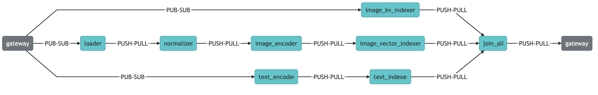
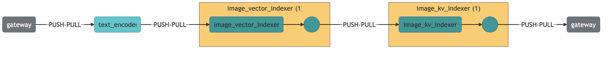

# Build a Cross-modal Search System to Look for Images from Captions


## Overview
|  |  |
| ------------- | ------------- |
| Learnings | How to use image captions (short descriptions of the image content) to search for images. |
| Used for indexing | Images + captions. |
| Used for querying | Image caption, e.g. "A boy playing basketball". |
| Dataset used | [Flickr 8k](https://www.kaggle.com/adityajn105/flickr8k) containing 8k image caption pairs. |
| Model used | Both [CLIP: Contrastive Language-Image Pre-Training](https://arxiv.org/abs/2007.13135) and [VSE++: Improving Visual-Semantic Embeddings with Hard Negatives](https://arxiv.org/pdf/1707.05612.pdf) are demonstrated. |

In this example, Jina is used to implement a cross-modal search system.
This example allows the user to search for images given a caption description.
We encode images and its captions (any descriptive text of the image) in separate indexes.
The `image index` is later queried using the `text embeddings`.
It is also possible to do it the other way around and use the `image encoding` to search for similar `text-embeddings` (captions).

_____

## 🐍 Build the app with Python

These instructions explain how to build the example yourself and deploy it with Python. 
If you want to skip the building steps and just run the example with Docker, check [the Docker deployment instructions at the end of this README](#deploy-with-docker)  


### 🗝️ Requirements

1. You have a working Python 3.7 or 3.8 environment. 
2. We recommend creating a [new Python virtual environment](https://docs.python.org/3/tutorial/venv.html) to have a clean installation of Jina and prevent dependency conflicts.   
3. You have at least 2 GB of free space on your hard drive. 

### 👾 Step 1. Clone the repo and install Jina

Begin by cloning the repo, so you can get the required files and datasets. (If you already have the examples repository on your machine make sure to fetch the most recent version)

```sh
git clone https://github.com/jina-ai/examples
cd examples/cross-modal-search
````
In your terminal, you should now be located in you the *cross-modal-search* folder. Let's install Jina and the other required Python libraries. For further information on installing Jina check out [our documentation](https://docs.jina.ai/chapters/core/setup/).

```sh
pip install -r requirements.txt
```

### 🏃 Step 2. Index your data
To quickly get started, you can index a [small dataset](data/toy-data) to make sure everything is working correctly. 
```
python app.py -t index
```

If you see the following output, it means your data has been correctly indexed.

```
Flow@5162[S]:flow is closed and all resources are released, current build level is 0
```

We recommend you come back to this step later and index the full flickr 8k dataset for better results. To index the [full dataset](https://www.kaggle.com/adityajn105/flickr8k) (8000 images) follow these steps:
<details>
  <summary>Click to expand!</summary>

1. Register for a free [Kaggle account](https://www.kaggle.com/account/login?phase=startRegisterTab&returnUrl=%2F)
2. Set up your API token (see [authentication section of their API docs](https://www.kaggle.com/docs/api))
3. Run `pip install kaggle`
4. Run `sh get_data.sh` 

To index the full dataset, run
```shell
python app.py -t index --data_set=f8k
```
</details>

### 🔎 Step 3: Query your data
Jina offers several ways to search (query) your data. In this example, we show two of the most common ones. In a production environment, you would only choose one which suits your use case best. 

#### Using a REST API
Begin by running the following command to open the REST API interface.

```sh
python app.py -t query_restful
```

You should open another terminal window and paste the following command. 

```sh
curl --request POST -d '{"top_k": 5, "mode": "search",  "data": ["hello world"]}' -H 'Content-Type: application/json' 'http://0.0.0.0:45678/search'
```

Once you run this command, you should see a JSON output returned to you. This contains the five most semantically similar images sentences to the text input you provided in the `data` parameter.
Note, that the toy-data only contains two images.
Feel free to alter the text in the 'data' parameter and play around with other queries (this is only fun with the large dataset)! For a better understanding of the parameters see the table below. 
|  |  |
|--|--|
| `top_k` | Integer determining the number of sentences to return |
| `mode` | Mode to trigger in the call. See [here](https://docs.jina.ai/chapters/rest/) for more details |
| `data` | Text input to query |
 
#### Using Jina Box; our frontend search interface

**Jina Box** is a light-weight, highly customizable JavaScript based front-end search interface. To use it for this example, begin by opening the REST API interface. 

```sh
python app.py -t query_restful
```

In your browser, open up the hosted Jina Box on [jina.ai/jinabox.js](https://jina.ai/jinabox.js/). In the configuration bar on the left-hand side, choose a custom endpoint and enter the following: `http://127.0.0.1:45678/search`.
You can type search queries into the text box on the right-hand side!

______

## 🌀 Flow diagram
This diagram provides a visual representation of the Flows in this example; Showing which executors are used in which order.
Remember, our goal is to compare vectors representing the semantics of images with vectors encoding the semantics of short text descriptions.

### Indexing

As you can see, the Flow that indexes the data contains three parallel branches. 
The upper branch contains only a key-value indexer for the images that we use as a lookup (like a Dictionary in Python).
The middle branch contains the transformations to get from the JPG to the image vector, and the lower branch takes care of turning 
text descriptions into vectors. To have low latency at query time, we store the computed vectors on disk.
   

This Flow shows what happens when a user queries our data. First, the provided text description is passed through the text Encoder which turns
it into a vector. Now, we use our image vector index to find the most similar image encodings to the previously computed text vector from the user.
Because the user does not want to see the vector as a result, but the image this vector belongs to we use the key-value lookup to get from image vector to human-interpretable JPG image.
Note, that this Flow only shows how to search for images using text. The example actually support searching for text using images as well. 
As an exercise, you can think of the required steps for that and check against our [Flow configuration](flows/flow-query.yml).


## 📖 Optional: Extra information useful for the user
<details>
  <summary>Click to expand more details on cross-modal retrieval!</summary>

**Motive behind Cross Modal Retrieval**

Cross-modal retrieval tries to effectively search for documents in a set of documents of a given modality by querying with documents from a different modality.

Modality is an attribute assigned to a document in Jina in the protobuf Document structure.
It is possible that documents may be of the same mime type,
but come from different distributions,
for them to have different modalities.
**Example**: In an article or web page, 
the body text and the title are from the same mime type (text),
but can be considered of different modalities (distributions).

Different Encoders map different modalities to a common embedding space.
They need to extract semantic information from the documents. 

In this embedding space,
documents that are semantically relevant to each other from different modalities are expected to be close to another - Metric Learning

In the example, we expect images embeddings to be nearby their captions’ embeddings.

**Research for Cross Modal Retrieval**

The models used for the example are cited from the paper, you can try our example with one of them:

1. [CLIP: Contrastive Language-Image Pre-Training](https://arxiv.org/abs/2007.13135) (recommend)
2. [VSE++: Improving Visual-Semantic Embeddings with Hard Negatives](https://arxiv.org/pdf/1707.05612.pdf).

Both of the models have been trained to encode pairs of `text` and `images` into a common embedding space.

**CLIP Encoders in Jina for Cross Modal Search**

Two encoders have been created for this example, namely `CLIPImageEncoder` and `CLIPTextEncoder`,
for encoding image and text respectively.

**VSE Encoders in Jina for Cross Modal Search**

Two Encoders have been created for this example, namely `VSEImageEncoder` and `VSETextEncoder`,
for encoding image and text respectively.
</details>


## 🔮 Overview of the files

*Add a list with all folders/files in the example:*

|                      |                                                                                                                  |
| -------------------- | ---------------------------------------------------------------------------------------------------------------- |
| 📂 `flows/`          | Folder to store Flow configuration                                                                               |
| --- 📃 `flow-index.yml`     | YAML file to configure indexing Flow                                                                             |
| --- 📃 `flow-query.yml`     | YAML file to configure querying Flow                                                                             |
| 📂 `pods/`           | Folder to store Pod configuration                                                                                |
| --- 📂 `clip`   | YAML files to configure the Encoder using the clip model                                                                               |
| --- 📂 `vse`   | YAML files to configure the Encoder using the vse model                                                                                |
| --- 📃 `image-load.yml`   | YAML file to configure loading JPG files                                                                             |
| --- 📃 `image-normalzer.yml`   | YAML file to configure how images are normalized                                                                           |
| --- 📃 `index-image-kv.yml`   | YAML file to configure the key-value image index                                                                           |
| --- 📃 `index-image-vector.yml`   | YAML file to configure the vector image index                                                                           |
| --- 📃 `index-text.yml`   | YAML file to configure the index for the text vectors                                                                            |
| --- 📃 `merge_matche_sort_topk.yml`   | YAML file to configure the ranking of matches                                                                        |
| 📂 `workspace/`      | Folder to store indexed files (embeddings and documents). Automatically created after the first indexing   |
| 📂 `visualizations/`      | Folder to store images used for documentation  |
| 📂 `data/`      | Folder to store the toy-data for the example  |

_____

## 🐋 Deploy with Docker
To make it easier for the user, we have built and published the [Docker image](https://hub.docker.com/r/jinahub/app.example.crossmodalsearch) with the indexed documents.
Just be aware that the image weights 11 GB. Make sure that your docker lets you allocate a sufficient amount of memory. 

You can retrieve the docker image using:

```bash
docker pull jinahub/app.example.crossmodalsearch:0.0.3-1.0.8
```
So you can pull from its latest tags. 

To run the application with the pre-indexed documents and ready to be used from Jina Box, run

```bash
docker run -p 45678:45678 jinahub/app.example.crossmodalsearch:0.0.3-1.0.8
```
### Build the docker image yourself
Download the data (if not done already) and build the docker image:

```bash
./get_data.sh
docker build -f Dockerfile -t cross-modal-search .
```
_______

## ⏭️ Next steps

Did you like this example and are you interested in building your own? For a detailed tutorial on how to build your Jina app check out [How to Build Your First Jina App](https://docs.jina.ai/chapters/my_first_jina_app/#how-to-build-your-first-jina-app) guide in our documentation. 

If you have any issues following this guide, you can always get support from our [Slack community](https://join.slack.com/t/jina-ai/shared_invite/zt-dkl7x8p0-rVCv~3Fdc3~Dpwx7T7XG8w) .

## 👩‍👩‍👧‍👦 Community

- [Slack channel](slack.jina.ai) - a communication platform for developers to discuss Jina.
- [LinkedIn](https://www.linkedin.com/company/jinaai/) - get to know Jina AI as a company and find job opportunities.
- [](https://twitter.com/JinaAI_) - follow us and interact with us using hashtag `#JinaSearch`.  
- [Company](https://jina.ai) - know more about our company, we are fully committed to open-source!

## 🦄 License

Copyright (c) 2021 Jina AI Limited. All rights reserved.

Jina is licensed under the Apache License, Version 2.0. See LICENSE for the full license text.
