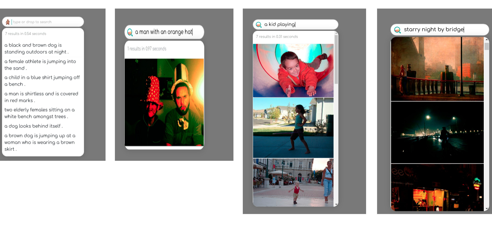

# Build A Cross-Modal Search System To Look For Images From Captions and vice versa

**Table of Contents**
- [Overview](#overview)
- [🐍 Build the app with Python](#-build-the-app-with-python)
- [🔮 Overview of the files in this example](#-overview-of-the-files-in-this-example)
- [🌀 Flow diagram](#-flow-diagram)
- [🔨 Next steps, building your own app](#-next-steps-building-your-own-app)
- [🐳 Deploy the prebuild application using Docker](#-deploy-the-prebuild-application-using-docker)
- [🙍 Community](#-community)
- [🦄 License](#-license)




## Overview
| About this example: |  |
| ------------- | ------------- |
| Learnings | How to use image captions (short descriptions of the image content) to search for images. |
| Used for indexing | Images + captions. |
| Used for querying | Image caption e.g. "A boy playing basketball". |
| Dataset used | [Flickr 8k](https://www.kaggle.com/adityajn105/flickr8k) containing 8k image caption pairs. |
| Model used | Both [CLIP: Contrastive Language-Image Pre-Training](https://arxiv.org/abs/2007.13135) and [VSE++: Improving Visual-Semantic Embeddings with Hard Negatives](https://arxiv.org/pdf/1707.05612.pdf) are demonstrated. |

In this example, Jina is used to implement a cross-modal search system.
This example allows the user to search for images given a caption description.
First, we encode all images in our dataset into vectors and create an index of these vectors.
When we search with text inputs, we compute the vector representation of this text and compare it to the previously calculated image vector index to find the most similar image. 
It is also possible to do it the other way around and use the image encoding to search for similar text-embeddings (captions).

_____

## 🐍 Build the app with Python

These instructions explain how to build the example yourself and deploy it with Python.


### 🗝️ Requirements

1. You have a working Python 3.7 or 3.8 environment and a installation of [Docker](https://docs.docker.com/get-docker/). 
2. We recommend creating a [new Python virtual environment](https://docs.python.org/3/tutorial/venv.html) to have a clean installation of Jina and prevent dependency conflicts.   
3. You have at least 2 GB of free space on your hard drive. 

### 👾 Step 1. Clone the repo and install Jina

Begin by cloning the repo, so you can get the required files and datasets. (If you already have the examples repository on your machine make sure to fetch the most recent version)

```sh
git clone https://github.com/jina-ai/examples
cd examples/cross-modal-search
````
In your terminal, you should now be located in the *cross-modal-search* folder. Let's install Jina and the other required Python libraries. For further information on installing Jina check out [our documentation](https://docs.jina.ai/chapters/core/setup/).

```sh
pip install -r requirements.txt
```

### 🏃 Step 2. Index your data
To quickly get started, you can index a [small dataset](data/toy-data) to make sure everything is working correctly. 

To index the toy dataset, run
```bash
python app.py -t index
```
If you see the following output, it means your data has been correctly indexed.

```
Flow@5162[S]:flow is closed and all resources are released, current build level is 0
```

We recommend you come back to this step later and index the full flickr 8k dataset for better results. 
To index the [full dataset](https://www.kaggle.com/adityajn105/flickr8k) (8000 images) follow these steps:
1. Register for a free [Kaggle account](https://www.kaggle.com/account/login?phase=startRegisterTab&returnUrl=%2F)
2. Set up your API token (see [authentication section of their API docs](https://www.kaggle.com/docs/api))
3. Run `sh get_data.sh` to download the flickr 8k dataset

To index the full dataset, run
```shell
python app.py -t index -d f8k -n 8000
```

### 🔎 Step 3: Query your data
Jina offers several ways to search (query) your data. 
In this example, we show two of the most common ones. 
In a production environment, you would only choose one which suits your use case best. 

#### Test query
Let us begin by running a small test query. This test query contains the sentence:
`a black dog and a spotted dog are fighting`. The system then searches for images that match
the caption and plots the closest images.

```sh
python app.py -t query
```

#### Restful API
To start an API that waits for restful search requests, type:
```sh
python app.py -t query_restful
```

You should open another terminal window and paste the following command.
```sh
curl --request POST -d '{"parameters":{"top_k": 5}, "data": ["a black dog and a spotted dog are fighting"]}' -H 'Content-Type: application/json' 'http://localhost:45678/search'
```

Once you run this command, you should see a JSON output returned to you. This contains the five most semantically similar images sentences to the text input you provided in the `data` parameter.
Note, that the toy-data only contains two images.
Feel free to alter the text in the 'data' parameter and play around with other queries (this is only fun with the large dataset)! For a better understanding of the parameters see the table below. 

|                      |                                                                                                                  |
| -------------------- | ---------------------------------------------------------------------------------------------------------------- |
| `top_k` | Integer determining the number of sentences to return |
| `data` | Text input to query |

## 📉 Understanding your results
When searching by text, the Flow returns the search document with matches appended to it.
These matches will contain a numpy array with the matched images in the `blob` attribute.

When searching by image, the Flow returns the search document with matches as well.
These matches will now contain captions in the `text` attribute.

## 🌀 Flow diagram
This diagram provides a visual representation of the Flows in this example; Showing which executors are used in which order.
Remember, our goal is to compare vectors representing the semantics of images with vectors encoding the semantics of short text descriptions.

### Indexing
  
As you can see, the Flow that Indexes the data contains two parallel branches: 
- Image: Encodes images and indexes them.
- Text: Encodes texts (captions) and indexes them.

### Querying
  
The query flow is fairly similar to the index flow.
We split the search Documents into images and text and go through two paths again.
The trick for performing a cross-modal search is using the text indexer for the search images and the image indexer for the text search documents.
This is what you can see in the image above.
As an exercise, you can check the [Flow configuration](flows/flow-query.yml).


## 📖 Optional: Extra information useful for the user

Request size can be configured with `-s` flag.

**Dataset Choice**

The dataset is provided with the `-d` parameter with the valid options of `f30k` and `f8k`.
If you want to index your own dataset,
check `dataset.py` to see how `data` is provided and adapt to your own data source.

Note that `num_docs` (provided by `-n` parameter) should be 8k or 30k depending on the `flickr` dataset you use.
If you decide to index the complete datasets,
it is recommendable to increase the number of shards and parallelization.
This is not featured in this example yet. Feel free to try it yourself.
```bash
python app.py -t index -n 8000 -s $request_size -d 'f8k'
```

**Motive behind Cross-Modal Retrieval**

Cross-modal retrieval tries to effectively search for documents of one modality (text) in an index storing data of another modality (images). An example of this is google image search.

Modality is an attribute assigned to a document in Jina in the protobuf Document structure.
It is possible that documents may be of the same mime type,
but come from different distributions,
for them to have different modalities.
**Example**: In an article or web page, 
the body text and the title are from the same mime type (text),
but will differ in statistical properties (like expected length or frequency of certain key-words) and should therefore be modeled separately.
If that is the case, we consider them as different modalities.


Different Encoders map different modalities to a common embedding space.
They need to extract semantic information from the documents. 

In this embedding space,
documents that are semantically relevant to each other from different modalities are expected to be close to another - [Metric Learning](https://en.wikipedia.org/wiki/Similarity_learning#:~:text=Metric%20learning%20is%20the%20task,(or%20the%20triangle%20inequality).)

In the example, we expect images embeddings to be nearby their captions’ embeddings.

**Research for Cross-Modal Retrieval**

The models used for the example are cited from the paper, you can try our example with one of them:

[CLIP: Contrastive Language-Image Pre-Training](https://arxiv.org/abs/2007.13135) (recommend)

Both of the models have been trained to encode pairs of `text` and `images` into a common embedding space.

**CLIP Encoders in Jina for Cross-Modal Search**

Two encoders have been created for this example, namely `CLIPImageEncoder` and `CLIPTextEncoder`,
for encoding image and text respectively.


## 🔮 Overview of the files

|                      |                                                                                                                  |
| -------------------- | ---------------------------------------------------------------------------------------------------------------- |
| 📂 `flows/`          | Folder to store Flow configuration                                                                               |
| --- 📃 `flow-index.yml`     | YAML file to configure indexing Flow                                                                             |
| --- 📃 `flow-query.yml`     | YAML file to configure querying Flow 
| --- 📃 `executors.py`  | File that contains ImageReader and TextFilter implementations  |
| 📂 `workspace/`      | Folder to store indexed files (embeddings and documents). Automatically created after the first indexing   |
| 📂 `visualizations/`      | Folder to store images used for documentation  |
| 📂 `data/`      | Folder to store the large datasets for the example  |
| 📂 `toy-data/`      | Folder to store the toy dataset for the example  |
| 📂 `tests/`      | Tests that check the example's correctness  |
| 📃 `app.py`  | Main file that runs the example  |


## ⏭️ Next steps

Did you like this example and are you interested in building your own? For a detailed tutorial on how to build your Jina app check out [How to Build Your First Jina App](https://docs.jina.ai/chapters/my_first_jina_app/#how-to-build-your-first-jina-app) guide in our documentation.  

To learn more about Jina concepts, check out the [cookbooks](https://github.com/jina-ai/jina/tree/master/.github/2.0/cookbooks).  

If you have any issues following this guide, you can always get support from our [Slack community](https://slack.jina.ai) .

## 👩‍👩‍👧‍👦 Community

- [Slack channel](https://slack.jina.ai) - a communication platform for developers to discuss Jina.
- [LinkedIn](https://www.linkedin.com/company/jinaai/) - get to know Jina AI as a company and find job opportunities.
- [](https://twitter.com/JinaAI_) - follow us and interact with us using hashtag `#JinaSearch`.  
- [Company](https://jina.ai) - know more about our company, we are fully committed to open-source!

## 🦄 License

Copyright (c) 2021 Jina AI Limited. All rights reserved.

Jina is licensed under the Apache License, Version 2.0. See [LICENSE](https://github.com/jina-ai/jina/blob/master/LICENSE) for the full license text.
