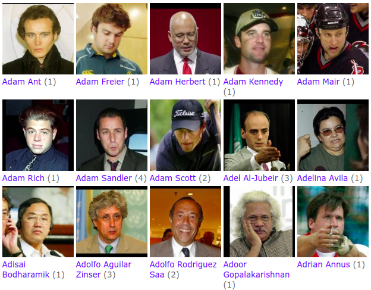
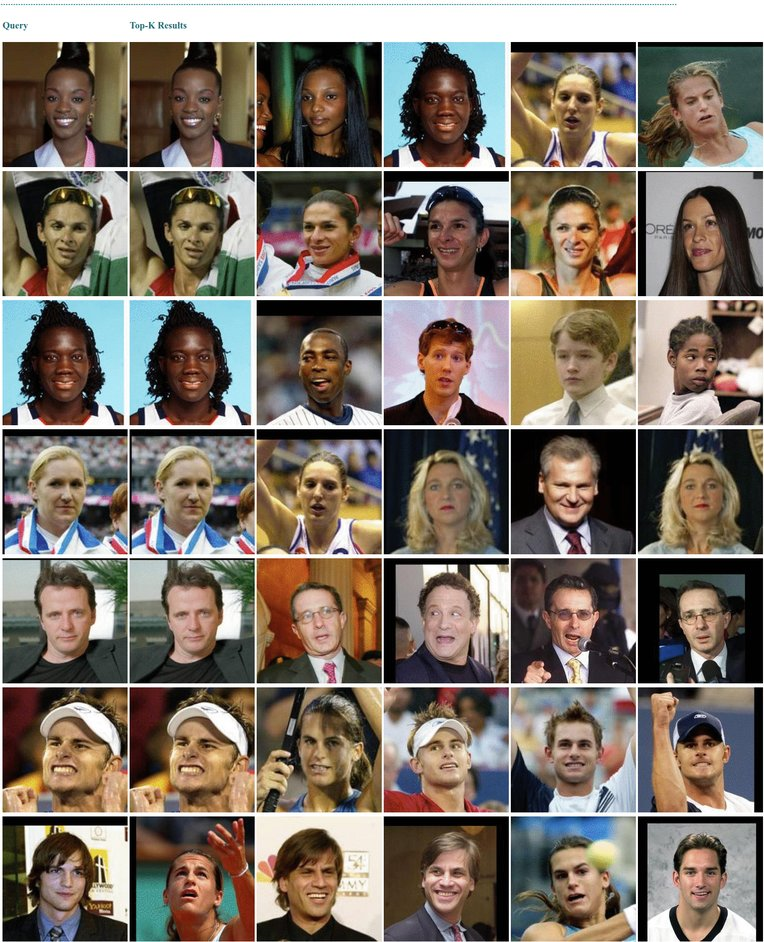

<!-- START doctoc generated TOC please keep comment here to allow auto update -->
<!-- DON'T EDIT THIS SECTION, INSTEAD RE-RUN doctoc TO UPDATE -->
**Table of Contents**

- [Build an Face Search System in 3 minutes](#build-an-face-search-system-in-3-minutes)
  - [<a name="custom-encoder">Overview</a>](#a-namecustom-encoderoverviewa)
  - [Prerequirements](#prerequirements)
  - [Prepare the data](#prepare-the-data)
  - [Define the Flows](#define-the-flows)
  - [<a name="custom-encoder">Custom Encoder</a>](#a-namecustom-encodercustom-encodera)
  - [Run the Flows](#run-the-flows)
  - [Next Steps](#next-steps)
  - [Documentation](#documentation)
  - [Community](#community)
  - [License](#license)

<!-- END doctoc generated TOC please keep comment here to allow auto update -->

# Build an Face Search System in 3 minutes
<p align="center">
 
[](https://jina.ai)
[](https://github.com/jina-ai/jina#jina-hello-world-)
[](#license)
[](https://docs.jina.ai)
[](https://jobs.jina.ai)
<a href="https://twitter.com/intent/tweet?text=%F0%9F%91%8DCheck+out+Jina%3A+the+New+Open-Source+Solution+for+Neural+Information+Retrieval+%F0%9F%94%8D%40JinaAI_&url=https%3A%2F%2Fgithub.com%2Fjina-ai%2Fjina&hashtags=JinaSearch&original_referer=http%3A%2F%2Fgithub.com%2F&tw_p=tweetbutton" target="_blank">
  </img>
</a>
[](#)
[](https://hub.docker.com/r/jinaai/jina/tags)

</p>

In this demo, we use the  Labeled Faces in the Wild (LFW) Dataset data from [http://vis-www.cs.umass.edu/lfw/lfw.tgz](http://vis-www.cs.umass.edu/lfw/#download) to build a face search system so one can run facial search on their own dataset. Make sure you have gone through our lovely [Jina 101](https://github.com/jina-ai/jina/tree/master/docs/chapters/101) and understood the [take-home-message](https://github.com/jina-ai/examples/tree/master/urbandict-search#wrap-up) in [our bert-based semantic search demo](https://github.com/jina-ai/examples/tree/master/urbandict-search) before moving on. 

  


**Table of Contents**

- [Overview](#overview)
- [Prerequirements](#prerequirements)
- [Prepare the data](#prepare-the-data)
- [Define the Flows](#define-the-flows)
- [Custom Encoder](#custom-encoder)
- [Run the Flows](#run-the-flows)
- [Next Steps](#next-steps)
- [Documentation](#documentation)
- [Community](#community)
- [License](#license)


## <a name="custom-encoder">Overview</a>

The overall design is similar to the semantic search demo. We consider each image as a Document and put the RGB array in the Chunk. Therefore, each Document has a single Chunk. The pretrained `facenet` model is used to encode the Chunks into vectors. 

In this demo, we will show how to define a custom Encoder to support a variety of models and use the pretrained model for indexing and searching.

<p align="center">
  
</p>


<details>
<summary>Click here to see the query outputs</summary>

<p align="center">
  
</p>

</details> 

## Prerequirements

This demo requires Python 3.7.

```bash
pip install --upgrade -r requirements.txt
```


## Prepare the data
In total, there are more than 13,000 images of faces. 1680 of the people pictured have two or more distinct photos in the data set.[LFW Dataset](http://vis-www.cs.umass.edu/lfw/#explore) dataset. The following script will download the data and uncompress it into `/tmp/jina/celeb/lfw`.

```bash
cd face-db-seach
bash ./get_data.sh
```

## Define the Flows

We start with defining the index and the query Flows  with the YAML files as following. If you found a bit confusing with the YAML files, we highly suggest to go through our [bert-based semantic search demo](https://github.com/jina-ai/examples/tree/master/urbandict-search) before moving forward.

<table style="margin-left:auto;margin-right:auto;">
<tr>
<td> </td>
<td> YAML</td>
<td> Dashboard </td>

</tr>
<tr>
<td> Index Flow </td>
<td>
  <sub>

```yaml
!Flow
metas:
  prefetch: 10
pods:
  loader:
    uses: yaml/craft-load.yml
    parallel: $PARALLEL
    read_only: true
  flipper:
    uses: yaml/craft-flip.yml
    parallel: $PARALLEL
    read_only: true
  normalizer:
    uses: yaml/craft-normalize.yml
    parallel: $PARALLEL
    read_only: true
  encoder:
    uses: jinaai/hub.executors.encoders.image.facenet
    parallel: $PARALLEL
    timeout_ready: 600000
    read_only: true
  chunk_indexer:
    uses: yaml/index-chunk.yml
    shards: $SHARDS
    separated_workspace: true
  doc_indexer:
    uses: yaml/index-doc.yml
    needs: loader
  join_all:
    uses: _merge
    needs: [doc_indexer, chunk_indexer]
    read_only: true
```

</sub>

</td>
<td>

</td>
</tr>
<tr>
<td> Query Flow </td>
<td>
  <sub>

```yaml
!Flow
with:
  read_only: true  # better add this in the query time
  rest_api: true
  port_expose: $JINA_PORT
pods:
  loader:
    uses: yaml/craft-load.yml
    read_only: true
    parallel: $PARALLEL
  flipper:
    uses: yaml/craft-flip.yml
    parallel: $PARALLEL
    read_only: true
  normalizer:
    uses: yaml/craft-normalize.yml
    read_only: true
    parallel: $PARALLEL
  encoder:
    uses: jinaai/hub.executors.encoders.image.facenet
    timeout_ready: 600000
    parallel: $PARALLEL
    read_only: true
  chunk_indexer:
    uses: yaml/index-chunk.yml
    separated_workspace: true
    polling: all
    shards: $SHARDS
    uses_reducing: _merge_all
  ranker:
    uses: MinRanker
  doc_indexer:
    uses: yaml/index-doc.yml
```

</sub>

</td>
<td>

</td>

</tr>
</table>

Let's have a look at the index Flow. As the same as in the [bert-based semantic search demo](https://github.com/jina-ai/examples/tree/master/urbandict-search), we define a two pathway Flow for indexing. For each image, we put the image file name in the request message and thus each image is considered as a Document. The `loader` Pod reads the image file and save the image's RGB values into the Chunk. Note that in this case, we have only one Chunk for each Document. 

Afterwards, the Flow splits into two parallel pathways. In the pathway on the left side, the `normalizer` Pod resizes and normalizes the image in the Chunks so that in the downstreaming Pods they can be properly handled. Followed by the `chunk_indexer`, the `encoder` Pod encodes the Chunks into vectors, which will be further saved into the index by the `chunk_indexer` Pod. 

In the other pathway, the `doc_indexer` Pod uses the key-value storage to save the Document IDs and the Document contents, i.e. the image file names. At the end, the `join_all` Pod merges the results from the `chunk_indexer` and the `doc_indexer`. In this case, the `join_all` Pods simply wait for the both incoming messages arrived because neither of the upstreaming Pods write into the request message.

The two-pathway Flow, as a common practice in jina, is designed to store the vectors and the Documents independently and in parallel. Of course, one can squeeze the two pathways into one pathway by concating the `doc_indexer` after the `chunk_indexer` and removing `join_all` Pod. However, this will slow down the index process. 

As for the query Flow, it is pretty much the same as the index Flow, and thereafter we won't be too verbose to iterate. You might have notice that there is something new in the YAML files. Let's dig into them!

### Hello, Docker!🐳
In the YAML file, we add the `encoder` Pod in a different way from the other Pods. Instead of using the YAML file to config the Pods, we define the `encoder` with a Docker image with the `image` argument. By doing this, we will have the `encoder` Pod running in a Docker container. This is one key feature of jina. By wrapping the Pods into the docker image, we can safely forget about the complicated dependency and environment setting that are required to run the Pods. 


```yaml
!Flow
pods:
  encoder:
    image: jinaai/hub.executors.encoders.image.facenet
```

This way we can pass the image  tag of docker container containing the Encoder

## <a name="custom-encoder">Custom Encoder</a>

Jina has a documentation on using the available Executors and overiding them with Custom Executor according to your needs. Here we build a custom encoder using [FaceNet](https://arxiv.org/abs/1503.03832).

### Write Custom YAML File

```yaml
!FaceNetTorchEncoder
with:
  pretrained: 'vggface2'
  img_shape: 160

metas:
  name: face-encoder
  py_modules: FaceNetEncoder.py
  workspace: ./
requests:
  on:
    [SearchRequest, IndexRequest, TrainRequest]:
      - !EncodeDriver
        with:
          method: encode
```

The tags in 'with' are passed down to the FaceNetEncoder.py class as parameters.
The 'py_modules' tag defines the Python Class containing your encoder logic. The class should override an existing Executor.

### Dockerfile

```docker
FROM pytorch/pytorch:latest

ADD FaceNetEncoder.py encode.yml requirements.txt install.sh ./

RUN apt-get update && apt-get install --no-install-recommends -y libglib2.0-0 libsm6 libxext6 libxrender-dev git
RUN pip install -r requirements.txt
RUN bash install.sh

RUN python -c "from facenet_pytorch import InceptionResnetV1; model = InceptionResnetV1(pretrained='vggface2').eval()"

COPY . /

ENTRYPOINT ["jina", "pod", "--uses", "encode.yml"]

```

The docker can be made on jina[devel] or any other image (pytorch in this case). We add dependancies such as jina , opencv etc. The model weights are downloaded and cached in the 'RUN python -c ...' command. The entrypoint runs this container as a jina pod. All arguments of jina pod can be overrideen during runtime ( such as specifying another yaml file).

We build this docker using the following command :


```bash
docker build -t jinaai/hub.executors.encoders.image.facenet .

```

Once built , we can pass this image tag to the Flow API.


## Run the Flows
### Index 
Now we start indexing with the following command.
 
```bash
python app.py index
```

<details>
<summary>Click here to see the console output</summary>

<p align="center">
  
</p>

</details> 

Here we use the YAML file to define a Flow and use it to index the data. The `index_files()` function load the image file names in the format of `bytes`, which will be further wrapped in an `IndexRequest` and send to the Flow. 

```python
from jina.flow import Flow
f = Flow.load_config('flow-index.yml')
with f:
    f.index_files(image_src, batch_size=8, read_mode='rb', size=num_docs)
```

### Query

In Jina , Querying images located in 'image_src' folder is as simple as the following command.
'print_result' is the callback function used. Here the top k (here k=5) is returned. In this example, we use the meta_info tag in response to create the image. 

```python
from jina.flow import Flow
f = Flow.load_config('flow-index.yml')
with f:
    f.search_files(image_src, sampling_rate=.01, batch_size=8, output_fn=print_result, top_k=5)
```

Run the following command to search images and display them in a webpage.

```bash
python make_html.py
```

<details>
<summary>Click here to see result of old API</summary>

<p align="center">
  
</p>

</details> 


</p>
Note : We have only used 500 images with only one or two images of each person. Hence the results are only as good as the database you have. It returns the closest matching face in the dataset.

<br /><br />

Congratulations! Now you have an image search engine working at hand. We won't go into details of the Pods' YAML files because they are quite self explained. If you feel a bit lost when reading the YAML files, please check out the [bert-based semantic search demo](https://github.com/jina-ai/examples/tree/master/urbandict-search#dive-into-the-pods).

## Next Steps

- Write your own executors.
- Check out the docker images at the Jina hub.

## Documentation 

<a href="https://docs.jina.ai/">

</a>

The best way to learn Jina in depth is to read our documentation. Documentation is built on every push, merge, and release event of the master branch. You can find more details about the following topics in our documentation.

- [Jina command line interface arguments explained](https://docs.jina.ai/chapters/cli/index.html)
- [Jina Python API interface](https://docs.jina.ai/api/jina.html)
- [Jina YAML syntax for executor, driver and flow](https://docs.jina.ai/chapters/yaml/yaml.html)
- [Jina Protobuf schema](https://docs.jina.ai/chapters/proto/index.html)
- [Environment variables used in Jina](https://docs.jina.ai/chapters/envs.html)
- ... [and more](https://docs.jina.ai/index.html)

## Community

- [Slack channel](https://join.slack.com/t/jina-ai/shared_invite/zt-dkl7x8p0-rVCv~3Fdc3~Dpwx7T7XG8w) - a communication platform for developers to discuss Jina
- [Community newsletter](mailto:newsletter+subscribe@jina.ai) - subscribe to the latest update, release and event news of Jina
- [LinkedIn](https://www.linkedin.com/company/jinaai/) - get to know Jina AI as a company and find job opportunities
- [](https://twitter.com/JinaAI_) - follow us and interact with us using hashtag `#JinaSearch`  
- [Company](https://jina.ai) - know more about our company, we are fully committed to open-source!


## License

Copyright (c) 2020 Jina AI Limited. All rights reserved.

Jina is licensed under the Apache License, Version 2.0. See [LICENSE](https://github.com/jina-ai/jina/blob/master/LICENSE) for the full license text.
