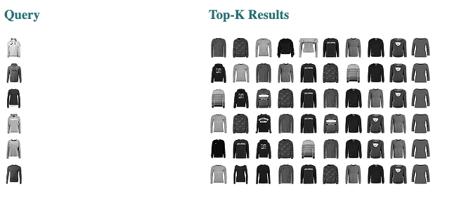

<!-- START doctoc generated TOC please keep comment here to allow auto update -->
<!-- DON'T EDIT THIS SECTION, INSTEAD RE-RUN doctoc TO UPDATE -->
**Table of Contents**

- [Run the Hello World example using query language](#run-the-hello-world-example-using-query-language)
  - [🗝️ Pre requirements](#Pre-requirements)
  - [🔮 Overview of the files](#Overview-of-the-files)
  - [🏃 Run the Flows](#run-the-flows)
  - [🌀 Flow Diagram](#flow-diagram)
  - [🌟 Results](#results)
  - [🧞‍QueryLanguage](#querylanguage)
  - [💫 Deploy with Docker](#Deploy-with-docker)
  - [Next steps](#next-steps)
  - [Community](#community)

<!-- END doctoc generated TOC please keep comment here to allow auto update -->

# Run Fashion-MNIST Example Using Query Language

This is an extension of the Hello World example using QueryLanguage. 
We will use the FashionMNIST dataset to index and query. The dataset has different categories such as t-shirts, trousers, and pullovers. We will use QueryLanguage to create a different index per each category so we can query through them. 


## 🗝️ Pre requirements

Before running this example, we recommend you meet the following requirements.

1. You have a working Python 3.7 environment. 
2. We recommend creating a [new python virtual envoriment](https://docs.python.org/3/tutorial/venv.html) to have a clean install of Jina and prevent dependency clashing.   
3. You have at least 8GB of free space on your hard drive.

### Install requirements

Begin by cloning the repo so you can get the required files and datasets:

```sh
git clone https://github.com/jina-ai/examples
````

And enter the correct folder:

```sh
cd examples/fashion-example-query
```

On your terminal, you should now be located in you the fashion-example-query folder. Let's install Jina and the other required python libraries. For further information on installing Jina check out [documentation](https://docs.jina.ai/chapters/core/setup/).

```sh
pip install -r requirements.txt
```

## 🔮 Overview of the files

These are the files you will see in this example:

* `components.py`: Python file with the custom encoder to use.
* `app.py`: Main Python file to run this example.
* `flows/index.yml`: YAML file for indexing.
* `flows/query.yml`: YAML file for querying.
* `pods/encoder.yml`: YAML file for encoder pod.
* `pods/indexer-pullover.yml`: Indexer for each specific category.
* `/workspace`: Directory that stores indexed files (embeddings and documents). Automatically created after the first indexing.
* `/tests`: Directory with tests for this example.
* `Dockerfile`: Dockerfile to run the example.
* `requirements.txt`: Text file to install requirements

## 🏃 Run the Flows

These instructions explain how to build the example yourself and deploy it with Python. If you want to skip the building step and just run the app, check out the [Docker section below](#Deploy-with-docker).
Most Jina applications will use two Flows. One for Indexing and one for Querying.

### Step 1: Index your data

First thing we need is to index our data, and we need a Flow to manage this. 

 ```python
def index(num_doc, target: dict):
    f = Flow.load_config('flows/index.yml')
    with f:
        f.index(index_generator(num_doc, target), request_size=2048)
 ```
      
There are 10 categories in the fashion-mnist-data, but to simplify this example we will only use 3 of them:

    0	        T-shirt/top
    1	        Trouser
    2	        Pullover
 
 We will create a separate index per category, so each category will have its own YAML file. We can then index the data updating its label:
 
 ```python
d.tags.update({'label': get_mapped_label(label_int)})
```
 
This is where you tweak the code if you would like to see only one category. For example if you would like to see only pullovers, you could do this:

```python 
def query_generator(num_doc: int, target: dict):
    for j in range(num_doc):
        n = random.randint(0, 9999) #there are 10000 query examples, so that's the limit
        label_int = target['query-labels']['data'][n][0] 
        category = get_mapped_label(label_int) 
        if category == 'Pullover':
            d = Document(content=(target['query']['data'][n]))
            d.tags['label'] = category
            yield d
```

But in the `category` you can change the label and get results for T-shirt, Trouser and so on, for example:

```python 
if category == 'Trouser':
    d = Document(content=(target['query']['data'][n]))
    d.tags['label'] = category
    yield d
```
 
Then we have ready all the indexes!

You can run all this with the command:

```bash
python app.py -t index
```

### Step 2: Search your data

The query Flow is similar but it uses the  `query.yml ` file instead of `index.yml`

 ```python
def query(num_doc, target: dict):
    f = Flow.load_config('flows/query.yml')
    with f:
        f.search(query_generator(num_doc, target), shuffle=True, size=128,
                 on_done=print_result, request_size=32, top_k=TOP_K)
    write_html(os.path.join('./workspace', 'hello-world.html'))
 ```

To query just run:

```bash
python app.py -t query
```

## 🌀 Flow diagram

This is how your Flow will look like:

<p align="center">
  
</p>

If you want to plot the Flow of your app yourself, you can do by adding the following just after creating your Flow:

````python
f.plot('your_name_for_flow.jpg')
````

## 🌟 Results

If you run this code as it is, you will see the results filtered by pullovers like this:




## 🧞 QueryLanguage

If you compare this with the original [Hello World Example](https://docs.jina.ai/chapters/helloworld/index.html), you will see that the only difference is that we are using QueryLanguage.
This is happening in the index and query flow of each category, for example, for the ```indexer-pullover.yml``` we have

```
IndexRequest:
      - !FilterQL
        with:
          lookups: {'tags__label': 'pullover'}
```

The key is the ```!FilterQL```, here we are filtering with some specific label, like pullover in this example.

You can read more about [QueryLanguage](https://hanxiao.io/2020/08/28/What-s-New-in-Jina-v0-5/#new-query-language-driver) here if you need more details. 

## 💫 Deploy with Docker

If you want to run this example quickly you can do so with Docker.

Pre requirements:
1. You have Docker installed and working.
2. You have at least 8GB of free space on your hard drive.

In order to build the docker image please run:

```bash
docker build -f Dockerfile -t {DOCKER_IMAGE_TAG} .
```

## Next steps

Check the tutorial for [My first Jina app](https://docs.jina.ai/chapters/my_first_jina_app).

## Community

- [Slack channel](https://join.slack.com/t/jina-ai/shared_invite/zt-dkl7x8p0-rVCv~3Fdc3~Dpwx7T7XG8w) - a communication platform for developers to discuss Jina.
- [Community newsletter](mailto:newsletter+subscribe@jina.ai) - subscribe to the latest update, release and event news of Jina.
- [LinkedIn](https://www.linkedin.com/company/jinaai/) - get to know Jina AI as a company and find job opportunities.
- [](https://twitter.com/JinaAI_) - follow us and interact with us using hashtag `#JinaSearch`.  
- [Company](https://jina.ai) - know more about our company, we are fully committed to open-source!

## License

Copyright (c) 2021 Jina AI Limited. All rights reserved.

Jina is licensed under the Apache License, Version 2.0. See LICENSE for the full license text.
