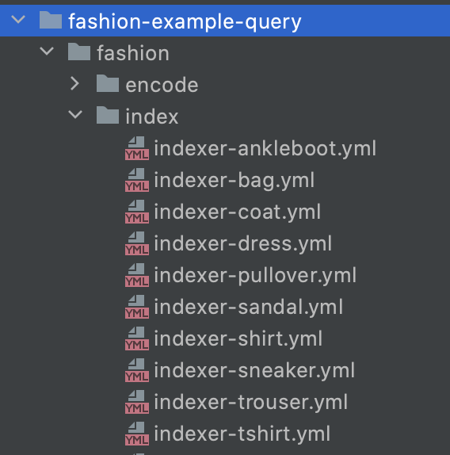
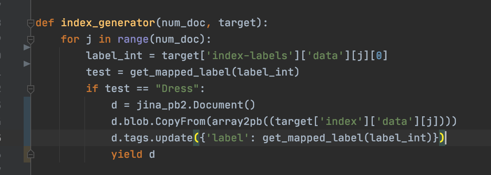
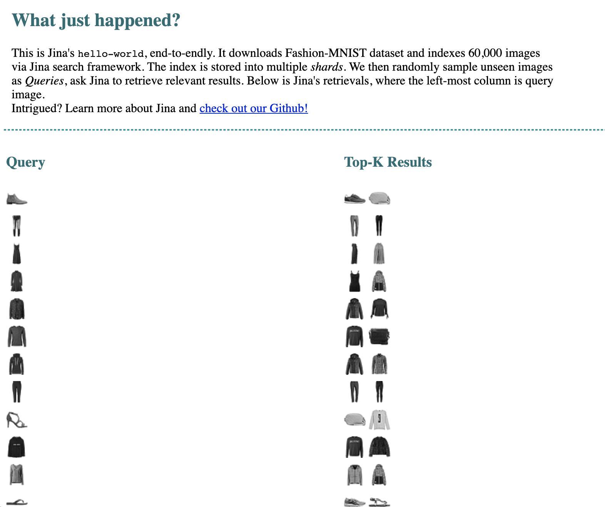

<!-- START doctoc generated TOC please keep comment here to allow auto update -->
<!-- DON'T EDIT THIS SECTION, INSTEAD RE-RUN doctoc TO UPDATE -->
**Table of Contents**

- [Run the Hello World example using query language](#run-the-hello-world-example-using-query-language)
  - [🗝️ Key Concepts](#-key-concepts)
  - [🏃 Run the Flows](#-run-the-flows)
  - [Results](#results)
  - [QueryLanguage](#querylanguage)

<!-- END doctoc generated TOC please keep comment here to allow auto update -->

# Run the Hello World example using query language

## 🗝️ Key Concepts

First of all, read up on [Jina 101](https://github.com/jina-ai/jina/tree/master/docs/chapters/101) so you have a clear understanding of how Jina works. We're going to refer to those concepts a lot. We assume you already have some knowledge of Python and machine learning.

This is an extension of the Hello World example, but here we use QueryLanguage to create an index per category and then, with that we can filter by category


### Install Requirements

In your terminal:

```
pip install -r requirements.txt
```


## 🏃 Run the Flows

Now that we've got the code to load our data, we're going to dive into writing our app and running our Flows!

### Index Flow

To run the index you type:

```bash
python app.py index
```
First up we need to build up an index and then we'll search through this index when we use the query Flow later.
So what is happening here?

There are 10 categories in the fashion-mnist-data

    0	        T-shirt/top
    1	        Trouser
    2	        Pullover
    3	        Dress
    4	        Coat
    5	        Sandal
    6	        Shirt
    7	        Sneaker
    8	        Bag
    9	        Ankle boot
    
What we are doing here is create a separate index per each category, so each category will have its own pod yml file. 
This will be done during index time so they all will be under the /index folder



We index the data updating updating the label

```
d.tags.update({'label': get_mapped_label(label_int)})
```
This is where you could tweak the code if you would like to see only one category.
For example if you would like to see only dresses, you could do something like this



Then we have ready all the indexes!


### Query Flow

Now for the query time, run:

```bash
python app.py query
```

## Results

This is an example of the results after the query using all categories




## QueryLanguage

So the real magic here, if you compare it with the original HelloWorld, is that we are using QueryLanguage.
This is happening in the index and query flow of each category, for example, for the ```indexer-dress.yml``` we have

```
IndexRequest:
      - !FilterQL
        with:
          lookups: {'tags__label': 'Dress'}
```

The key is the ```!FilterQL```, here we are filtering with some specific label, like Dress in this example.
