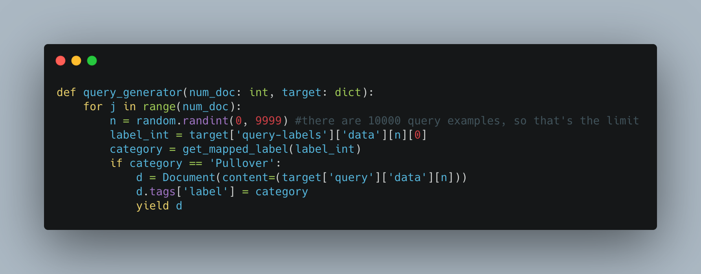

<!-- START doctoc generated TOC please keep comment here to allow auto update -->
<!-- DON'T EDIT THIS SECTION, INSTEAD RE-RUN doctoc TO UPDATE -->
**Table of Contents**

- [Run the Hello World example using query language](#run-the-hello-world-example-using-query-language)
  - [🗝️ Key Concepts](#️-key-concepts)
  - [🏃 Run the Flows](#-run-the-flows)
  - [🌟 Results](#results)
  - [🧞‍QueryLanguage](#querylanguage)

<!-- END doctoc generated TOC please keep comment here to allow auto update -->

# Run Fashion-MNIST Example Using Query Language

This is an extension of the Hello World example using QueryLanguage. 
We will use the FashionMNIST dataset to index and query. The dataset has different categories such as t-shirts, trousers, and pullovers. We will use QueryLanguage to create a different index per each category so we can query through them. 


## 🗝️ Expected knowledge 

1. Read up on [Jina 101](http://101.jina.ai). 
2. Python knowledge.
3. [Hello World Example](https://docs.jina.ai/chapters/helloworld/index.html) understanding.


### Install requirements

There are some requirements to run this example, to download everything you need, just run in your terminal:

```
pip install -r requirements.txt
```

## 🏃 Run the Flows

We usually need at least two Flows in Jina. One for Indexing and one for Querying. 

### Index Flow

First thing we need is to index our data, and we need a Flow to manage this. 

 ```python
def index(num_doc, target: dict):
    f = Flow.load_config('flows/index.yml')
    with f:
        f.index(index_generator(num_doc, target), request_size=2048)
 ```
      
There are 10 categories in the fashion-mnist-data, but to simplify this example we will only use 3 of them:

    0	        T-shirt/top
    1	        Trouser
    2	        Pullover
 
 We will create a separate index per category, so each category will have its own Yaml file. We can then index the data updating its label
 
 ```python
d.tags.update({'label': get_mapped_label(label_int)})
```
 
This is where you could tweak the code if you would like to see only one category. For example if you would like to see only pullovers, you could do something like this
 
 
 
 Then we have ready all the indexes!


You can run all this with the command:

```bash
python app.py -t index
```

### Query Flow

The query Flow is similar but it uses the  `query.yml ` file instead of `index.yml`

 ```python
def query(num_doc, target: dict):
    f = Flow.load_config('flows/query.yml')
    with f:
        f.search(query_generator(num_doc, target), shuffle=True, size=128,
                 on_done=print_result, request_size=32, top_k=TOP_K)
    write_html(os.path.join('./workspace', 'hello-world.html'))
 ```

To query just run:

```bash
python app.py -t query
```

## 🌟 Results

If you run this code as it is, you will see the results filtered by pullovers like this:


## 🧞 QueryLanguage

If you compare this with the original [Hello World Example](https://docs.jina.ai/chapters/helloworld/index.html), you will see that the only difference is that we are using QueryLanguage.
This is happening in the index and query flow of each category, for example, for the ```indexer-pullover.yml``` we have

```
IndexRequest:
      - !FilterQL
        with:
          lookups: {'tags__label': 'pullover'}
```

The key is the ```!FilterQL```, here we are filtering with some specific label, like pullover in this example.
