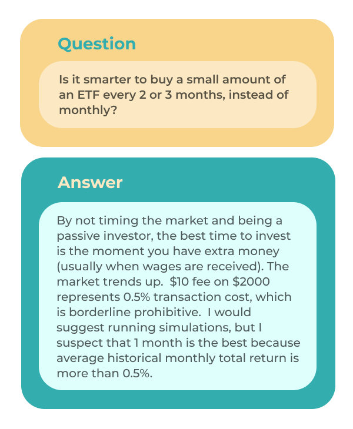
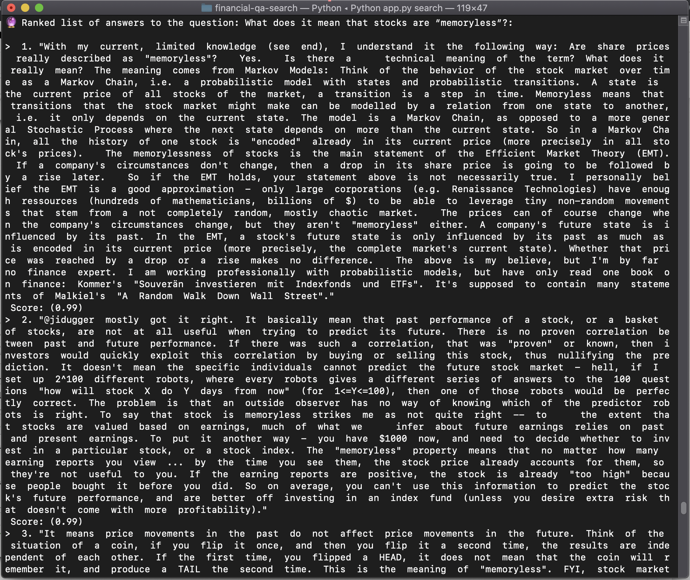

<p align="center">
 
[](https://jina.ai)
[](https://github.com/jina-ai/jina#jina-hello-world-)
[](#license)
[](https://docs.jina.ai)
[](https://jobs.jina.ai)
<a href="https://twitter.com/intent/tweet?text=%F0%9F%91%8DCheck+out+Jina%3A+the+New+Open-Source+Solution+for+Neural+Information+Retrieval+%F0%9F%94%8D%40JinaAI_&url=https%3A%2F%2Fgithub.com%2Fjina-ai%2Fjina&hashtags=JinaSearch&original_referer=http%3A%2F%2Fgithub.com%2F&tw_p=tweetbutton" target="_blank">
  </img>
</a>
[](#)
[](https://hub.docker.com/r/jinaai/jina/tags)

</p>

# BERT-based Financial Question Answering System

In this example, we use Jina, PyTorch, and [Hugging Face transformers](https://github.com/huggingface/transformers) to build a production-ready
BERT-based Financial Question Answering System.
We adapt a [passage reranking](https://arxiv.org/pdf/1901.04085.pdf) approach by first retrieving the top-50 candidate answers,
then reranking the candidate answers using [FinBERT-QA](https://github.com/yuanbit/FinBERT-QA), a BERT-based model fine-tuned on
the [FiQA](https://sites.google.com/view/fiqa/home) dataset that achieved the state-of-the-art results.

**🦉 Please refer to this [tutorial](https://github.com/jina-ai/_homepage/blob/posts-financial-qa-tutorial/_posts/2020-12-14-financial-qa-tutorial.md)
for a step-by-step guide and detailed explanations.**

<p align="center">

</p>

## Motivation
Motivated by the emerging demand in the financial industry for 
the automatic analysis of unstructured and structured data at scale, QA systems can provide lucrative and competitive 
advantages to companies by facilitating the decision making of financial advisers. The goal of our system is to
search for a list of relevant answer passages given a question. Here is an example of a question and a ground
truth answer from the [FiQA](https://sites.google.com/view/fiqa/home) dataset:

<p align="center">

</p>

## Set up

### Clone:

```
git clone https://github.com/jina-ai/examples.git
```

We will use ```financial-qa-search/``` as our working directory. 

### Install:

```pip install -r requirements.txt```

### Download data and model:

```bash get_data.sh```

## Index Answers

We want to index a subset of the answer passages from the FiQA dataset, ```dataset/test_answers.csv```:
```
398960	From  http://financial-dictionary.thefreedictionary.com/Business+Fundamentals  The  facts  that  affect  a  company's      underlying  value.  Examples  of  business      fundamentals  include  debt,  cash  flow,      supply  of  and  demand  for  the  company's      products,  and  so  forth.  For  instance,      if  a  company  does  not  have  a      sufficient  supply  of  products,  it  will      fail.  Likewise,  demand  for  the  product      must  remain  at  a  certain  level  in      order  for  it  to  be  successful.  Strong      business  fundamentals  are  considered      essential  for  long-term  success  and      stability.  See  also:  Value  Investing,      Fundamental  Analysis.  For  a  stock  the  basic  fundamentals  are  the  second  column  of  numbers  you  see  on  the  google  finance  summary  page,    P/E  ratio,  div/yeild,  EPS,  shares,  beta.      For  the  company  itself  it's  generally  the  stuff  on  the  'financials'  link    (e.g.  things  in  the  quarterly  and  annual  report,    debt,  liabilities,  assets,  earnings,  profit  etc.
19183	If  your  sole  proprietorship  losses  exceed  all  other  sources  of  taxable  income,  then  you  have  what's  called  a  Net  Operating  Loss  (NOL).  You  will  have  the  option  to  "carry  back"  and  amend  a  return  you  filed  in  the  last  2  years  where  you  owed  tax,  or  you  can  "carry  forward"  the  losses  and  decrease  your  taxes  in  a  future  year,  up  to  20  years  in  the  future.  For  more  information  see  the  IRS  links  for  NOL.  Note:  it's  important  to  make  sure  you  file  the  NOL  correctly  so  I'd  advise  speaking  with  an  accountant.  (Especially  if  the  loss  is  greater  than  the  cost  of  the  accountant...)
327002	To  be  deductible,  a  business  expense  must  be  both  ordinary  and  necessary.  An  ordinary  expense  is  one  that  is  common  and  accepted  in  your  trade  or  business.  A  necessary  expense  is  one  that  is  helpful  and  appropriate  for  your  trade  or  business.  An  expense  does  not  have  to  be  indispensable  to  be  considered  necessary.    (IRS,  Deducting  Business  Expenses)  It  seems  to  me  you'd  have  a  hard  time  convincing  an  auditor  that  this  is  the  case.    Since  business  don't  commonly  own  cars  for  the  sole  purpose  of  housing  $25  computers,  you'd  have  trouble  with  the  "ordinary"  test.    And  since  there  are  lots  of  other  ways  to  house  a  computer  other  than  a  car,  "necessary"  seems  problematic  also.
```

You can change the path to ```answer_collection.tsv``` to index with the full dataset.

### Run
```
python app.py index
```

[](https://asciinema.org/a/RDQvKPeibRRURYtpQWqmkCUsH)

At the end you will see the following:

```
✅ done in ⏱ 1 minute and 54 seconds 🐎 7.7/s
        gateway@18904[S]:terminated
    doc_indexer@18903[I]:recv ControlRequest from ctl▸doc_indexer▸⚐
    doc_indexer@18903[I]:Terminating loop requested by terminate signal RequestLoopEnd()
    doc_indexer@18903[I]:#sent: 56 #recv: 56 sent_size: 1.7 MB recv_size: 1.7 MB
    doc_indexer@18903[I]:request loop ended, tearing down ...
    doc_indexer@18903[I]:indexer size: 865 physical size: 3.1 MB
    doc_indexer@18903[S]:artifacts of this executor (vecidx) is persisted to ./workspace/doc_compound_indexer-0/vecidx.bin
    doc_indexer@18903[I]:indexer size: 865 physical size: 3.2 MB
    doc_indexer@18903[S]:artifacts of this executor (docidx) is persisted to ./workspace/doc_compound_indexer-0/docidx.bin
```

## Search Answers

We need to build a custom Executor to rerank the top-50 candidate answers. We can do this with the Jina Hub API.
Let's get make sure that the Jina Hub extension is installed:

```pip install "jina[hub]"```

We can build the custom Ranker, ```FinBertQARanker``` by running:

```jina hub build FinBertQARanker/ --pull --test-uses --timeout-ready 60000```

### Run

We can now use our Financial QA search engine by running:

```python app.py search```

The Ranker might take some time to compute the relevancy scores since it is using a BERT-based model. 
You can try out this list of questions from the [FiQA](https://sites.google.com/view/fiqa/home) dataset:

```
• What does it mean that stocks are “memoryless”?
• What would a stock be worth if dividends did not exist?
• What are the risks of Dividend-yielding stocks?
• Why do financial institutions charge so much to convert currency?
• Is there a candlestick pattern that guarantees any kind of future profit?
• 15 year mortgage vs 30 year paid off in 15
• Why is it rational to pay out a dividend?
• Why do companies have a fiscal year different from the calendar year?
• What should I look at before investing in a start-up?
• Where do large corporations store their massive amounts of cash?
```

<p align="center">

</p>

## Community

- [Slack channel](https://join.slack.com/t/jina-ai/shared_invite/zt-dkl7x8p0-rVCv~3Fdc3~Dpwx7T7XG8w) - a communication platform for developers to discuss Jina
- [Community newsletter](mailto:newsletter+subscribe@jina.ai) - subscribe to the latest update, release and event news of Jina
- [LinkedIn](https://www.linkedin.com/company/jinaai/) - get to know Jina AI as a company and find job opportunities
- [](https://twitter.com/JinaAI_) - follow us and interact with us using hashtag `#JinaSearch`  
- [Company](https://jina.ai) - know more about our company, we are fully committed to open-source!

## License

Copyright (c) 2021 Jina's friend. All rights reserved.


