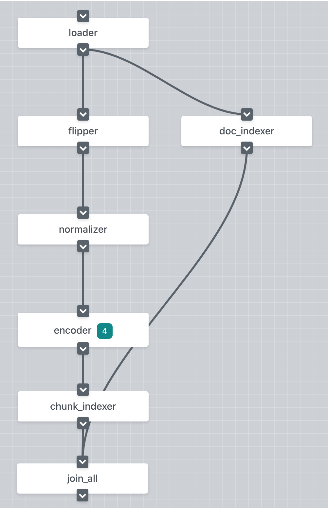

# Build an Image Search System in 3 minutes
<p align="center">
 
[](https://jina.ai)
[](https://github.com/jina-ai/jina#jina-hello-world-)
[](#license)
[](https://docs.jina.ai)
[](https://jobs.jina.ai)
<a href="https://twitter.com/intent/tweet?text=%F0%9F%91%8DCheck+out+Jina%3A+the+New+Open-Source+Solution+for+Neural+Information+Retrieval+%F0%9F%94%8D%40JinaAI_&url=https%3A%2F%2Fgithub.com%2Fjina-ai%2Fjina&hashtags=JinaSearch&original_referer=http%3A%2F%2Fgithub.com%2F&tw_p=tweetbutton" target="_blank">
  </img>
</a>
[](#)
[](https://hub.docker.com/r/jinaai/jina/tags)

</p>

In this example, we'll use the [17flowers dataset](http://www.robots.ox.ac.uk/~vgg/data/flowers/17/) to build a flower image search system to find similar images. Make sure you've gone through [Jina 101](https://github.com/jina-ai/jina/tree/master/docs/chapters/101) and understood the [take-home-message](https://github.com/jina-ai/examples/tree/master/urbandict-search#wrap-up) in our [bert-based semantic search example](https://github.com/jina-ai/examples/tree/master/urbandict-search) before moving on. 

  


<!-- START doctoc generated TOC please keep comment here to allow auto update -->
<!-- DON'T EDIT THIS SECTION, INSTEAD RE-RUN doctoc TO UPDATE -->
**Table of Contents**

- [Overview](#overview)
- [Prerequirements](#prerequirements)
- [Prepare the data](#prepare-the-data)
- [Define the Flows](#define-the-flows)
- [Run the Flows](#run-the-flows)
- [Add a Customized Executor](#add-a-customized-executor)
- [Wrap Up](#wrap-up)
- [Next Steps](#next-steps)
- [Similar Examples](#similar-examples)
- [Documentation](#documentation)
- [Community](#community)
- [License](#license)

<!-- END doctoc generated TOC please keep comment here to allow auto update -->


## Overview

Our overall design is similar to the [semantic search example](https://github.com/jina-ai/examples/tree/master/southpark-search). We consider each image as a Document and put the RGB array in the Chunk. Therefore, each Document has one single Chunk. The pre-trained `mobilenet_v2` model from the `torchvision` library is used to encode the Chunks into vectors. 

In this example, we'll show how to run the Pods in a Docker container and how to scale up the Pods to speed up the whole procedure. Plus, you'll learn to define your own Executor in your project. Sounds interesting? Let's get coding!

<p align="center">
  
</p>

<details>
<summary>Click here to see the query outputs</summary>

<p align="center">
  
</p>

</details> 

## Prerequirements

This example requires Python 3.7.

```bash
cd flower-search
pip install --upgrade -r requirements.txt
```


## Prepare the data
In total, there are 1,360 images in 17 categories in the [17flowers](http://www.robots.ox.ac.uk/~vgg/data/flowers/17/) dataset. The following script downloads the data and decompresses it into `/tmp/jina/flower/jpg`.

```bash
bash ./get_data.sh
```

## Define the Flows

We start by defining the index and query Flows with the YAML files as follows. If you find the YAML files a bit confusing, we suggest you go through our [bert-based semantic search example](https://github.com/jina-ai/examples/tree/master/urbandict-search) before moving forwards.

<table style="margin-left:auto;margin-right:auto;">
<tr>
<td> </td>
<td> YAML</td>
<td> Dashboard </td>

</tr>
<tr>
<td> Index Flow </td>
<td>
  <sub>

```yaml
!Flow
metas:
  prefetch: 10
pods:
  loader:
    uses: yaml/craft-load.yml
    parallel: 4
    read_only: true
  normalizer:
    uses: yaml/craft-normalize.yml
    parallel: 4
    read_only: true
  encoder:
    uses: jinaai/hub.executors.encoders.image.torchvision-mobilenet_v2
    parallel: 4
    timeout_ready: 600000
    read_only: true
  chunk_indexer:
    uses: yaml/index-chunk.yml
    shards: 2
    separated_workspace: true
  doc_indexer:
    uses: yaml/index-doc.yml
    needs: loader
  join_all:
    uses: _merge
    needs: [doc_indexer, chunk_indexer]
    read_only: true
```

</sub>

</td>
<td>

</td>
</tr>
<tr>
<td> Query Flow </td>
<td>
  <sub>

```yaml
!Flow
with:
  read_only: true
  port_expose: $JINA_PORT
pods:
  loader:
    uses: yaml/craft-load.yml
    read_only: true
  normalizer:
    uses: yaml/craft-normalize.yml
    read_only: true
  encoder:
    uses: jinaai/hub.executors.encoders.image.torchvision-mobilenet_v2
    timeout_ready: 600000
    read_only: true
  chunk_indexer:
    uses: yaml/index-chunk.yml
    separated_workspace: true
    polling: all
    uses_reducing: _merge_all
  ranker:
    uses: MinRanker
  doc_indexer:
    uses: yaml/index-doc.yml
```

</sub>

</td>
<td>

</td>

</tr>
</table>

Let's look at the index Flow: Just like the [bert-based semantic search example](https://github.com/jina-ai/examples/tree/master/urbandict-search), we define a double-pathway Flow for indexing. For each image, we put the image filename in the request message and thus each image is considered as a Document. The `loader` Pod reads the file and saves the image's RGB values into the Chunk. Note that in this case, we have only one Chunk per Document. 

Next, the Flow splits into two parallel pathways. In the pathway on the left side, the `normalizer` Pod resizes and normalizes the image in the Chunk so that it can be properly handled in the downstream Pods. This is followed by the `encoder`, in which Chunks are encoded into vectors, which will be further saved into the index by the `chunk_indexer` Pod. 

In the other pathway, the `doc_indexer` Pod uses key-value storage to save the Document IDs and Document contents, i.e. the image filenames. At the end, the `join_all` Pod merges the results from `chunk_indexer` and `doc_indexer`. In this case, the `join_all` Pod simply waits for both incoming messages to arrive because neither of the upstream Pods writes into the request message.

The double-pathway Flow is a common practice in Jina and is designed to store vectors and Documents independently and in parallel. Of course, you could squeeze the two pathways into one by concatenating the `doc_indexer` after the `chunk_indexer` and removing the `join_all` Pod. However, this would slow down the indexing process. 

As for the query Flow, it's pretty much the same as the index Flow, so we won't go into it too much. 

You might notice that there's something new in the YAML files. Let's dig into them!

### Hello, Docker!🐳
In our YAML file, we've added the `encoder` Pod differently from the other Pods. Instead of using YAML to configure the Pod, we define the `encoder` with a Docker image using the same `uses` argument, which automatically tells whether the input is a YAML file or a Docker image. This runs the `encoder` Pod in a Docker container. This is one of the key features of Jina: by wrapping Pods into a Docker image, we can safely forget about complicated dependencies and environment settings needed to run the Pod. 


```yaml
!Flow
pods:
  encoder:
    uses: jinaai/hub.executors.encoders.image.torchvision-mobilenet_v2
```

Back to our example, here we use the Docker image containing the pre-trained `mobilenet_v2` model from the `torchvision` lib. So that you do **NOT** need to install the `torchvision` lib or download a pre-trained model. Everything is packed into the Docker image. As long as you have Docker installed, the container Pods will run out-of-the-box.

### Dockerfile

```docker
FROM pytorch/pytorch:latest

RUN pip install jina==0.4.1 uvloop
RUN python -c "import torchvision.models as models; models.mobilenet_v2(pretrained=True)"

ENTRYPOINT ["jina", "pod", "--uses", "ImageTorchEncoder"]
```

The docker can be made from jina[devel] or any other image (pytorch in this case). We add dependancies such as jina , uvloop etc. The model weights are downloaded and cached in the 'RUN python -c ...' command. The entrypoint runs this container as a jina pod. All arguments of jina pod can be overridden during runtime(such as specifying another yaml file).

We build this docker using the following command :


```bash
docker build -t jinaai/hub.executors.encoders.image.torchvision-mobilenet_v2 .
```

Once built, we can pass this image tag to the Flow API.


### Scale up 
Another newcomer is the `parallel` argument. As its name implies, `parallel` defines the number of parallel Peas in a Pod that can run at the same time. This is useful for scaling up your service. In this example, as the encoding procedure with the deep-learning models is well-known to be slow, we set the `parallel` to 4, thus starting 4 Peas to encode the Chunks in parallel. This greatly speeds up the indexing process.

```yaml
!Flow
pods:
  encoder:
    uses: jinaai/hub.executors.encoders.image.torchvision-mobilenet_v2
    parallel: 4
```


## Run the Flows
### Index 
Now we start indexing with the following command.
 
```bash
python app.py -t index
```

If you run into the following `TimeoutError` as shown below, it's probably because the Docker image is too large to download in time. Please try `docker pull jinaai/hub.executors.encoders.image.torchvision-mobilenet_v2` to download the image before running the Flow.

```bash 
TimeoutError: <class 'jina.peapods.container.ContainerPea'> with name encoder can not be initialized after 600000 ms
```

<details>
<summary>Click here to see the console output</summary>

<p align="center">
  
</p>

</details> 

Here we use a YAML file to define a Flow and use it to index the data. The `index_file()` function loads the local files into the format of `bytes`, which will be further wrapped in an `IndexRequest` and sent to the Flow. 

```python
data_path = '/tmp/jina/flower/jpg'
f = Flow().load_config('flow-index.yml')
with f:
    f.index_files(f'{data_path}/*.jpg', size=num_docs, read_mode='rb', batch_size=2)
```

### Query

```bash
python app.py -t query
```
In this case, we expose the RESTful APIs and use jinabox to visualize the results. Open [https://jina.ai/jinabox.js/](https://jina.ai/jinabox.js/) in your brower, and replace the server endpoint with `http://localhost:45678/api/search`. If you want to learn more about jinabox, please check out [https://github.com/jina-ai/jinabox.js](https://github.com/jina-ai/jinabox.js).


<details>
<summary>Click here to see the console output</summary>

<p align="center">
  
</p>

</details> 

For querying, we build the Flow and run it in the `block` mode so that it will stand by and listen to the port:

```python
f = Flow().load_config('flow-query.yml')
f.use_rest_gateway()
with f:
    f.block()
```

Congratulations! Now you have an image search engine working. We won't go into too much details of the Pods' YAML files because they are quite self-explanatory. If you feel a bit lost when reading the YAML files, please check the [bert-based semantic search example](https://github.com/jina-ai/examples/tree/master/urbandict-search#dive-into-the-pods).

## Add a Customized Executor
Although we have an image search engine, there are still dozens of ways to make it better. One common method is to flip the images and index the flipped versions as well as the original, so that we can retrieve similar images even when the query image is flipped.

We start by adding a new Pod called `flipper`, to our Flow. 

<table style="margin-left:auto;margin-right:auto;">
<tr>
<td> </td>
<td> YAML</td>
<td> Dashboard </td>

</tr>
<tr>
<td> Index Flow </td>
<td>
  <sub>

```yaml
!Flow
metas:
  prefetch: 10
pods:
  loader:
    uses: yaml/craft-load.yml
    parallel: 4
    read_only: true
  flipper:
    uses: yaml/craft-flip.yml
    parallel: 4
    read_only: true
  normalizer:
    uses: yaml/craft-normalize.yml
    parallel: 4
    read_only: true
  encoder:
    uses: jinaai/hub.executors.encoders.image.torchvision-mobilenet_v2
    parallel: 4
    timeout_ready: 600000
    read_only: true
  chunk_indexer:
    uses: yaml/index-chunk.yml
    shards: 2
    separated_workspace: true
  doc_indexer:
    uses: yaml/index-doc.yml
    needs: loader
  join_all:
    uses: _merge
    needs: [doc_indexer, chunk_indexer]
    read_only: true
```

</sub>

</td>
<td>

</td>
</tr>
<tr>
<td> Query Flow </td>
<td>
  <sub>

```yaml
!Flow
with:
  read_only: true
  port_expose: $JINA_PORT
pods:
  loader:
    uses: yaml/craft-load.yml
    read_only: true
  flipper:
    uses: yaml/craft-flip.yml
    read_only: true
  normalizer:
    uses: yaml/craft-normalize.yml
    read_only: true
  encoder:
    uses: jinaai/hub.executors.encoders.image.torchvision-mobilenet_v2
    timeout_ready: 600000
    read_only: true
  chunk_indexer:
    uses: yaml/index-chunk.yml
    separated_workspace: true
    polling: all
    uses_reducing: _merge_all
  ranker:
    uses: MinRanker
  doc_indexer:
    uses: yaml/index-doc.yml
```

</sub>

</td>
<td>

</td>

</tr>
</table>

As stated in the Flow's YAML file, the `flipper` Pod is configured in `yaml/craft-flip.yml`. Let's create this YAML file as follows. For the `flipper` Pod, we use an Executor with the name `ImageFlipper`, which we'll create in the next step. 

```yaml
!ImageFlipper
metas:
  py_modules: customized_executors.py
with:
  channel_axis: 0
requests:
  on:
    [SearchRequest, IndexRequest]:
      - !CraftDriver
        with:
          method: craft

```

In the YAML file, we define the Pod to behave in the same way on both `SearchRequest` and `IndexRequest`. In both cases, the Pod will use the `CraftDriver` to prepare the request data for the `ImageFlipper` and call the `craft()` function of the `ImageFlipper` to process the data.

The `py_modules` argument under the `metas` field specifies the file in which the Executor is implemented. Therefore we can now move onto the `customized_executors.py` and implement `ImageFlipper`.

```python
import numpy as np
from jina.executors.crafters.image import ImageChunkCrafter
from PIL import ImageOps


class ImageFlipper(ImageChunkCrafter):
    def craft(self, blob, doc_id, *args, **kwargs):
        raw_img = self.load_image(blob)
        _img = ImageOps.mirror(raw_img)
        img = self.restore_channel_axis(np.asarray(_img))
        return [{'doc_id': doc_id, 'blob': img.astype('float32')}, ]
```

In this case, we need to inherit from `ImageChunkCrafter` because we've saved the images in the Chunks of the requests.

> `ImageChunkCrafter` provides the basic functions for processing image data at the Chunk-level.

Here comes the code: 

The `load_image()` function from `ImageChunkCrafter` loads the image array and returns a `PIL.Image` object. With the `PIL.Image` object, we can simply call the `mirror()` function to flip the images. Note we need to restore the color channel by calling the `restore_channel_axis()` function. This is because the `PIL.Image` always puts the color channel in the last axis. In contrast, the input images might use a different axis for the color channel, which is defined in the YAML file by the `channel_axis`.
  
Finally, our customized Executor is ready to go. Let's check the results. Interestingly, the top1 matched image is no longer always the query image itself. The flipped image in the Chunks somehow disturbs the retrieval process.

<details>
<summary>Click here to see the console output</summary>

<p align="center">
  
</p>

</details> 

## Wrap Up
Hooray! Now you've got a pretty simple flower image search engine working. Let's wrap up what we've covered in this example.

1. Pods can use a Docker image and run in a Docker container. 
2. The `parallel` argument lets you quickly scale up the Pods.
3. Pods can use user-defined Executors.  

## Next Steps

- Write your own executors.
<!---
- Check out the Docker images at Jina hub.
--->
- Try similar examples.

## Similar Examples

The flow design of following examples are very similar to the flower example. Please use an analogous way to take a try.

### Face-db-search

In this demo, we used the Labeled Faces in the Wild (LFW) Dataset data from [http://vis-www.cs.umass.edu/lfw/lfw.tgz](http://vis-www.cs.umass.edu/lfw/#download) to build a face search system.

<p align="center">
  
</p>

To reproduce this example, one can use the following codes:

```bash
cd face-db-seach
pip install --upgrade -r requirements.txt
bash ./get_data.sh
python app.py index
python app.py query
```


## Documentation 

<a href="https://docs.jina.ai/">

</a>

The best way to learn Jina in-depth is to read our documentation. Documentation is built on every push, merge, and release event of the master branch. For more details, check out:

- [Jina command line interface arguments explained](https://docs.jina.ai/chapters/cli/index.html)
- [Jina Python API interface](https://docs.jina.ai/api/jina.html)
- [Jina YAML syntax for executor, driver and flow](https://docs.jina.ai/chapters/yaml/yaml.html)
- [Jina Protobuf schema](https://docs.jina.ai/chapters/proto/index.html)
- [Environment variables used in Jina](https://docs.jina.ai/chapters/envs.html)
- ... [and more](https://docs.jina.ai/index.html)

## Community

- [Slack channel](https://join.slack.com/t/jina-ai/shared_invite/zt-dkl7x8p0-rVCv~3Fdc3~Dpwx7T7XG8w) - a communication platform for developers to discuss Jina
- [Community newsletter](mailto:newsletter+subscribe@jina.ai) - subscribe to the latest update, release and event news of Jina
- [LinkedIn](https://www.linkedin.com/company/jinaai/) - get to know Jina AI as a company and find job opportunities
- [](https://twitter.com/JinaAI_) - follow us and interact with us using hashtag `#JinaSearch`  
- [Company](https://jina.ai) - know more about our company, we are fully committed to open-source!


## License

Copyright (c) 2020 Jina AI Limited. All rights reserved.

Jina is licensed under the Apache License, Version 2.0. See [LICENSE](https://github.com/jina-ai/jina/blob/master/LICENSE) for the full license text.
