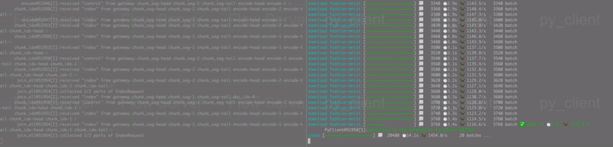

# Jina "Hello, World" in Client-Server Architecture

<p align="center">
 
[](https://jina.ai)

[](https://github.com/jina-ai/jina#jina-hello-world-)
[](#license)
[](https://docs.jina.ai)
[](https://jobs.jina.ai)
<a href="https://twitter.com/intent/tweet?text=%F0%9F%91%8DCheck+out+Jina%3A+the+New+Open-Source+Solution+for+Neural+Information+Retrieval+%F0%9F%94%8D%40JinaAI_&url=https%3A%2F%2Fgithub.com%2Fjina-ai%2Fjina&hashtags=JinaSearch&original_referer=http%3A%2F%2Fgithub.com%2F&tw_p=tweetbutton" target="_blank">
  </img>
</a>
[](#)
[](https://hub.docker.com/r/jinaai/jina/tags)

</p>

After playing with `jina hello-world` and reading its code, you may wonder if one can decouple the Flow and the send/receive part. It is particularly interesting in production, as one may run the Flow on one instance, whereas the request sending/receiving is from another.



In this example, we will refactor the hello-world example into client-server architecture by using `py_client`.

<!-- START doctoc generated TOC please keep comment here to allow auto update -->
<!-- DON'T EDIT THIS SECTION, INSTEAD RE-RUN doctoc TO UPDATE -->
**Table of Contents**

- [Flow as a Service](#flow-as-a-service)
- [Start the Client](#start-the-client)
- [Take home message](#take-home-message)
- [Documentation](#documentation)
- [Community](#community)
- [License](#license)

<!-- END doctoc generated TOC please keep comment here to allow auto update -->


## Flow as a Service

The complete server-side code can be found in [server.py](server.py). The key is to start the Flow and then hangs in there forever, dropping the request sending part. 

```python
f = Flow.load_config(args.index_uses)
with f:
    f.block()
```

Here we use `f.block()`, it is much more efficient way comparing to `while True: pass`.


You can start the server via:

```bash
python server.py
```

It will start the Flow and stop at

```text
Flow@50431[I]:6 Pods (i.e. 15 Peas) are running in this Flow
Flow@50431[S]:flow is now ready for use, current build_level is GRAPH
JINA@50431[S]:hello-world server is started at 0.0.0.0:58596, you can now use "python client.py --port-expose 58596 --host 0.0.0.0" to send request!
```

`58596` is the port number we need to write down as it will be used on the client side. 

At any time, you can do `Ctrl+C` to terminate the server.

## Start the Client

The complete client-side code can be found in [client.py](client.py).

On the client side, we simply use `py_client` to connect to the server that we just launched. 

`host` and `port_expose` are the most important arguments in the client.

```python
from jina.clients import py_client
from jina.clients.python.io import input_numpy

py_client(port_expose=args.port_expose, host=args.host).index(
        input_numpy(targets['index']['data']), batch_size=args.index_batch_size)
```

You can now start the client via:

```bash
python client.py --port-expose 58596
```

Notice: this 58596 is not a fixed number. Please refer to the server side and find the port number there.

In this example, our Flow and Client are on the same machine, so no host address is required. If you are running Flow remotely, please also add the remote IP address to `--host` and make sure the `port-expose` is set to public in the remote security group.

It will show the progress bar on client side while indexing

```bash
PyClient@51641[S]:connected to the gateway at localhost:58596!
index [====================] 📃  20480 ⏱️ 11.4s 🐎 1796.8/s     20 batchx ...
index [====================] 📃  40960 ⏱️ 22.1s 🐎 1855.7/s     40 batch
index [=================== ] 📃  60416 ⏱️ 31.9s 🐎 1893.5/s     59 batch    [31.919 secs]
	✅ done in ⏱ 31.9s 🐎 1892.8/s
PyClient@51641[S]:terminated
```

And that's how you use Flow in a C/S manner. Pretty easy right?

## Take home message

- ###### Use `with` context manager and `block()` to start a Flow
- Use `py_client` to connect to a Flow with proper `host` and `port_expose`
- **You can also start a Flow directly from the console, check out `jina flow --help` for more details.**


I'm leaving the query part of this example as a homework.


## Documentation 

<a href="https://docs.jina.ai/">

</a>

The best way to learn Jina in depth is to read our documentation. Documentation is built on every push, merge, and release event of the master branch. You can find more details about the following topics in our documentation.

- [Jina command line interface arguments explained](https://docs.jina.ai/chapters/cli/index.html)
- [Jina Python API interface](https://docs.jina.ai/api/jina.html)
- [Jina YAML syntax for executor, driver and flow](https://docs.jina.ai/chapters/yaml/yaml.html)
- [Jina Protobuf schema](https://docs.jina.ai/chapters/proto/index.html)
- [Environment variables used in Jina](https://docs.jina.ai/chapters/envs.html)
- ... [and more](https://docs.jina.ai/index.html)

## Community

- [Slack channel](https://join.slack.com/t/jina-ai/shared_invite/zt-dkl7x8p0-rVCv~3Fdc3~Dpwx7T7XG8w) - a communication platform for developers to discuss Jina
- [Community newsletter](mailto:newsletter+subscribe@jina.ai) - subscribe to the latest update, release and event news of Jina
- [LinkedIn](https://www.linkedin.com/company/jinaai/) - get to know Jina AI as a company and find job opportunities
- [](https://twitter.com/JinaAI_) - follow us and interact with us using hashtag `#JinaSearch`  
- [Company](https://jina.ai) - know more about our company, we are fully committed to open-source!


## License

Copyright (c) 2020 Jina AI Limited. All rights reserved.

Jina is licensed under the Apache License, Version 2.0. See [LICENSE](https://github.com/jina-ai/jina/blob/master/LICENSE) for the full license text.


