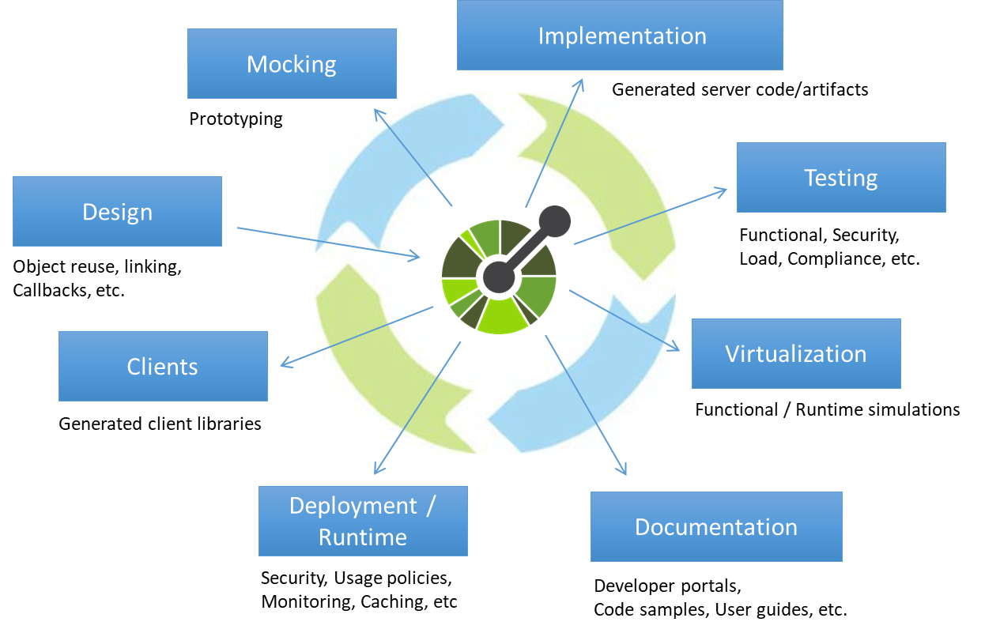

# openapi example

[]
> try better api design with openapi.



## Api design

### online

http://editor.swagger.io/

### local
```sh
docker run -d -p 80:8080 swaggerapi/swagger-editor
```

## code-generate
### none additional-properties
OS X & Linux:

```sh
openapi-generator generate -g python-flask -o python-flask -i jinaai.yaml
```

### use additional-properties

```sh
openapi-generator generate -g python-flask --additional-properties=prependFormOrBodyParameters=true \
    -o python-flask -i jinaai.yaml
```

### unit test the generated codebase

#### install tox 
```sh
pip install tox
```

## intergrate jina api in openapi controller


### python-flask/openapi_server/controllers/doc_controller.py
```sh
def doc_index_get(port_grpc, host_grpc):  # noqa: E501
    """index with an flow

    index with default flow yaml file # noqa: E501

    :param port_grpc: port number of grpc
    :type port_grpc: int
    :param host_grpc: host ip address of grpc
    :type host_grpc: int

    :rtype: ApiResponse
    """
    return 'do some magic!'

```

```sh
def doc_query_get(port_grpc, host_grpc, batch_size):  # noqa: E501
    """query indexed result

    querying # noqa: E501

    :param port_grpc: port number of grpc
    :type port_grpc: int
    :param host_grpc: host ip address of grpc
    :type host_grpc: int
    :param batch_size: batch size of index
    :type batch_size: int

    :rtype: None
    """
    return 'do some magic!'
```

_For more examples and usage, please refer to the [https://docs.jina.ai/chapters/io/main.html]._

## Development setup
.
```sh
pip install tox
```
if unittest passed and codecoveage satisfied then we go to jina api implements

### dockerize openapi

```sh
docker build -t localhost/jinaai-open-api . 
```
### docker run openapi
```sh
docker run -p 80:8080 localhost/jinaai-open-api
```
Finally review your openapi at localhost.

