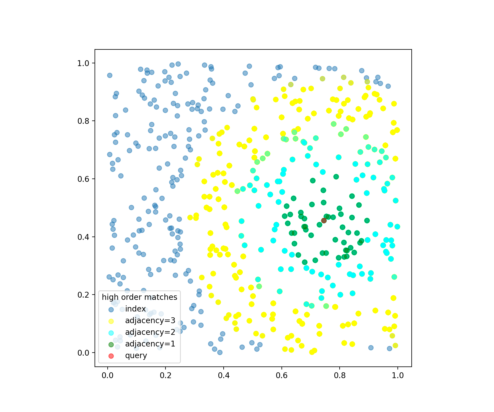

<!-- START doctoc generated TOC please keep comment here to allow auto update -->
<!-- DON'T EDIT THIS SECTION, INSTEAD RE-RUN doctoc TO UPDATE -->
**Table of Contents**

- [Retrieving High-order Matches](#retrieving-high-order-matches)
  - [Prerequisite](#prerequisite)
  - [Run & Plot](#run--plot)
  - [Understand the YAML](#understand-the-yaml)

<!-- END doctoc generated TOC please keep comment here to allow auto update -->

# Retrieving High-order Matches

New feature since `0.5.0`.



## Prerequisite 
```bash
pip install -r requirements.txt
```

## Run & Plot

```bash
python app.py
```


## Understand the YAML

After it searches for the first shot, it recursively searches on matches. Each time retrieves top-50.

```yaml
SearchRequest:
  - !VectorSearchDriver
    with:
      top_k: 50
      fill_embedding: true
  - !VectorSearchDriver
    with:
      top_k: 50
      fill_embedding: true
      recur_on: matches
      recur_range: [ 0, 2 ]
```