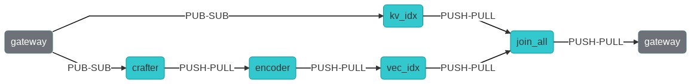
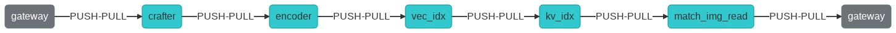

# Search Pokemon Images with Jina

In this example, we use [BiT (Big Transfer)](https://github.com/google-research/big_transfer), to build an end-to-end **neural image search** system. You can use this demo to index an image dataset and query the most similar image from it.

## Table of contents
 
 - [Overview](#overview)
- [🐍 Build the app with Python](#-build-the-app-with-python)
- [🔮 Overview of the files in this example](#-overview-of-the-files-in-this-example)
- [🌀 Flow diagram](#-flow-diagram)
- [🔨 Next steps, building your own app](#-next-steps-building-your-own-app)
- [🐳 Deploy the prebuild application using Docker](#-deploy-the-prebuild-application-using-docker)
- [🙍 Community](#-community)
- [🦄 License](#-license)


## Overview
|  |  |
| ------------- | ------------- |
| Learnings | *When running this example, you can learn how to create a jina image search* |
| Data for indexing | *Pokemon sprites from [veekun.com](https://veekun.com/dex/downloads)* |
| Data for querying | *An image* |
| Dataset used | *[Veekun Pokemon Sprites](https://veekun.com/static/pokedex/downloads/)* |
| Model used | *[Resnet R50x1 BiT(Big Transfer) model](https://tfhub.dev/google/bit/m-r50x1/imagenet21k_classification/1) trained on Imagenet21k* |


## 🐍 Build the app with Python

These instructions explain how to build the example yourself and deploy it with Python. If you want to skip the building steps and just run the example with Docker, check [the Docker deployment instructions at the end of this README](#deploy-with-docker)  


### 🗝️ Requirements

For example:

1. You have a working Python 3.8 or 3.9 development environment. (To install: ```apt install python3.8 python3.8-dev python3.8-venv```) 
2. We recommend creating a [new Python virtual environment](https://docs.python.org/3/tutorial/venv.html) to have a clean install of Jina and prevent dependency conflicts.   
3. You have at least 5 GB of free space on your hard drive.
4. You have installed ```wget``` (To install:```apt install wget```)

### 👾 Step 1. Clone the repo and install Jina

Begin by cloning the repo so you can get the required files and datasets. (If you already have the examples repository on your machine make sure to fetch the most recent version)

```sh
git clone https://github.com/jina-ai/examples
````

And enter the correct folder:

```sh
cd examples/image-search
```

In your terminal, you should now be located in the *image-search* folder. Let's install Jina and the other required Python libraries. For further information on installing Jina check out [our documentation](https://docs.jina.ai/chapters/core/setup/).

```sh
pip install wheel
pip install -r requirements.txt
```

### 📥 Step 2. Download your data to search

**Full dataset:**
In order to get the full dataset, follow the instructions below:
- Run `sh get_data.sh`

### 📥 Step 3. Download the pretrained model

**ResNet R50x1 BiT Big Transfer model:**
In order to download the model, follow the instructions below:
- Run `sh get_model.sh`

### 🏃 Step 4. Index your data
In this step, we will index our data.

There are two different python files that you can use for indexing:
```sh
python app.py -t index
```
OR
```sh
python app_py.py -t index
```
Both files do exactly the same indexing procedure, but `app.py` configures the
Flow using yml files, while `app_py.py` configures using python only.

You can optionally limit the number of images to index using the `-n` flag:
```sh
python app.py -t index -n NUM_DOCS
```

The relevant Jina code to index the data given your Flow's YAML definition breaks down to
```python
with Flow.load_config('flows/index.yml') as f:
    document_generator = from_files(IMAGE_SRC, size=num_docs)
    flow.post(on='/index', inputs=DocumentArray(document_generator),
              request_size=64, read_mode='rb')
```
In the indexing process, all images are read and normalized, and then transformed into
an embedding by the BiT model. This embedding is then stored in the workspace together with some
metainformation required for searching later.

If you see the following output, it means your data has been correctly indexed:
```sh
Flow@1234[S]:flow is closed and all resources are released, current build level is 0
```

### 🔎 Step 5: Query your data
Next, we will deploy our query Flow.

When querying, you provide an input image to the query Flow and the Flow
will return similar images by calculating the distance of the embeddings.

To start a RESTful API that waits for query requests, use:
```sh
python app.py -t query_restful
``` 
OR
```sh
python app_py.py -t query_restful
``` 

Once the API has started, there are two ways of querying data from it.
1. **Using cURL:** 
  You can query data directly from the command line using cURL. Jina's REST API uses the [data URI scheme](https://en.wikipedia.org/wiki/Data_URI_scheme) to represent multimedia data. To query your indexed data, simply organize your picture(s) into this scheme and send a POST request via cURL:
```bash  
curl --verbose --request POST -d '{"parameters": {"top_k": 1}, "mode": "search",  "data": ["data:image/png;base64,iVBORw0KGgoAAAANSUhEUgAAAAgAAAAICAIAAABLbSncAAAA2ElEQVR4nADIADf/AxWcWRUeCEeBO68T3u1qLWarHqMaxDnxhAEaLh0Ssu6ZGfnKcjP4CeDLoJok3o4aOPYAJocsjktZfo4Z7Q/WR1UTgppAAdguAhR+AUm9AnqRH2jgdBZ0R+kKxAFoAME32BL7fwQbcLzhw+dXMmY9BS9K8EarXyWLH8VYK1MACkxlLTY4Eh69XfjpROqjE7P0AeBx6DGmA8/lRRlTCmPkL196pC0aWBkVs2wyjqb/LABVYL8Xgeomjl3VtEMxAeaUrGvnIawVh/oBAAD///GwU6v3yCoVAAAAAElFTkSuQmCC"]}' -H 'Content-Type: application/json' 'http://localhost:45678/search'
```
2. **Using jinabox.js:**
  You can use jina's frontend interface jinabox.js.
  - In your browser, go to [jinabox.js](https://jina.ai/jinabox.js/)
  - As a search endpoint, enter `Custom Endpoint` and enter `http://localhost:45678/search` as URL.
  - Now, drag a pokemon image from the bottom left corner into the search.

______

## 📉 Understanding your results
The search Flow works in the following way:
1. Compute the embedding of the search image in the same way as the indexed images.
2. Compute the cosine distance between the search image and all indexed images.
3. Choose the `top_k` images with the smallest distance and return them.

## 🌀 Flow diagram
This diagram provides a visual representation of the Flows in this example; Showing which executors are used in which order.

### Indexing Flow

When indexing an image, two paths are executed in parallel. The first path contains only
the KeyValueIndexer, which stores the image's URI, MIME type and an ID in its index file.
The second path reads and preprocesses the image in the crafter, then computes the embedding in the encoder.
Then, the embedding is stored together with the ID by the EmbeddingIndexer vec_idx.
Once both paths have finished, the gateway is notified.

### Query Flow

When searching for similar images, the Flow looks slightly different.
First, we read and preprocess the image in the crafter, then we compute its embedding.
Then, the EmbeddingIndexer finds the most similar images based on the embeddings it has stored.
After that, we use the KeyValueIndexer to obtain the URIs and MIME types of the images that the EmbeddingIndexer found.
Finally, we read the result images from the disk and return the results to the gateway.

## 🔮 Overview of the files

*Add a list with all folders/files in the example:*

|                      |                                                                                                                  |
| -------------------- | ---------------------------------------------------------------------------------------------------------------- |
| 📂 `flows/`          | Folder to store Flow configurations                                                                              |
| --- 📃 `index.yml`     | YAML file to configure indexing Flow                                                                             |
| --- 📃 `query.yml`     | YAML file to configure querying Flow                                                                              |
| 📃 `executors.py`      | File that contains all executor implementations  |
| 📃 `helper.py` | File containing helper functions for the executors
_____

## 🐋 Deploy with Docker
To make it easier for you, we have built and published the Docker image for this example.

### ☑️ Requirements:

1. You have Docker installed and working.
2. You have at least 8GB of free space on your hard drive.

### 🏃🏿‍♂️ Build and run the image
We suggest using our prebuilt docker image. This image can be downloaded and executed by using:
```bash
docker run -p 45678:45678 jinahub/app.example.image-search:2.0.0rc2
```
Alternatively, you can build the container yourself.  
Running the following command will build the Docker image:
```bash
docker build -t image-search .
```
To run the container, execute:
```bash
docker run -p 45678:45678 image-search
```
_______

## ⏭️ Next steps

Did you like this example and are you interested in building your own? For a detailed tutorial on how to build your Jina app check out [How to Build Your First Jina App](https://docs.jina.ai/chapters/my_first_jina_app/#how-to-build-your-first-jina-app) guide in our documentation. 

If you have any issues following this guide, you can always get support from our [Slack community](https://join.slack.com/t/jina-ai/shared_invite/zt-dkl7x8p0-rVCv~3Fdc3~Dpwx7T7XG8w) .

## 👩‍👩‍👧‍👦 Community

- [Slack channel](https://slack.jina.ai/) - a communication platform for developers to discuss Jina.
- [LinkedIn](https://www.linkedin.com/company/jinaai/) - get to know Jina AI as a company and find job opportunities.
- [](https://twitter.com/JinaAI_) - follow us and interact with us using hashtag `#JinaSearch`.  
- [Company](https://jina.ai) - know more about our company, we are fully committed to open-source!

## 🦄 License

Copyright (c) 2021 Jina AI Limited. All rights reserved.

Jina is licensed under the Apache License, Version 2.0. See [LICENSE](https://github.com/jina-ai/examples/blob/master/LICENSE) for the full license text.
