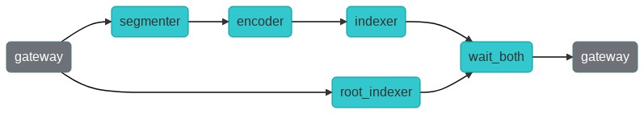
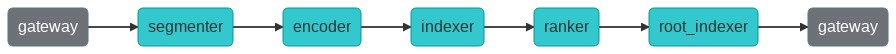

# Lyrics Search: Understanding Chunks

[](.github/demo.gif)

  * [Overview](#overview)
  * [🐍 Build the app with Python](#---build-the-app-with-python)
  * [📉 Using the search interface and understanding your results](#---using-the-search-interface-and-understanding-your-results)
  * [🔮 Overview of the files in this example](#---overview-of-the-files-in-this-example)
  * [🌀 Flow diagram](#---flow-diagram)
  * [⏭️ Next steps, building your own app](#---next-steps--building-your-own-app)
  * [👩‍👩‍👧‍👦 Community](#------------community)
  * [🦄 License](#---license)

## Overview
|  |  |
| ------------- | ------------- |
| Summary | This showcases a semantic text search app with a front end interface to show how chunking works.  |
| Data for indexing | Dataset of songs |
| Data for querying | A text sentence  |
| Dataset used |  [Kaggle lyrics](https://www.kaggle.com/neisse/scrapped-lyrics-from-6-genres)     |
| ML model used |  [`distilbert-based-uncased`](https://huggingface.co/distilbert-base-uncased) |

This example shows you how to build a semantic search app powered by [Jina AI](http://www.jina.ai)'s neural search framework.  You can index and search song lyrics using state-of-the-art machine learning language models. This example helps teaches you about the concept of chunking and its importance in search systems. Once you've built the example, you can visualize how the system is matching inputs to output via a custom front-end we have built. 

## 🐍 Build the app with Python

These instructions explain how to build the example yourself and deploy it with Python.

### 🗝️ Requirements
1. You have a working Python 3.7 or 3.8 environment. 
2. We recommend creating a [new python virtual environment](https://docs.python.org/3/tutorial/venv.html) to have a clean install of Jina and prevent dependency clashing.   
3. You have at least 2GB of free space on your hard drive. 


### 👾 Step 1. Clone the repo and install Jina

Begin by cloning the repo so you can get the required files and datasets. If you already have the examples repository on your machine make sure to fetch the most recent version. 

```sh
git clone https://github.com/jina-ai/examples
cd examples/multires-lyrics-search
```

On your terminal,  you should now be located in the `multires-lyrics-search` folder. Let's install Jina and the other required Python libraries. For futher information on installing Jina check out our [documentation](https://docs.jina.ai/chapters/core/setup/).

```sh
pip install -r requirements.txt
```
If this command runs without any error messages, you can then move onto step two. 

### 📥 Step 2. Download your data to search 

You have two different options here. You can either use the toy-data we provide in this repo, which is quick to index but will give very poor results. Alternatively you can download a larger dataset, which takes longer to index, but you will see better results.  

#### Toy dataset
We have included 1000 songs' lyrics as toy data in [`lyrics-data`](lyrics-data).
This data is ready to use with this example.  
If you intend to use the toy data, no action is needed here. 

#### Full dataset 
Begin by installing the Kaggle library if you haven't already done so.  You will also need to setup your API keys as [explained here](https://github.com/Kaggle/kaggle-api#api-credentials) .
```sh
pip install kaggle
```

Running the following bash script should perform all the steps needed to download the full dataset. 

```bash
bash get_data.sh
```

### 🏃 Step 3. Index your data

In this step, we will index our data. When we run the following command, we call our index Flow and pass our data through it. The Flow begins by breaking each song into sentences and then encoding those sentences using a language model. The data is then stored in an Index. 

```sh
python app.py -t index
```

### 🔎 Step 4. Query your indexed data

Next, we will deploy our query Flow. This Flow will accept a search input, break it down into sentences and encode it using the same language model as above. It then performs a nearest neighbor search and finds sentences in the index which are most similar to your query sentence. 
We have two options for querying data.
#### REST Api
You can use a REST API for querying data. To start the API, type:
```sh
python app.py -t query
```
Once the API is running, you can use cURL to query data:
```sh
curl --request POST -d '{"parameters": {"top_k": 10}, "data": ["hello world"]}' -H 'Content-Type: application/json' 'http://0.0.0.0:45678/search'

```
As an alternative to cURL, you can also launch the web interface in another terminal:
```bash
cd static
python -m http.server
```
Now you can open `http://0.0.0.0:8000/` in your browser and you should see a web interface. See the next section to understand your results. 

## 📉 Using the search interface and understanding your results
Let's begin by starting with a simple one-sentence query. For example, if you add the sentence 'I am very happy today; you should see a similar result. Each of these boxes you see on the right-hand side is a song in your dataset. Each highlighted sentence is a 'match.'  A match is a similar sentence, determined by how close two vectors are in embedding space.  If you don't understand the concept of embedding spaces, we suggest you check out this guide [here](https://towardsdatascience.com/neural-network-embeddings-explained-4d028e6f0526) and then return to this example after. 


Similarity can be adjusted using the breakdown slider on the left-hand side. 
As you move the slider to the right, you will see more matches appear. 
This is because we are increasing our radius in the vector space for finding similar matches. 

The relevance score you see at the bottom of the song box summarizes all the matches in a song. 
Each match has a numeric value between 0 and 1, determining how close it is to the original input in the vector space.
The average of these match values is the relevance score. This means that a song with only good matches will be ranked as highly relevant. 

The example also allows for more complex, multi sentence queries. 
If you input two or three sentences when querying, the query Flow will break down the total input into individual 'chunks'. 
these chunks in this example are sentences, but you can determine what is a chunk for your own data when building Jina. 
To calculate the relevance score, we aggregate all the match scores using the [MinRanker class](flows/executors.py). 


## 🔮 Overview of the files in this example
Here is a small overview if you're interested in understanding what each file in this example is doing. 

| File | Explanation |
|---|---|
|📃`toy-data/lyrics-toy-data1000.csv`  |Contains a small number of songs to test the example   |
|📂`flows`  |Folder to store Flow configuration |
|--- 📃`flows/index.yml`  |determines which executors should index the data, and the configuration details of these executors |
|--- 📃`flows/index.yml`  |determines which executors should query the data, and the configuration details of these executors |
|📂`pods`  |Folder to store Pod configuration   |
|--- 📃`pods/encode.yml`  | specifies which executor should be used to encode the data |
|--- 📃`pods/chunk.yml`  | specifies which executor should be used to chunk the data |
|--- 📃`pods/chunk_merger.yml`  |  specifies how the chunks should be merged during indexing and querying |
|--- 📃`pods/doc.yml`  | specifies which executor should be used for indexing and the configuration details for this executor |
|--- 📃`pods/ranker.yml`  | specifies which executor should be used to rank the matches, the configuration details for this executor |
|--- 📃`pods/segment.yml`  | specifies the configuration values for the segmenting of chunks |
|📂`static/*`  |contains the frontend interface |
|📂`test/*`  | various maintenance tests to keep the example running.  |
|📃`app.py`  | the gateway code to combine the index and query flow   |
|📃`get_data.sh`  | downloads the Kaggle dataset|
|📃`requirements.txt`  | contains all required python libraries|


## 🌀 Flow diagram
This diagram provides a visual representation of the two Flows in this example. Showing which executors are used in which order.

#### Index Flow



During indexing, we have two parallel paths. The first path splits the input text into sentences, 
then computes embeddings for the sentences and then indexes the sentence level documents.  
The second path only indexes the whole songs with their lyrics to be able to look them up later on.

#### Query Flow



The query flow is different than the indexing flow. During query time, we again split the query into sentences and compute the embeddings.
Then, the indexer compares the query embeddings with the indexed embeddings and adds the indexed documents with the closest embedding distance to the query as matches.
Then, the ranker finds a list of song id's (the songs that the matches belong to) from the matches, so that the root_indexer can then lookup all the song information and also return it.
The returned document has the following fields:
```
document: The whole search text
- chunks: The sentences within whole search text
  - matches: The closest matches to the search sentence
- matches: The whole songs which are in the chunk-matches
```

## ⏭️ Next steps, building your own app

Did you like this example and are you interested in building your own? For a detailed tuturial on how to build your Jina app check out [How to Build Your First Jina App](https://docs.jina.ai/chapters/my_first_jina_app/#how-to-build-your-first-jina-app) guide in our documentation. 

For more information on chunking, check out our [Understand Jina Recursive Document Representation](https://docs.jina.ai/chapters/traversal/#understand-jina-recursive-document-representation).

If you have any issues following this guide, you can always get support from our [Slack community](https://slack.jina.ai) .


## 👩‍👩‍👧‍👦 Community

- [Slack channel](https://slack.jina.ai) - a communication platform for developers to discuss Jina
- [LinkedIn](https://www.linkedin.com/company/jinaai/) - get to know Jina AI as a company and find job opportunities
- [](https://twitter.com/JinaAI_) - follow us and interact with us using hashtag `#JinaSearch`  
- [Company](https://jina.ai) - know more about our company, we are fully committed to open-source!

## 🦄 License

Copyright (c) 2021 Jina AI Limited. All rights reserved.

Jina is licensed under the Apache License, Version 2.0. See [LICENSE](https://github.com/jina-ai/examples/blob/master/LICENSE) for the full license text.
