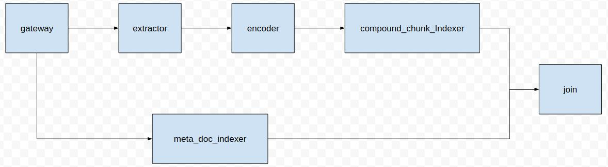
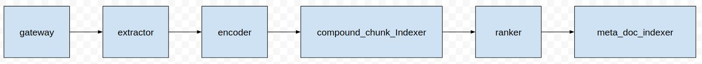

# JINA 轻松实现一套新闻搜索引擎

## 前言

    经过上一篇介绍，我想大家已经jina有了一定的认识，如果还没有阅读的同学，可以点击[链接]()！

    在上一篇中我们利用jina，实现了WebQA的搜索引擎的搭建，效果如大家所见，还是**蛮不错的(*^__^*) 嘻嘻……！**我想大家在阅读完上一篇已经发现了，上一篇是基于短文本搜索短文本的，即title搜索title，每个doc中的chunk只有一个，那么你或许会问jina能不能长文本搜索长文本呢，每个doc中chunk有多个？答案显而易见，Sure!

    那么，怎么做呢？请看如下分解！

## 效果展示


### Index Flow

```python
index_flow = (Flow().add(name='extractor', yaml_path='extractor.yml')
 .add(name='md_indexer', yaml_path='meta_doc_indexer.yml',needs='gateway')
 .add(name='encoder', yaml_path='encoder.yml', needs='extractor', timeout_ready=600000, replicas=1)
 .add(name='cc_indexer',yaml_path='compound_chunk_indexer.yml',
 needs='encoder')
 .join(['cc_indexer', 'md_indexer']))
```

### Query Flow

```python
query_flow = (Flow().add(name='extractor', yaml_path='extractor.yml')
 .add(name='encoder', yaml_path='encoder.yml', needs='extractor', timeout_ready=60000, replicas=2)
 .add(name='compound_chunk_indexer', yaml_path='compound_chunk_indexer.yml',
 needs='encoder', timeout_ready=60000)
 .add(name='ranker', yaml_path='ranker.yml', needs='compound_chunk_indexer')
 .add(name='meta_doc_indexer', yaml_path='meta_doc_indexer.yml', needs='ranker'))
```

## 数据集

### 数据描述

    包含了250万篇新闻。新闻来源涵盖了6.3万个媒体，含标题、关键词、描述、正文。

数据集划分：数据去重并分成三个部分。训练集：243万；验证集：7.7万；测试集，数万。下载[链接](https://drive.google.com/file/d/1TMKu1FpTr6kcjWXWlQHX7YJsMfhhcVKp/view?usp=sharing)。

### 结构

```json
{'news_id': <news_id>,'title':<title>,'content':<content>,'source': <source>,'time':<time>,'keywords': <keywords>,'desc': <desc>, 'desc': <desc>}

其中，title是新闻标题，content是正文，keywords是关键词，desc是描述，source是新闻的来源，time是发布时间
```

### 例子

```json
{"news_id": "610130831", "keywords": "导游，门票","title": "故宫淡季门票40元 “黑导游”卖外地客140元", "desc": "近日有网友微博爆料称，故宫午门广场售票处出现“黑导游”，专门向外地游客出售高价门票。昨日，记者实地探访故宫，发现“黑导游”确实存在。窗口出售", "source": "新华网", "time": "03-22 12:00", "content": "近日有网友微博爆料称，故宫午门广场售票处出现“黑导游”，专门向外地游客出售高价门票。昨日，记者实地探访故宫，发现“黑导游”确实存在。窗口出售40元的门票，被“黑导游”加价出售，最高加到140元。故宫方面表示，请游客务必通过正规渠道购买门票，避免上当受骗遭受损失。目前单笔门票购买流程不过几秒钟，耐心排队购票也不会等待太长时间。....再反弹”的态势，打击黑导游需要游客配合，通过正规渠道购买门票。"}
```

## 搭建过程

### 创建索引

    在这个新闻搜索引擎中，创建索引的模块还是分为`extractor`, `encoder`, `compound_chunk_indexer`, `meta_doc_indexer`. 

    Flow结构图如下



#### Extractor

    由于我们是长文本搜索长文本，怎么才能达到更好的效果呢？我们应该怎么做呢？答案是将长文本分割成短文本，即将`doc`级别的信息分割成多个`chunk`级别的信息。

```python
class WeightSentencizer(Sentencizer):
    def craft(self, raw_bytes: bytes, doc_id: int, *args, ** kwargs) -> List[Dict]:
        results = super().craft(raw_bytes, doc_id)
        weights = np.linspace(1, 0.1, len(results))
        for result, weight in zip(results, weights):
            result['weight'] = weight

        return results
```

    由于是长文本，每个子句对文本的主旨贡献不同，所以，我们采用了权重的方式进行对`chunk`进行的权重设置；并且由于数据集是新闻数据集，而且新闻数据集存在一个特点，开头信息在文本主旨贡献度较大，而越往后，则没那么重要，所以这里我们采取了一个线性递减的权重。

yaml文件

```yaml
!WeightSentencizer
metas:
  py_modules: extractor.py
  workspace: $TMP_WORKSPACE
  name: extractor

requests:
  on:
    [IndexRequest, SearchRequest]:
      - !SegmentDriver
        with:
          random_chunk_id: false
          method: craft

    ControlRequest:
      - !ControlReqDriver {}
```

#### Encoder

    encoder在这里的作用就是将文本信息编码成向量信息，这里我们采用哈工大-Roberta base作为我们编码器的模型！并且采用`max_length`采用128。

yaml 文件

```yaml
!TransformerRobertaEncoder
metas:
  on_gpu: true
  batch_size: 4
  workspace: $TMP_WORKSPACE
  name: transformer_roberta_encoder
  py_modules: transformer_roberta.py

with:
  max_length: 128
```

#### Compound Chunk Indexer

    在`compund_chunk_indexer`这里我们存储的是向量信息和`chunk_id`和`doc_id`的对应关系，方便日后查询的时候进行调用。

yaml 文件

```yaml
!CompoundExecutor
components:
  - !NumpyIndexer
    with:
      index_filename: vecidx_index.gzip
      metrix: cosine
    metas:
      name: vecidx_exec
      workspace: $TMP_WORKSPACE
  - !LeveldbIndexer
    with:
      index_filename: meta_chunk_index.gzip
    metas:
      name: chunk_meta_exec
      workspace: $TMP_WORKSPACE

metas:
  name: compound_chunk_indexer

requests:
  on:
    IndexRequest:
      - !ChunkIndexDriver
        with:
          executor: vecidx_exec
          method: add
      - !ChunkPruneDriver {}
      - !ChunkPbIndexDriver
        with:
          executor: chunk_meta_exec
          method: add
    SearchRequest:
      - !ChunkSearchDriver
        with:
          executor: vecidx_exec
          method: query
      - !ChunkPruneDriver {}
      - !ChunkPbSearchDriver
        with:
          executor: chunk_meta_exec
          method: query
    ControlRequest:
      - !ControlReqDriver {}
```

#### Meta Doc Indexer

    在`meta_doc_indexer`这存储的是`doc_id`与原新闻内容的对应关系！

```yaml
!LeveldbIndexer
with:
  index_filename: meta_doc_index.gzip
metas:
  name: meta_doc_indexer
  workspace: $TMP_WORKSPACE
requests:
  on:
    IndexRequest:
      - !DocPbIndexDriver
        with:
          method: add

    SearchRequest:
      - !DocPbSearchDriver
        with:
          method: query

    ControlRequest:
      - !ControlReqDriver {}
```

#### Join

    由于创建`chunk`索引和`doc`索引时，是两个并行的流！所以我们这里要加入`join`。


#### Build

    建立`flow`

```python
flow.build()        
```


#### Index

    发送`IndexRequest`请求和数据

```python
def read_data(fn):
    items = []
    with open(fn, 'r', encoding='utf-8') as f:
        for line in f:
            line = line.replace('\n', '')
            item = json.loads(line)
            content = item['content']
            if content == '':
                continue

            items.append(item)

    results = []
    for content in items:
        results.append(("{}".format(json.dumps(content, ensure_ascii=False))).encode("utf-8"))

    for item in results:
        yield item
```

### 查询

    在查询时，我们希望用户输入一个完整的新闻，搜索引擎返回给他相似的新闻！



#### Extractor

    当查询的时候，我们需要将新闻内容还是与建立索引时一样，分割成一个一个的子句，即`chunk`，并赋予相应的权值。

#### Encoder

    在分割完成以后，我们还是将`chunk`中的文本进行向量化！使用的`Encodr`与建立索引时一致。

#### Compound Chunk Indexer

    我们在编码以后，我们利用余弦相似度将每个`chunk`的`top_k`的`chunk`索引找出来，然后再利用`meta_chunk`找出`doc_id`与`chunk_id`对应关系。


#### Ranker

    在每个`chunk`找出对应的`top_k`以后，我们需要对每个`doc`下的所有`chunk`的`top_k``chunk`进行排序，融合成`doc`下的`top_k chunk`，因为我们刚刚找出的是每个`chunk`下的`top_k`，所有的`chunk`下的`top_k`需要进行排序。

```yaml
!BiMatchRanker
metas:
  name: ranker
  py_modules: weight.py
requests:
  on:
    SearchRequest:
      - !ChunkWeightDriver
        with:
          reverse: true
      - !Chunk2DocScoreDriver
        with:
          method: score
      - !DocPruneDriver {}
```

#### Meta Doc Indexer

    最后将找到的`doc_id`利用`meta_doc`找出原始新闻内容！


#### Build

    建立`flow`

```python
flow.build()
```


#### Query

    发送`SearchRequest`请求和数据，并且利用`print_topk`将查询结果进行保存！

```python
def print_topk(resp, fp):
    for d in resp.search.docs:
        v = MessageToDict(d, including_default_value_fields=True)
        v['metaInfo'] = d.raw_bytes.decode()
        for k, kk in zip(v['topkResults'], d.topk_results):
            k['matchDoc']['metaInfo'] = kk.match_doc.raw_bytes.decode()
        fp.write(json.dumps(v, sort_keys=True, indent=4, ensure_ascii=False) + "\n")
```

```python
f.search(raw_bytes=read_data(data_fn), callback=print_topk, top_k=10)
```

## 结语

    我们利用了Jina完成了2个搜索引擎的搭建，有没有感觉！Wow，好简单！所以，开始利用Jina搭建自己的搜索引擎吧！

    详细项目[地址](https://github.com/jina-ai/examples/blob/webqa-search/news-search)，欢迎关注[jina](https://github.com/jina-ai/jina)！
