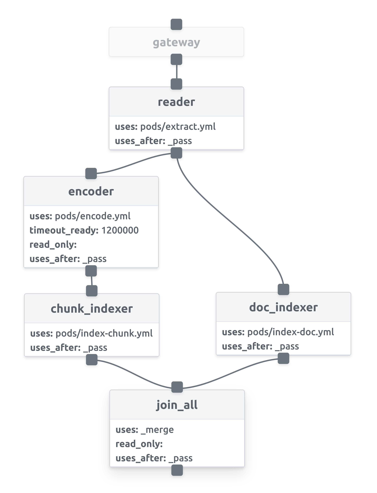

# Build Bert-based NLP Semantic Search System

<p align="center">

[](https://jina.ai)
[](https://github.com/jina-ai/jina#jina-hello-world-)
[](#license)
[](https://docs.jina.ai)
[](https://jobs.jina.ai)
<a href="https://twitter.com/intent/tweet?text=%F0%9F%91%8DCheck+out+Jina%3A+the+New+Open-Source+Solution+for+Neural+Information+Retrieval+%F0%9F%94%8D%40JinaAI_&url=https%3A%2F%2Fgithub.com%2Fjina-ai%2Fjina&hashtags=JinaSearch&original_referer=http%3A%2F%2Fgithub.com%2F&tw_p=tweetbutton" target="_blank">
  </img>
</a>
[](#)
[](https://hub.docker.com/r/jinaai/jina/tags)

</p>

In this demo, we use Jina to build a semantic search system on the [SouthParkData](https://github.com/BobAdamsEE/SouthParkData/). The goal is to find out who said what in the South Park episodes when the user query a sentence. The SouthPark data contains the characters and lines from seasons 1 to 19. Many thanks to [BobAdamsEE](https://github.com/BobAdamsEE) for sharing this awesome dataset!👏. This demo will show you how to quickly build a search system from scratch with Jina. Before moving forward, We highly suggest to going through our lovely [Jina 101](https://github.com/jina-ai/jina/tree/master/docs/chapters/101) and [Jina "Hello, World!"👋🌍](https://github.com/jina-ai/jina#jina-hello-world-).


<!-- START doctoc generated TOC please keep comment here to allow auto update -->
<!-- DON'T EDIT THIS SECTION, INSTEAD RE-RUN doctoc TO UPDATE -->
**Table of Contents**

- [Overview](#overview)
- [Try out this demo by yourself](#try-out-this-demo-by-yourself)
- [Prerequirements](#prerequirements)
- [Prepare the data](#prepare-the-data)
- [Define the Flows](#define-the-flows)
- [Run the Flows](#run-the-flows)
- [Dive into the Pods](#dive-into-the-pods)
- [Wrap up](#wrap-up)
- [Next Steps](#next-steps)
- [Documentation](#documentation)
- [Stay tuned](#stay-tuned)
- [License](#license)

<!-- END doctoc generated TOC please keep comment here to allow auto update -->


## Overview

Let's have an overview of the magic. We want build a search system to find lines from South Park scripts which are similar to a user's input text. To make this happen, we split the scripts into sentences and consider each sentence as one **Document**. For simplicity, each Document has only one **Chunk**, which contains the same sentence as the Document. Each sentence, as a Chunk, is encoded into a vector with the help of the **Encoder** (i.e. we use the `DistilBert` from the `🤗 Transformers` lib).

Similar to classic search engines, we first build an index for all the documents (i.e. the characters and their lines). During indexing, Jina, _the_ neural search framework, uses vectors to represent the sentences and save the vectors in the index. During querying, taking the text from the user's input, we encode the input into vectors with the same **Encoder**. As a result, these query vectors can be used to retrieve the indexed lines with similiar meanings.

<p align="center">
  
</p>


## Try out this demo by yourself

We've prepared a docker image with indexed data and you can run it by the following command,

```bash
docker run -p 45678:45678 jinaai/hub.app.distilbert-southpark:latest
```

Now you can open your shell and check out the results via the RESTful API. The matched results are stored in `topkResults`.

```bash
curl --request POST -d '{"top_k": 10, "mode": "search",  "data": ["text:hey, dude"]}' -H 'Content-Type: application/json' 'http://0.0.0.0:45678/api/search'
```

For a better visualization, you can also open [https://jina.ai/jinabox.js/](https://jina.ai/jinabox.js/) in your brower, and replace server endpoint with `http://localhost:45678/api/search`. If you want to learn more about jinabox, please check out [https://github.com/jina-ai/jinabox.js](https://github.com/jina-ai/jinabox.js) and enjoy playing.

<p align="center">
  
</p>

Check out more details about the docker image [here](README.restful.md).


## Prerequirements

This demo requires Python 3.7.

```bash
pip install --upgrade -r requirements.txt
```


## Prepare the data

The raw data contains season, episode, character, and line information in the `.csv` format as follows:

```
Season,Episode,Character,Line
10,1,Stan,"You guys, you guys! Chef is going away.
"
10,1,Kyle,"Going away? For how long?
"
10,1,Stan,"Forever.
"
10,1,Chef,"I'm sorry boys.
```

Run the following script to clone the data and do some data wrangling. Overall, there are 106,820 lines in `/tmp/jina/southpark/character-lines.csv`

```bash
cd southpark-search
bash ./get_data.sh /tmp/jina/southpark
```


## Define the Flows
### Index
To index the data we first need to define our **Flow** with a **YAML** file. In the Flow YAML file, we add **Pods** in sequence. In this demo, we have 5 pods defined with the names `splitter`, `encoder`, `chunk_indexer`, `doc_indexer`, and `join_all`.

However, we have another Pod working in silence. In fact, the input to the very first Pod is always the Pod with the name **gateway**, the "Forgotten" Pod. For most of the time, we can safely ignore the **gateway** because it basically does the dirty orchestration work for the Flow.

<table style="margin-left:auto;margin-right:auto;">
<tr>
<td> flow-index.yml</td>
<td> Flow in Dashboard</td>
</tr>
<tr>
<td>
  <sub>

```yaml
!Flow
pods:
  splitter:
    uses: pods/craft-split.yml
  encoder:
    uses: pods/encode.yml
    timeout_ready: 60000
  chunk_indexer:
    uses: pods/index-chunk.yml
  doc_indexer:
    uses: pods/index-doc.yml
    needs: gateway
  join_all:
    uses: _merge
    needs: [doc_indexer, chunk_indexer]
```

</sub>

</td>
<td>

</td>
</tr>
</table>

By default, the input of each Pod is the Pod defined right above it, and the request message flows from one Pod to another. That's how Flow lives up to its name. Of course, you might want to have a Pod skipping over the Pods above it. In this case, you would use the `needs` argument to specify the source of the input messages. In our example, the `doc_indexer` actually get inputs directly from the `gateway`. By doing this, we have two parallel pathways as shown in the index Flow diagram.

```yaml
doc_indexer:
  uses: pods/index-doc.yml
  needs: gateway
```

As we can see, for most Pods, we only need to define the YAML file path. Given the YAML files, Jina will automatically build the Pods. Plus, `timeout_ready` is a useful argument when adding a Pod, which defines the waiting time before the Flow gives up on the Pod initializing.

```yaml
encoder:
  uses: pods/encode.yml
  timeout_ready: 60000
```

You might also notice the `join_all` Pod has a special YAML path. It denotes a built-in YAML path, which will merge all the incoming messages defined in `needs`.

```yaml
join_all:
  uses: _merge
  needs: [doc_indexer, chunk_indexer]
```

Overall, the index Flow has two pathways, as shown in the Flow diagram. The idea is to save the index and the contents seperately so that we can quickly retrieve the Document IDs from the index and afterwards combine the Document ID with its content.

The pathway on the right side with a single `doc_indexer` stores the Document content. Under the hood it is basically a key-value storage. The key is the Document ID and the value is the Document itself.

The pathway on the other side is for saving the index. From top to bottom, the first Pod, `splitter`, splits the Document into Chunks, which are the basic units to process in Jina. Chunks are later encoded into vectors by the `encoder`. These vectors (together with other information in the Chunks) are saved in a vector storage by `chunk_indexer`. Finally, the two pathways are merged by `join_all` and the processing of that message is concluded.


### Query
As in the indexing time, we also need a Flow to process the request message during querying. Here we start with the `splitter` sharing exactly the same YAML with its conterpart in the index Flow. This means it plays the same role as before, which is to split the Document into Chunks. Afterwards, the Chunks are encoded into vectors by `encoder`, and later these vectors are used to retrieve the indexed Chunks by `chunk_indexer`. At the same as the `splitter`, both `encoder` and `chunk_indexer` share the YAML with their counterparts in the index Flow.

<table  style="margin-left:auto;margin-right:auto;">
<tr>
<td> flow-query.yml</td>
<td> Flow in Dashboard</td>
</tr>
<tr>
<td>
  <sub>

```yaml
!Flow
with:
  read_only: true
pods:
  splitter:
    uses: pods/craft-split.yml
  encoder:
    uses: pods/encode.yml
    timeout_ready: 60000
  chunk_indexer:
    uses: pods/index-chunk.yml
  ranker:
    uses: MinRanker
  doc_indexer:
    uses: pods/index-doc.yml
```

</sub>

</td>
<td>

</td>
</tr>
</table>


Eventually, there comes a new Pod named `ranker`. Remember that Chunks are the basic units in Jina. In the deep core of Jina, both indexing and quering take place at the Chunk level. Chunks are the elements that the Jina core can understand and process. However, we need to ship the final query results in the form of a Document which is actually meaningful to users. This is precisely the job of `ranker`. `ranker` combines the query results from the Chunk level into the Document level. In this demo, we use the built-in `MinRanker` to do the job. It simple takes the `1 / (1 + s)` as the score of the Document, where `s` denotes the minimal matching score from all the Chunks that belong to this Document. Why do we take the minimal matching score for Chunks? Because here we use the **cosine distance** as the chunks' matching scores.

> `MaxRanker` calculates the score of the matched Document from the matched Chunks. For each matched Document, the score is the maximal score from all the matched Chunks belonging to that Document.

```yaml
ranker:
  uses: MaxRanker
```

In the last step, the `doc_indexer` comes into play. Sharing the same YAML file, `doc_indexer` will load the stored key-value index and retrieve the matched Documents according to the Document ID.

### Let's take a closer look
Now the index and query Flows are both ready to work. Before proceeding, let's take a closer look at the two Flows and see the differences between them.

Obviously, they have different structures, although they share most Pods. This is a common practice in the Jina world for the sake of speed. Except for the `ranker`, both Flows can indeed use identical structures. The two-pathway design of the index Flow is intended to speed up message passing, because indexing Chunks and Documents can be done in parallel.

Another important difference is that the two Flows are used to process different types of request messages. To index a Document, we send an **IndexRequest** to the Flow. While querying, we send a **SearchRequest**. That's why Pods in both Flows can play different roles while sharing the same YAML files. Later, we will dive deep into into the YAML files, where we define the different ways of processing messages of various types.


## Run the Flows

### Index


```bash
python app.py -t index -n 10000
```

<details>
<summary>Click here to see the console output</summary>

<p align="center">
  
</p>

</details>

With the Flows, we can now write the code to run the Flow. For indexing, we start by defining the Flow with a YAML file. Afterwards, the `build()` function will do the magic to construct Pods and connect them together. After that, the `IndexRequest` will be sent to the flow by calling the `index()` function.

```python
def index(num_docs):
    config(num_docs, mode = 'index')
    data_path = os.path.join('/tmp/jina/southpark', 'character-lines.csv')
    f = Flow().load_config('flow-index.yml')
    with f:
        f.index_lines(filepath=data_path, batch_size=8, size=int(os.environ['MAX_NUM_DOCS']))

```

The content of the `IndexRequest` is fed from `index_lines()`, which loads the processed `.csv` file.
Encoding the text with bert-family models takes a long time. To save your time, here we limit the number of indexed documents to 10,000.

### Query

```bash
python app.py -t query
```

<details>
<summary>Click here to see the console output</summary>

<p align="center">
  
</p>

</details>

For querying, we follow the same process to define and build the Flow from the YAML file. The `search_lines()` function is used to send a `SearchRequest` to the Flow. Here we accept the user's query input from the terminal and wrap it into a list of `string`.

```python
def query(num_docs, top_k):
    config(num_docs, mode = 'search')
    f = Flow().load_config('flow-query.yml')
    with f:
        while True:
            text = input('please type a sentence: ')
            if not text:
                break
            ppr = lambda x: print_topk(x, text)
            f.search_lines(lines=[text, ], output_fn=ppr, top_k=top_k)
```

The `callback` argument is used to post-process the returned message. In this demo, we define a simple `print_topk` function to show the results. The returned message `resp` in a Protobuf message. `resp.search.docs` contains all the Documents for searching, and in our case there is only one Document. For each query Document, the matched Documents, `.match_doc`, together with the matching score, `.score`, are stored under the `.topk_results` as a repeated variable.

```python
ppr = lambda x: print_topk(x, text)
f.search_lines(lines=[text, ], output_fn=ppr, top_k=top_k)
```

```python
def print_topk(resp, word):
    for d in resp.search.docs:
        print(f'Ta-Dah🔮, here are what we found for: {word}')
        for idx, match in enumerate(d.matches):
            score = match.score.value
            if score < 0.0:
                continue
            doc = match.meta_info.decode()
            name, line = doc.split('[SEP]', maxsplit=1)
            print('> {:>2d}({:.2f}). {} said, "{}"'.format(idx, score, name.upper(), line.strip()))
```

## Dive into the Pods
If you want to know more about Pods, keep reading. As shown above, we defined the Pods by giving the YAML files. Now let's move on to see what is exactly written in these magic YAML files.

> Note that since v0.3.0, the `requests` field in the `.yml` file is no longer necessary. The default behaviors upon the requests are definded at `jina/resources`. Feel free to skip the descriptions about `requests` and come back later if you want to know more about how jina works.

### `splitter`
As a convention in Jina, A YAML config is used to describe the properties of an object so that we can easily configure the behavior of the Pods without touching the code.

Here is the YAML file for the `splitter`. We first use the built-in **Sentencizer** as the **executor** in the Pod. The `with` field is used to specify the arguments passing to the `__init__()` function.


```yaml
!Sentencizer
with:
  min_sent_len: 2
  max_sent_len: 64
```

In the `requests` field, we define the different behaviors of the Pod for different requests. Remember that both the index and query Flows share the same Pods with the YAML files while they behave differently to the requests. This is how the magic works: For `SearchRequest`, `IndexRequest`, and `TrainRequest`, the `splitter` will use the `SegmentDriver`. On the one hand, the Driver encodes the request messages in [Protobuf format](https://en.wikipedia.org/wiki/Protocol_Buffers) into a format that the Executor can understand (e.g. a Numpy array). On the other hand, the `SegmentDriver` will call the `craft()` function from the Executor to handle the message and encode the processed results back into Protobuf format. For the time being, the `splitter` shows the same behavior for both requests.


```yaml
requests:
  on:
    [SearchRequest, IndexRequest]:
      - !SegmentDriver
        with:
          method: craft
```

### `encoder`
The YAML file of the `encoder` is pretty similar to the `splitter`. As one can see, we specify the `distilbert-base-cased` model. One can easily switch to other fancy pretrained models from **transformers** by giving another `model_name`.

```yaml
!TransformerTorchEncoder
with:
  pooling_strategy: cls
  model_name: distilbert-base-cased
  max_length: 96
```

### `doc_indexer`
In contrast to the Pods above, the `doc_indexer` behave differently depending on different requests. For the `IndexRequest`, the Pod uses `DocPruneDriver` and the `DocKVIndexDRiver` in sequence. The `DocPruneDriver` prunes the redundant data in the message that is not used by the downstream Pods. Here we discard all the data in the `chunks` field because we only want to save the Document level data.

```yaml
!BinaryPbIndexer
with:
  index_filename: doc.gzip
metas:
  name: docIndexer
  workspace: $TMP_WORKSPACE
```

For the `SearchRequest`, the Pod uses the same `DocKVSearchDriver` just like the `IndexRequest`.
```yaml
requests:
  on:
    SearchRequest:
      - !DocKVSearchDriver
      with:
        method: query
```

### `chunk_indexer`
The YAML file for `chunk_indexer` is a little bit cumbersome. But take it easy: It is as straightforward as it should be. The executor in the `chunk_indexer` Pod is called `ChunkIndexer`, which wraps two other executors. The `components` field specifies the two wrapped executors: The `NumpyIndexer` stores the Chunks' vectors, and the `BasePbIndexer` is used as a key-value storage to save the Chunk ID and Chunk details.

```yaml
!CompoundIndexer
components:
  - !NumpyIndexer
    with:
      index_filename: vec.gz
      metric: cosine
    metas:
      name: vecidx  # a customized name
      workspace: $TMP_WORKSPACE
  - !BinaryPbIndexer
    with:
      index_filename: chunk.gz
    metas:
      name: chunkidx  # a customized name
      workspace: $TMP_WORKSPACE
metas:
  name: chunk_indexer
  workspace: $TMP_WORKSPACE

```

Just like the `doc_indexer`, the `chunk_indexer` has different behaviors for different requests. For the `IndexRequest`, the `chunk_indexer` uses three Drivers in serial, namely, `VectorIndexDriver`, `PruneDriver`, and `KVIndexDriver`. The idea is to first use `VectorIndexDriver` to call the `index()` function from the `NumpyIndexer` so that the vectors for all the Chunks are indexed. Then the `PruneDriver` prunes the message, and the `KVIndexDriver` calls the `index()` function from the `BasePbIndexer`. This behavior is defined in the `executor` field.

```yaml
requests:
  on:
    IndexRequest:
      - !VectorIndexDriver
        with:
          executor: NumpyIndexer
      - !PruneDriver
        with:
          level: chunk
          pruned:
            - embedding
            - buffer
            - blob
            - text
      - !KVIndexDriver
        with:
          level: chunk
          executor: BasePbIndexer
```

For the `SearchRequest`, the same procedure continues, but under the hood the `KVSearchDriver` and the `VectorSearchDriver` call the `query()` function from the `NumpyIndexer` and `BasePbIndexer` correspondingly.

```yaml
requests:
  on:
    SearchRequest:
      - !VectorSearchDriver
        with:
          executor: NumpyIndexer
      - !PruneDriver
        with:
          level: chunk
          pruned:
            - embedding
            - buffer
            - blob
            - text
      - !KVSearchDriver
        with:
          level: chunk
          executor: BasePbIndexer
```

## Wrap up
Congratulations! Now you've got your very own neural search engine explained!

Let's wrap up what we've covered in this demo.

1. Chunks are basic elements in Jina. Documents are the final inputs and outputs from Jina.
2. Flows are our good friends to build the search engine. To either index or query, we need to define and build a Flow.
3. The index and the query Flow shares most Pods.
4. The Pods in the Flow can run either in serial or in parallel.
5. The Pods can behave differently to different types of requests. The Pods' YAML file defines their behaviors.
6. The data in the requests should be in `bytes` format.
7. Inside the Pods, Drivers are used to interpret the messages for Executors, call the Executors to handle the messages, and wrap the results back into the message.
8. The query results in the return response are saved in the Protobuf format.

**Enjoy Coding with Jina!**

## Next Steps
- Try other encoders or rankers.
- Run the Pods in docker containers.
- Scale up the indexing procedure.
- Speed up the procedure by using `read_only`
- Explore the `metas` field in the YAML file.

## Documentation

<a href="https://docs.jina.ai/">

</a>

The best way to learn Jina in depth is to read our documentation. Documentation is built on every push, merge, and release event of the master branch. You can find more details about the following topics in our documentation.

- [Jina command line interface arguments explained](https://docs.jina.ai/chapters/cli/index.html)
- [Jina Python API interface](https://docs.jina.ai/api/jina.html)
- [Jina YAML syntax for executor, driver and flow](https://docs.jina.ai/chapters/yaml/yaml.html)
- [Jina Protobuf schema](https://docs.jina.ai/chapters/proto/index.html)
- [Environment variables used in Jina](https://docs.jina.ai/chapters/envs.html)
- ... [and more](https://docs.jina.ai/index.html)

## Stay tuned

- [Slack chanel](https://join.slack.com/t/jina-ai/shared_invite/zt-dkl7x8p0-rVCv~3Fdc3~Dpwx7T7XG8w) - a communication platform for developers to discuss Jina
- [Community newsletter](mailto:newsletter+subscribe@jina.ai) - subscribe to the latest update, release and event news of Jina
- [LinkedIn](https://www.linkedin.com/company/jinaai/) - get to know Jina AI as a company
-  - follow us and interact with us using hashtag `#JinaSearch`
- [Join Us](mailto:hr@jina.ai) - want to work full-time with us at Jina? We are hiring!
- [Company](https://jina.ai) - know more about our company, we are fully committed to open-source!


## License

Copyright (c) 2020 Jina AI Limited. All rights reserved.

Jina is licensed under the Apache License, Version 2.0. See [LICENSE](https://github.com/jina-ai/jina/blob/master/LICENSE) for the full license text.
