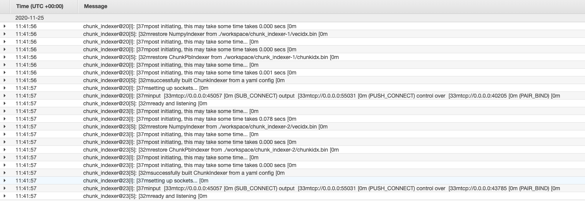

## Terraform for setting up cloud infrastructure

Configure AWS provider for Terraform as per README:
https://github.com/jina-ai/cloud-ops

We fetch the ip adresses of the pod-machines in the cloud VPN, putting them into JINA_ENCODER_HOST and JINA_INDEX_HOST environment variables
Send the curl command below to the jinad on the flow machine in order to spin up the flow:
```
curl -s --request PUT "http://localhost:8000/v1/flow/yaml" \
    -H  "accept: application/json" \
    -H  "Content-Type: multipart/form-data" \
    -F "uses_files=@pods/encode.yml" \
    -F "uses_files=@pods/extract.yml" \
    -F "uses_files=@pods/index.yml" \
    -F "pymodules_files=@pods/text_loader.py" \
    -F "yamlspec=@tests/distributed/flow-query.yml"
```

Docker image generated via `tests/distributed/Dockerfile` jinad will automatically be running on each machine brought up by Terraform.

The provisioning would hence be:
- Set up `Index` instance, make it use the Dockerfile
- Set up `Encode` instance, make it use the Dockerfile
- On the `Flow` instance, run the curl command. Extract the IPs of Index and Encode, make them available to Env variables

The terraform script here spins up AWS resources, this is the output of running
`terraform apply`:

<details> 
<summary>Click here to see the outputs </summary>

```
data.aws_iam_policy_document.assume_role_policy: Refreshing state...

An execution plan has been generated and is shown below.
Resource actions are indicated with the following symbols:
  + create
 <= read (data resources)

Terraform will perform the following actions:

  # data.aws_subnet_ids.default will be read during apply
  # (config refers to values not yet known)
 <= data "aws_subnet_ids" "default"  {
      + id     = (known after apply)
      + ids    = (known after apply)
      + tags   = (known after apply)
      + vpc_id = (known after apply)
    }

  # aws_alb.application_load_balancer will be created
  + resource "aws_alb" "application_load_balancer" {
      + arn                        = (known after apply)
      + arn_suffix                 = (known after apply)
      + dns_name                   = (known after apply)
      + drop_invalid_header_fields = false
      + enable_deletion_protection = false
      + enable_http2               = true
      + id                         = (known after apply)
      + idle_timeout               = 60
      + internal                   = (known after apply)
      + ip_address_type            = (known after apply)
      + load_balancer_type         = "application"
      + name                       = "southpark-lb-tf"
      + security_groups            = (known after apply)
      + subnets                    = (known after apply)
      + vpc_id                     = (known after apply)
      + zone_id                    = (known after apply)

      + subnet_mapping {
          + allocation_id = (known after apply)
          + subnet_id     = (known after apply)
        }
    }

  # aws_default_vpc.default_vpc will be created
  + resource "aws_default_vpc" "default_vpc" {
      + arn                              = (known after apply)
      + assign_generated_ipv6_cidr_block = (known after apply)
      + cidr_block                       = (known after apply)
      + default_network_acl_id           = (known after apply)
      + default_route_table_id           = (known after apply)
      + default_security_group_id        = (known after apply)
      + dhcp_options_id                  = (known after apply)
      + enable_classiclink               = (known after apply)
      + enable_classiclink_dns_support   = (known after apply)
      + enable_dns_hostnames             = (known after apply)
      + enable_dns_support               = true
      + id                               = (known after apply)
      + instance_tenancy                 = (known after apply)
      + ipv6_association_id              = (known after apply)
      + ipv6_cidr_block                  = (known after apply)
      + main_route_table_id              = (known after apply)
      + owner_id                         = (known after apply)
    }

  # aws_ecr_repository.southpark will be created
  + resource "aws_ecr_repository" "southpark" {
      + arn                  = (known after apply)
      + id                   = (known after apply)
      + image_tag_mutability = "MUTABLE"
      + name                 = "sp-repo"
      + registry_id          = (known after apply)
      + repository_url       = (known after apply)
      + tags                 = {
          + "Name" = "southpark_repo"
        }
    }

  # aws_ecs_cluster.southpark_cluster will be created
  + resource "aws_ecs_cluster" "southpark_cluster" {
      + arn  = (known after apply)
      + id   = (known after apply)
      + name = "southpark_cluster"

      + setting {
          + name  = (known after apply)
          + value = (known after apply)
        }
    }

  # aws_ecs_service.southpark_service will be created
  + resource "aws_ecs_service" "southpark_service" {
      + cluster                            = (known after apply)
      + deployment_maximum_percent         = 200
      + deployment_minimum_healthy_percent = 100
      + desired_count                      = 1
      + enable_ecs_managed_tags            = false
      + iam_role                           = (known after apply)
      + id                                 = (known after apply)
      + launch_type                        = "FARGATE"
      + name                               = "southpark_service"
      + platform_version                   = (known after apply)
      + scheduling_strategy                = "REPLICA"
      + task_definition                    = (known after apply)

      + load_balancer {
          + container_name   = "southpark_task"
          + container_port   = 45678
          + target_group_arn = (known after apply)
        }

      + network_configuration {
          + assign_public_ip = true
          + security_groups  = (known after apply)
          + subnets          = (known after apply)
        }

      + placement_strategy {
          + field = (known after apply)
          + type  = (known after apply)
        }
    }

  # aws_ecs_task_definition.southpark_task will be created
  + resource "aws_ecs_task_definition" "southpark_task" {
      + arn                      = (known after apply)
      + container_definitions    = (known after apply)
      + cpu                      = "256"
      + execution_role_arn       = (known after apply)
      + family                   = "southpark_task"
      + id                       = (known after apply)
      + memory                   = "512"
      + network_mode             = "awsvpc"
      + requires_compatibilities = [
          + "FARGATE",
        ]
      + revision                 = (known after apply)
    }

  # aws_iam_role.ecsExecutionRole will be created
  + resource "aws_iam_role" "ecsExecutionRole" {
      + arn                   = (known after apply)
      + assume_role_policy    = jsonencode(
            {
              + Statement = [
                  + {
                      + Action    = "sts:AssumeRole"
                      + Effect    = "Allow"
                      + Principal = {
                          + Service = "ecs-tasks.amazonaws.com"
                        }
                      + Sid       = ""
                    },
                ]
              + Version   = "2012-10-17"
            }
        )
      + create_date           = (known after apply)
      + force_detach_policies = false
      + id                    = (known after apply)
      + max_session_duration  = 3600
      + name                  = "ecsExecutionRole"
      + path                  = "/"
      + unique_id             = (known after apply)
    }

  # aws_iam_role_policy_attachment.ecsTaskExecutionRole_policy will be created
  + resource "aws_iam_role_policy_attachment" "ecsTaskExecutionRole_policy" {
      + id         = (known after apply)
      + policy_arn = "arn:aws:iam::aws:policy/service-role/AmazonECSTaskExecutionRolePolicy"
      + role       = "ecsExecutionRole"
    }

  # aws_instance.encoder will be created
  + resource "aws_instance" "encoder" {
      + ami                          = "ami-07efac79022b86107"
      + arn                          = (known after apply)
      + associate_public_ip_address  = (known after apply)
      + availability_zone            = (known after apply)
      + cpu_core_count               = (known after apply)
      + cpu_threads_per_core         = (known after apply)
      + get_password_data            = false
      + host_id                      = (known after apply)
      + id                           = (known after apply)
      + instance_state               = (known after apply)
      + instance_type                = "t2.micro"
      + ipv6_address_count           = (known after apply)
      + ipv6_addresses               = (known after apply)
      + key_name                     = (known after apply)
      + network_interface_id         = (known after apply)
      + outpost_arn                  = (known after apply)
      + password_data                = (known after apply)
      + placement_group              = (known after apply)
      + primary_network_interface_id = (known after apply)
      + private_dns                  = (known after apply)
      + private_ip                   = (known after apply)
      + public_dns                   = (known after apply)
      + public_ip                    = (known after apply)
      + security_groups              = (known after apply)
      + source_dest_check            = true
      + subnet_id                    = (known after apply)
      + tags                         = {
          + "Name" = "encoder"
        }
      + tenancy                      = (known after apply)
      + volume_tags                  = (known after apply)
      + vpc_security_group_ids       = (known after apply)

      + ebs_block_device {
          + delete_on_termination = (known after apply)
          + device_name           = (known after apply)
          + encrypted             = (known after apply)
          + iops                  = (known after apply)
          + kms_key_id            = (known after apply)
          + snapshot_id           = (known after apply)
          + volume_id             = (known after apply)
          + volume_size           = (known after apply)
          + volume_type           = (known after apply)
        }

      + ephemeral_block_device {
          + device_name  = (known after apply)
          + no_device    = (known after apply)
          + virtual_name = (known after apply)
        }

      + metadata_options {
          + http_endpoint               = (known after apply)
          + http_put_response_hop_limit = (known after apply)
          + http_tokens                 = (known after apply)
        }

      + network_interface {
          + delete_on_termination = (known after apply)
          + device_index          = (known after apply)
          + network_interface_id  = (known after apply)
        }

      + root_block_device {
          + delete_on_termination = (known after apply)
          + device_name           = (known after apply)
          + encrypted             = (known after apply)
          + iops                  = (known after apply)
          + kms_key_id            = (known after apply)
          + volume_id             = (known after apply)
          + volume_size           = (known after apply)
          + volume_type           = (known after apply)
        }
    }

  # aws_instance.flow will be created
  + resource "aws_instance" "flow" {
      + ami                          = "ami-07efac79022b86107"
      + arn                          = (known after apply)
      + associate_public_ip_address  = (known after apply)
      + availability_zone            = (known after apply)
      + cpu_core_count               = (known after apply)
      + cpu_threads_per_core         = (known after apply)
      + get_password_data            = false
      + host_id                      = (known after apply)
      + id                           = (known after apply)
      + instance_state               = (known after apply)
      + instance_type                = "t2.micro"
      + ipv6_address_count           = (known after apply)
      + ipv6_addresses               = (known after apply)
      + key_name                     = (known after apply)
      + network_interface_id         = (known after apply)
      + outpost_arn                  = (known after apply)
      + password_data                = (known after apply)
      + placement_group              = (known after apply)
      + primary_network_interface_id = (known after apply)
      + private_dns                  = (known after apply)
      + private_ip                   = (known after apply)
      + public_dns                   = (known after apply)
      + public_ip                    = (known after apply)
      + security_groups              = (known after apply)
      + source_dest_check            = true
      + subnet_id                    = (known after apply)
      + tags                         = {
          + "Name" = "flow"
        }
      + tenancy                      = (known after apply)
      + volume_tags                  = (known after apply)
      + vpc_security_group_ids       = (known after apply)

      + ebs_block_device {
          + delete_on_termination = (known after apply)
          + device_name           = (known after apply)
          + encrypted             = (known after apply)
          + iops                  = (known after apply)
          + kms_key_id            = (known after apply)
          + snapshot_id           = (known after apply)
          + volume_id             = (known after apply)
          + volume_size           = (known after apply)
          + volume_type           = (known after apply)
        }

      + ephemeral_block_device {
          + device_name  = (known after apply)
          + no_device    = (known after apply)
          + virtual_name = (known after apply)
        }

      + metadata_options {
          + http_endpoint               = (known after apply)
          + http_put_response_hop_limit = (known after apply)
          + http_tokens                 = (known after apply)
        }

      + network_interface {
          + delete_on_termination = (known after apply)
          + device_index          = (known after apply)
          + network_interface_id  = (known after apply)
        }

      + root_block_device {
          + delete_on_termination = (known after apply)
          + device_name           = (known after apply)
          + encrypted             = (known after apply)
          + iops                  = (known after apply)
          + kms_key_id            = (known after apply)
          + volume_id             = (known after apply)
          + volume_size           = (known after apply)
          + volume_type           = (known after apply)
        }
    }

  # aws_instance.indexer will be created
  + resource "aws_instance" "indexer" {
      + ami                          = "ami-07efac79022b86107"
      + arn                          = (known after apply)
      + associate_public_ip_address  = (known after apply)
      + availability_zone            = (known after apply)
      + cpu_core_count               = (known after apply)
      + cpu_threads_per_core         = (known after apply)
      + get_password_data            = false
      + host_id                      = (known after apply)
      + id                           = (known after apply)
      + instance_state               = (known after apply)
      + instance_type                = "t2.micro"
      + ipv6_address_count           = (known after apply)
      + ipv6_addresses               = (known after apply)
      + key_name                     = (known after apply)
      + network_interface_id         = (known after apply)
      + outpost_arn                  = (known after apply)
      + password_data                = (known after apply)
      + placement_group              = (known after apply)
      + primary_network_interface_id = (known after apply)
      + private_dns                  = (known after apply)
      + private_ip                   = (known after apply)
      + public_dns                   = (known after apply)
      + public_ip                    = (known after apply)
      + security_groups              = (known after apply)
      + source_dest_check            = true
      + subnet_id                    = (known after apply)
      + tags                         = {
          + "Name" = "indexer"
        }
      + tenancy                      = (known after apply)
      + volume_tags                  = (known after apply)
      + vpc_security_group_ids       = (known after apply)

      + ebs_block_device {
          + delete_on_termination = (known after apply)
          + device_name           = (known after apply)
          + encrypted             = (known after apply)
          + iops                  = (known after apply)
          + kms_key_id            = (known after apply)
          + snapshot_id           = (known after apply)
          + volume_id             = (known after apply)
          + volume_size           = (known after apply)
          + volume_type           = (known after apply)
        }

      + ephemeral_block_device {
          + device_name  = (known after apply)
          + no_device    = (known after apply)
          + virtual_name = (known after apply)
        }

      + metadata_options {
          + http_endpoint               = (known after apply)
          + http_put_response_hop_limit = (known after apply)
          + http_tokens                 = (known after apply)
        }

      + network_interface {
          + delete_on_termination = (known after apply)
          + device_index          = (known after apply)
          + network_interface_id  = (known after apply)
        }

      + root_block_device {
          + delete_on_termination = (known after apply)
          + device_name           = (known after apply)
          + encrypted             = (known after apply)
          + iops                  = (known after apply)
          + kms_key_id            = (known after apply)
          + volume_id             = (known after apply)
          + volume_size           = (known after apply)
          + volume_type           = (known after apply)
        }
    }

  # aws_lb_listener.lsr will be created
  + resource "aws_lb_listener" "lsr" {
      + arn               = (known after apply)
      + id                = (known after apply)
      + load_balancer_arn = (known after apply)
      + port              = 45678
      + protocol          = "HTTP"
      + ssl_policy        = (known after apply)

      + default_action {
          + order            = (known after apply)
          + target_group_arn = (known after apply)
          + type             = "forward"
        }
    }

  # aws_lb_target_group.target_group will be created
  + resource "aws_lb_target_group" "target_group" {
      + arn                                = (known after apply)
      + arn_suffix                         = (known after apply)
      + deregistration_delay               = 90
      + id                                 = (known after apply)
      + lambda_multi_value_headers_enabled = false
      + load_balancing_algorithm_type      = (known after apply)
      + name                               = "target-gp"
      + port                               = 45678
      + protocol                           = "HTTP"
      + proxy_protocol_v2                  = false
      + slow_start                         = 0
      + target_type                        = "ip"
      + vpc_id                             = (known after apply)

      + health_check {
          + enabled             = true
          + healthy_threshold   = 3
          + interval            = 80
          + matcher             = "200-405"
          + path                = "/"
          + port                = "traffic-port"
          + protocol            = "HTTP"
          + timeout             = 60
          + unhealthy_threshold = 2
        }

      + stickiness {
          + cookie_duration = (known after apply)
          + enabled         = (known after apply)
          + type            = (known after apply)
        }
    }

  # aws_security_group.load_balancer_security_group will be created
  + resource "aws_security_group" "load_balancer_security_group" {
      + arn                    = (known after apply)
      + description            = "control access to the ALB"
      + egress                 = [
          + {
              + cidr_blocks      = [
                  + "0.0.0.0/0",
                ]
              + description      = ""
              + from_port        = 0
              + ipv6_cidr_blocks = []
              + prefix_list_ids  = []
              + protocol         = "-1"
              + security_groups  = []
              + self             = false
              + to_port          = 0
            },
        ]
      + id                     = (known after apply)
      + ingress                = [
          + {
              + cidr_blocks      = [
                  + "0.0.0.0/0",
                ]
              + description      = ""
              + from_port        = 45678
              + ipv6_cidr_blocks = []
              + prefix_list_ids  = []
              + protocol         = "tcp"
              + security_groups  = []
              + self             = false
              + to_port          = 45678
            },
        ]
      + name                   = (known after apply)
      + owner_id               = (known after apply)
      + revoke_rules_on_delete = false
      + vpc_id                 = (known after apply)
    }

  # aws_security_group.service_security_group will be created
  + resource "aws_security_group" "service_security_group" {
      + arn                    = (known after apply)
      + description            = "Allow acces only from the ALB"
      + egress                 = [
          + {
              + cidr_blocks      = [
                  + "0.0.0.0/0",
                ]
              + description      = ""
              + from_port        = 0
              + ipv6_cidr_blocks = []
              + prefix_list_ids  = []
              + protocol         = "-1"
              + security_groups  = []
              + self             = false
              + to_port          = 0
            },
        ]
      + id                     = (known after apply)
      + ingress                = [
          + {
              + cidr_blocks      = []
              + description      = ""
              + from_port        = 0
              + ipv6_cidr_blocks = []
              + prefix_list_ids  = []
              + protocol         = "-1"
              + security_groups  = (known after apply)
              + self             = false
              + to_port          = 0
            },
        ]
      + name                   = (known after apply)
      + owner_id               = (known after apply)
      + revoke_rules_on_delete = false
      + vpc_id                 = (known after apply)
    }

Plan: 15 to add, 0 to change, 0 to destroy.
```

Warning: Interpolation-only expressions are deprecated

  on terraform.tf line 42, in data "aws_subnet_ids" "default":
  42:   vpc_id = "${aws_default_vpc.default_vpc.id}"

Terraform 0.11 and earlier required all non-constant expressions to be
provided via interpolation syntax, but this pattern is now deprecated. To
silence this warning, remove the "${ sequence from the start and the }"
sequence from the end of this expression, leaving just the inner expression.

Template interpolation syntax is still used to construct strings from
expressions when the template includes multiple interpolation sequences or a
mixture of literal strings and interpolations. This deprecation applies only
to templates that consist entirely of a single interpolation sequence.

(and 14 more similar warnings elsewhere)

Do you want to perform these actions?
  Terraform will perform the actions described above.
  Only 'yes' will be accepted to approve.

  Enter a value: yes


## Creation of resources produces log:

```
aws_ecr_repository.southpark: Creating...
aws_default_vpc.default_vpc: Creating...
aws_instance.flow: Creating...
aws_ecs_cluster.southpark_cluster: Creating...
aws_security_group.load_balancer_security_group: Creating...
aws_iam_role.ecsExecutionRole: Creating...
aws_instance.indexer: Creating...
aws_instance.encoder: Creating...
aws_ecr_repository.southpark: Creation complete after 3s [id=sp-repo]
aws_iam_role.ecsExecutionRole: Creation complete after 4s [id=ecsExecutionRole]
aws_iam_role_policy_attachment.ecsTaskExecutionRole_policy: Creating...
aws_ecs_task_definition.southpark_task: Creating...
aws_ecs_task_definition.southpark_task: Creation complete after 2s [id=southpark_task]
aws_default_vpc.default_vpc: Still creating... [10s elapsed]
aws_instance.flow: Still creating... [10s elapsed]
aws_ecs_cluster.southpark_cluster: Still creating... [10s elapsed]
aws_security_group.load_balancer_security_group: Still creating... [10s elapsed]
aws_instance.indexer: Still creating... [10s elapsed]
aws_instance.encoder: Still creating... [10s elapsed]
aws_iam_role_policy_attachment.ecsTaskExecutionRole_policy: Creation complete after 7s [id=ecsExecutionRole-20201111074001649600000002]
aws_security_group.load_balancer_security_group: Creation complete after 15s [id=sg-0715058114b7a741b]
aws_security_group.service_security_group: Creating...
aws_default_vpc.default_vpc: Creation complete after 19s [id=vpc-aca40bc7]
data.aws_subnet_ids.default: Reading...
aws_lb_target_group.target_group: Creating...
aws_ecs_cluster.southpark_cluster: Creation complete after 19s [id=arn:aws:ecs:us-east-2:416454113568:cluster/southpark_cluster]
aws_instance.flow: Still creating... [20s elapsed]
aws_instance.encoder: Still creating... [20s elapsed]
aws_instance.indexer: Still creating... [20s elapsed]
data.aws_subnet_ids.default: Read complete after 1s [id=vpc-aca40bc7]
aws_alb.application_load_balancer: Creating...
aws_security_group.service_security_group: Still creating... [10s elapsed]
aws_lb_target_group.target_group: Creation complete after 6s [id=arn:aws:elasticloadbalancing:us-east-2:416454113568:targetgroup/target-gp/24febcf8aac1b7ae]
aws_instance.flow: Still creating... [30s elapsed]
aws_instance.indexer: Still creating... [30s elapsed]
aws_instance.encoder: Still creating... [30s elapsed]
aws_alb.application_load_balancer: Still creating... [10s elapsed]
aws_security_group.service_security_group: Still creating... [20s elapsed]
aws_instance.flow: Still creating... [40s elapsed]
aws_instance.encoder: Still creating... [40s elapsed]
aws_instance.indexer: Still creating... [40s elapsed]
aws_alb.application_load_balancer: Still creating... [20s elapsed]
aws_security_group.service_security_group: Creation complete after 27s [id=sg-0822ef672ee11a158]
aws_instance.flow: Still creating... [50s elapsed]
aws_instance.indexer: Still creating... [50s elapsed]
aws_instance.encoder: Still creating... [50s elapsed]
aws_alb.application_load_balancer: Still creating... [30s elapsed]
aws_instance.indexer: Creation complete after 50s [id=i-04b25f4997c8b27b2]
aws_instance.encoder: Creation complete after 51s [id=i-07ee40a8c9b273f2b]
aws_instance.flow: Creation complete after 54s [id=i-0471e78dd6e2ae2a9]
aws_alb.application_load_balancer: Still creating... [40s elapsed]
aws_alb.application_load_balancer: Still creating... [50s elapsed]
aws_alb.application_load_balancer: Still creating... [1m0s elapsed]
aws_alb.application_load_balancer: Still creating... [1m10s elapsed]
aws_alb.application_load_balancer: Still creating... [1m20s elapsed]
aws_alb.application_load_balancer: Still creating... [1m30s elapsed]
aws_alb.application_load_balancer: Still creating... [1m40s elapsed]
aws_alb.application_load_balancer: Still creating... [1m50s elapsed]
aws_alb.application_load_balancer: Still creating... [2m0s elapsed]
aws_alb.application_load_balancer: Still creating... [2m10s elapsed]
aws_alb.application_load_balancer: Creation complete after 2m11s [id=arn:aws:elasticloadbalancing:us-east-2:416454113568:loadbalancer/app/southpark-lb-tf/0a247285d77e7b25]
aws_lb_listener.lsr: Creating...
aws_lb_listener.lsr: Creation complete after 2s [id=arn:aws:elasticloadbalancing:us-east-2:416454113568:listener/app/southpark-lb-tf/0a247285d77e7b25/4c9cb7d5a1788dff]
aws_ecs_service.southpark_service: Creating...
aws_ecs_service.southpark_service: Creation complete after 8s [id=arn:aws:ecs:us-east-2:416454113568:service/southpark_cluster/southpark_service]

Apply complete! Resources: 15 added, 0 changed, 0 destroyed.

```

</details>

You can see the logs on the AWS console under:

CloudWatch -> LogGroups

<p align="center">
  
</p>

Click on the desired one and you'll see the details 

<p align="center">
  
</p>