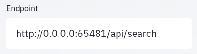
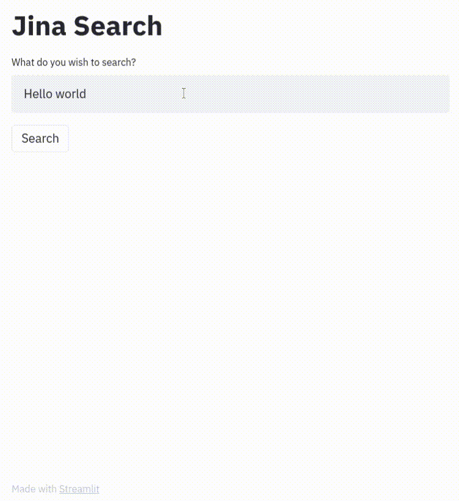
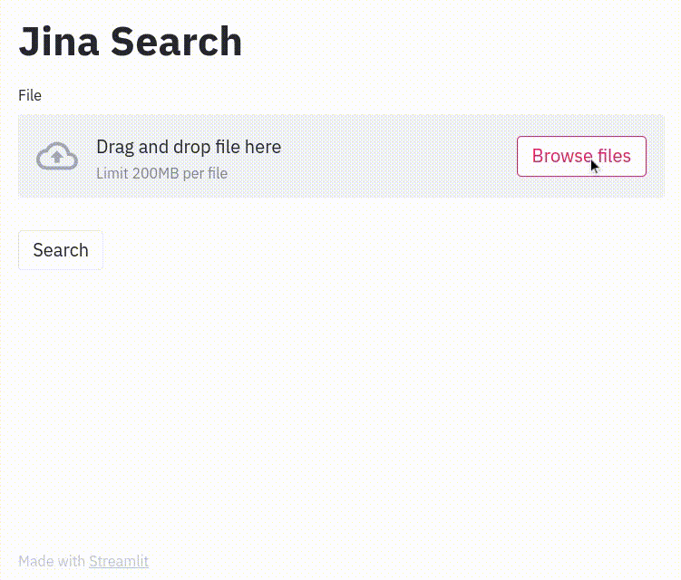
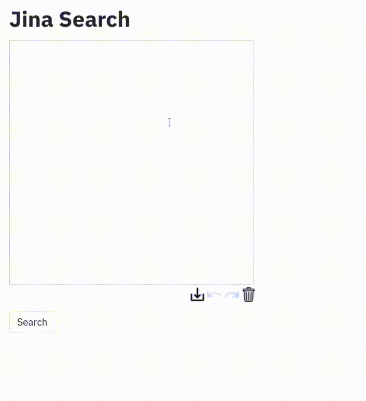

<!-- START doctoc generated TOC please keep comment here to allow auto update -->
<!-- DON'T EDIT THIS SECTION, INSTEAD RE-RUN doctoc TO UPDATE -->
**Table of Contents**

- [Jina + Streamlit](#jina--streamlit)
  - [1. Clone repo, install requirements](#1-clone-repo-install-requirements)
  - [1. Run Docker image](#1-run-docker-image)
  - [3. Start up Streamlit front end](#3-start-up-streamlit-front-end)
  - [4. Set endpoint](#4-set-endpoint)
  - [5. Search!](#5-search)

<!-- END doctoc generated TOC please keep comment here to allow auto update -->

# Jina + Streamlit

A more comprehensive [Streamlit](http://www.streamlit.io) front-end for [Jina](http://www.jina.ai) neural search framework.

## 1. Clone repo, install requirements

```bash
git clone https://github.com/alexcg1/jina-streamlit-frontend.git
cd jina-streamlit-frontend
pip install -r requirements.txt
```

## 1. Run Docker image

For text:

```bash
docker run -p 45678:45678 jinaai/hub.app.distilbert-southpark
```

For image:

```bash
docker run -p 65481:65481 -e "JINA_PORT=65481" jinaai/hub.app.bitsearch-pokedex search
```

## 3. Start up Streamlit front end

```bash
streamlit run app.py
```

## 4. Set endpoint

Use whatever Docker says is the right URL and port (in examples above, `45678` or `65481`)



## 5. Search!

<table>
<tr>
<td>Text</td>
<td>Image</td>
<td>Draw</td>
</tr>


<tr>
<td>

</td>
<td>

</td>
<td>

</td>
</tr>
</table>
