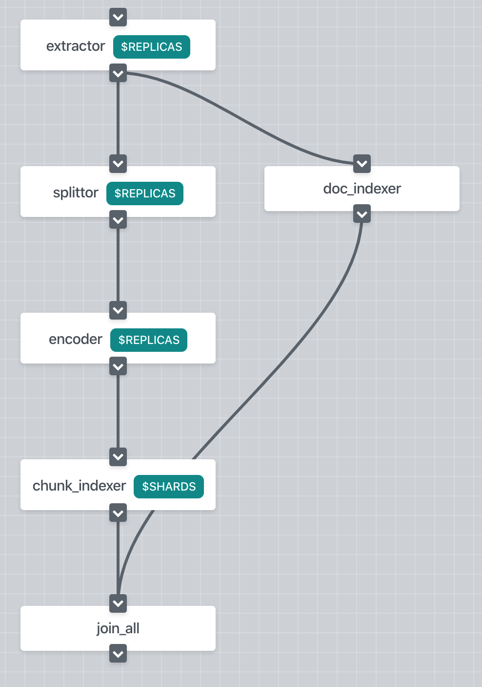
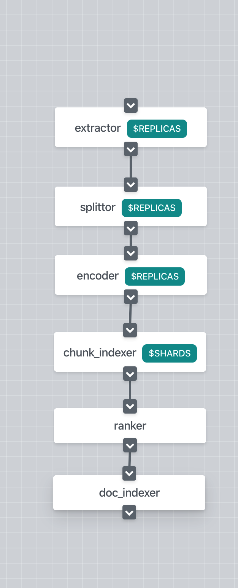

# Build Bert-based NLP Semantic Search System in 3 minutes
<p align="center">
 
[](https://jina.ai)

[](https://github.com/jina-ai/jina#jina-hello-world-)
[](#license)
[](https://docs.jina.ai)
[](https://jobs.jina.ai)
<a href="https://twitter.com/intent/tweet?text=%F0%9F%91%8DCheck+out+Jina%3A+the+New+Open-Source+Solution+for+Neural+Information+Retrieval+%F0%9F%94%8D%40JinaAI_&url=https%3A%2F%2Fgithub.com%2Fjina-ai%2Fjina&hashtags=JinaSearch&original_referer=http%3A%2F%2Fgithub.com%2F&tw_p=tweetbutton" target="_blank">
  </img>
</a>
[](#)
[](https://hub.docker.com/r/jinaai/jina/tags)

</p>

In this demo, we use Jina to build a vocabulary search engine so that one can find a word if s/he only knows the definition. We use the [urban-dictionary-words-dataset](https://www.kaggle.com/therohk/urban-dictionary-words-dataset) from kaggle. The data contains 1.7 million entries from Urban Dictionary with definations and votes. In the urbandict data, each word has one or more definitions. Therefore we consider a word and its definition as one **document**, and each sentence in the definition as one **chunk**. If you are not familiar with these concepts, we highly suggest to go through our lovely [Jina 101](https://github.com/jina-ai/jina/tree/master/docs/chapters/101) and [Jina "Hello, World!"👋🌍](https://github.com/jina-ai/jina#jina-hello-world-) before moving forward. 

As the same as build classic search engines, we first build an index for all the documents (i.e. the words and their definitions from the urban dictionary) and later use the query document (i.e. the user's input definition) to retrieve the indexed documents.


<!-- START doctoc generated TOC please keep comment here to allow auto update -->
<!-- DON'T EDIT THIS SECTION, INSTEAD RE-RUN doctoc TO UPDATE -->
**Table of Contents**

- [Overview](#overview)
- [Prerequirements](#prerequirements)
- [Prepare the data](#prepare-the-data)
- [Define the Flows](#define-the-flows)
- [Run the Flows](#run-the-flows)
- [Dive into the Pods](#dive-into-the-pods)
- [Wrap up](#wrap-up)
- [Next Steps](#next-steps)
- [Documentation](#documentation)
- [Community](#community)
- [License](#license)

<!-- END doctoc generated TOC please keep comment here to allow auto update -->


## Overview

Before dashing into the codes, let's have an overview of the magic. The goal is to enable to find the word if you only know the definition. To make this happen, we consider each sentence in the words' definition as a chunk, which is the minimal semantical unit in Jina. Specially, each word can be explained with a few sentences. And each sentence, as a chunk, is encoded into a vector with the help of the **Encoder** (i.e. we use the `DistilBert` from the `transformer` lib). 

During indexing, Jina, _the_ neural search framework, uses vectors to represent the words and save the vectors in the index. During querying, having only the definition from the user's input, we encode the input into vectors with the same **Encoder**. So that, these query vectors can be used to retrieve the indexed words with similiar definitions back.

<p align="center">
  
</p>

## Prerequirements

This demo requires Python 3.7.

```bash
pip install --upgrade -r requirements.txt
```


## Prepare the data

The raw urbandict data contains 2.5 million entries in the `.csv` format as following.

```
word_id,word,up_votes,down_votes,author,definition
0000007,Janky,296,255,dc397b2f,"Undesirable; less-than optimum."
```

Please download the `urban-dictionary-words-dataset.zip` from
[https://www.kaggle.com/therohk/urban-dictionary-words-dataset](https://www.kaggle.com/therohk/urban-dictionary-words-dataset) and saved at `/tmp`. 

After downloading, run the following script to do some data wrangling before indexing. We use the uncased words and drop the definitions with few up-votes. In total, 744,676 words are kept with 1,112,851 definitions. The processed data is kept in `/tmp/jina/urbandict/urbandict-word-defs.json`. 

```bash
python prepare_data.py
```


## Define the Flows
### Index
To index the data we first need to define our **Flow**. Here we use **YAML** file to define the Flow. In the Flow YAML file, we add **Pods** in sequence. In this demo, we have 5 pods defined with the name of `splitter`, `encoder`, `chunk_indexer`, `doc_indexer`, and `join_all`. 

However, we have another Pod working in silent. Actually, the input to the very first Pod is always the Pod with the name of **gateway**, the Forgotten Pod. For most time, we can safely ignore the **gateway** because it basically do the dirty orchestration work for the Flow.

<table style="margin-left:auto;margin-right:auto;">
<tr>
<td> flow-index.yml</td>
<td> Flow in Dashboard</td>
</tr>
<tr>
<td>
  <sub>

```yaml
!Flow
pods:
  splitter:
    uses: yaml/craft-index.yml
  encoder:
    uses: yaml/encode.yml
    timeout_ready: 60000
  chunk_indexer:
    uses: yaml/index-chunk.yml
  doc_indexer:
    uses: yaml/index-doc.yml
    needs: gateway
  join_all:
    uses: _merge
    needs: [doc_indexer, chunk_indexer]
```

</sub>

</td>
<td>

</td>
</tr>
</table>

By default, the input of each Pod is the Pod defined right above it, and the request message flows from one Pod to another. That how Flow lives up to its name. Of course, you might want to have a Pod skipping or jump over the above Pods. In this case, you will use the `needs` argument to specify the source of the input messages. In our case, the `doc_indexer` actually get inputs directly from the `gateway`. By doing this, we have two pathways in parallel as shown in the index Flow diagram.

```yaml
doc_indexer:
  uses: yaml/index-doc.yml
  needs: gateway
```

As we can see, for most Pods, we only need to define the YAML file path. Given the YAML files, jina will automatically build the Pods. Plus, `timeout_ready` is a useful argument when adding a Pod, which defines the waiting time before the Flow considers the Pod fails to initialize. 

```yaml
encoder:
  uses: yaml/encode.yml
  timeout_ready: 60000
```

You might also notice the `join_all` Pod has a special YAML path. It denotes a built-in YAML path, which will merge all the incoming messages defined in `needs`.

```yaml
join_all:
  uses: _merge
  needs: [doc_indexer, chunk_indexer]
```

Overall, the index Flow has two pathways, as shown in the Flow diagram. The idea is to save the index and the contents seperately so that one can quickly retrieve the Document Ids from the index and afterwards combine the Document Id with its content. 

The pathway on the right side with single `doc_indexer` is used to storage the Document content. Underhood it is basically a key-value storage. The key is the Document Id and the value is the Document itself.

The pathway on the other side is for saving the index. From top to bottom, the first Pod, `splitter`, is used to split the Document into Chunks, which are the basic units to process in jina. Chunks are later encoded into vectors by the `encoder`. These vectors together with other informations in the Chunks are saved in a vector storage by `chunk_indexer`. Finally, the two pathway are merged by `join_all` and the processing of one message is concluded.


### Query
As in the indexing time, we also need a Flow to process the request message during querying. Here we start with the `splitter` sharing exactly the same YAML with its conterpart in the index Flow. This means it plays the same role as before, which is to split the Document into Chunks. Afterwards, the Chunks are encoded into vectors by `encoder`, and later these vectors are used to retrieve the indexed Chunks by `chunk_indexer`. As the same as the `splitter`, both `encoder` and `chunk_indexer` share the YAML with their counterparts in the index Flow. 

<table  style="margin-left:auto;margin-right:auto;">
<tr>
<td> flow-query.yml</td>
<td> Flow in Dashboard</td>
</tr>
<tr>
<td>
  <sub>

```yaml
!Flow
with:
  read_only: true
pods:
  splitter:
    uses: yaml/craft-index.yml
  encoder:
    uses: yaml/encode.yml
    timeout_ready: 60000
  chunk_indexer:
    uses: yaml/index-chunk.yml
  ranker:
    uses: BM25Ranker
  doc_indexer:
    uses: yaml/index-doc.yml
```

</sub>

</td>
<td>

</td>
</tr>
</table>


Eventually, here comes a new Pod with the name of `ranker`. Remember that Chunks are the basic units in jina. In the deep core of jina, both indexing and quering take place at the Chunk level. Chunks are the elements the, the jina core can understand and process. However, we need to ship the final query results in the form of Document, which are actually meaningful for the users. This is exactly the job of `ranker`. `ranker` combines the querying results from the Chunk level into the Document level. In this demo, we use the built-in `BM25Ranker` to do the job. It uses the BM25 algorithm to get the weights of query Chunks, and calculates the weights sum of the Chunks' matching scores as the score of the matched Document. For the details, please refer to the jina document page. 

```yaml
ranker:
  uses: BM25Ranker
```

At the last step, the `doc_indexer` comes into play. Sharing the same YAML file, `doc_indexer` will load the storaged key-value index and retrieve the matched Documents back according the Document Id.

### Let's take a closer look
Now we've both index and query Flows ready to work. Before proceeding forward, let's take a closer look at the two Flows and check out the differences between them. 

Obviously, they have different structure, although they share most Pods. This is a common practice in the jina world for the consideration of speed. Except the `ranker`, both Flow can indeed use the identical structure. The two-pathway design of the index Flow is intended to speed up the message passing, because indexing the Chunks and the Documents can be done in parallel. 

Another important difference is that the two Flows are used to process different types of request messages. To index a Document, we send an **IndexRequest** to the Flow. While querying, we send a **SearchRequest**. That's why the Pods in both Flows can share the YAML files while playing different roles. Later, we will dive deep into into the YAML files, where we define the different ways of processing messages of various types.


## Run the Flows

### Index 

 
```bash
python app.py -t index -n 10000
```

<details>
<summary>Click here to see the console output</summary>

<p align="center">
  
</p>

</details> 

With the Flows, we now can write the codes to run the Flow. For indexing, we start with defining the Flow with YAML file. Afterwards, the `build()` function will do the magic to construct Pods and connect them together. Then the `IndexRequest` will be sent to the flow by calling the `index()` function. 

```python        
def main(num_docs):
    f = Flow().load_config('flow-index.yml')
    with f:
        f.index_lines(filepath=data_fn, size=num_docs, batch_size=16)
```

The content of the `IndexRequest` is fed from the `read_data()`, which loads the processed JSON file and output each word together with its defintion in `bytes` format.
Encoding the text with bert-family models will take a long time. To save your time, here we limit the number of indexing documents to 10000.

```python
def read_data(fn, max_sample_size=10000):
    with open(fn, 'r') as f:
        data_dict = json.load(f)
        for r in data_dict[:max_sample_size]:
            word = r['word'].lower()
            def_text = r['text'].lower()
            yield '{}: {}'.format(word, def_text).encode('utf8')
```

### Query

#### Via interactive input

```bash
python app.py -t query
```

<details>
<summary>Click here to see the console output</summary>

<p align="center">
  
</p>

</details> 

As for the query part, we follow the same story to define and build the Flow from the YAML file. The `search()` function is used to send a `SearchRequest` to the Flow. Here we accept the user query inputs from the terminal and wrap it into request message in the `bytes` format. 

```python
def read_query_data(text):
    yield '{}'.format(text).encode('utf8')     

def main(top_k):
    flow = Flow().load_config('flow-query.yml')
    with flow.build() as fl:
        while True:
            text = input('word definition: ')
            if not text:
                break
            ppr = lambda x: print_topk(x, text)
            fl.search(read_query_data(text), callback=ppr, top_k=top_k)
```

The `callback` argument is used to post-process the returned message. In this demo, we define a simple `print_topk` function to show the results. The returned message `resp` in a protobuf message. `resp.search.docs` contains all the Documents for searching, and in our case there is only one Document. For each query Document, the matched Documents, `.match_doc`, together with the matching score, `.score`, are storaged under the `.topk_results` as a repeated variable.

```python
ppr = lambda x: print_topk(x, text)
fl.search(read_query_data(text), callback=ppr, top_k=top_k)
```

```python
def print_topk(resp, word):
    for d in resp.search.docs:
        print(f'Ta-Dah🔮, here are what we found for: {word}')
        for idx, match in enumerate(d.matches):
            score = match.score.value
            if score <= 0.0:
                continue
            doc = match.chunks[0].text
            word, word_def = doc.split('+-=', maxsplit=1)
            print('> {:>2d}({:.2f}). {}: "{}"'.format(idx, score, word, word_def.strip()))     
```

#### Via jina python client

As part of this tutorial, we also want to show, how you can query a running jina flow via the jina `py_client`. You can also run in a second console:

```bash
python http_query.py "luxury cars"
```

Beware, that the input and output processing are identical to searching on the flow locally. This guarantees a seemless switch from testing a flow towards using it in production.

## Dive into the Pods
If you want to know more about Pods, keep reading. As shown above, we defined the Pods by giving the YAML files. Now let's move on to see what is exactly written in these magic YAML files.

### `splitter`
As a convention in jina, A YAML config is used to describe the properties of an object so that we can easily config the behavior of the Pods without touching the codes. 

Here is the YAML file for the `splitter`. We firstly claim to use the built-in **Sentencizer** as the **executor** in the Pod. The `with` field is used to specify the arguments passing to the `__init__()` function. 


```yaml
!Sentencizer
with:
  min_sent_len: 3
  max_sent_len: 128
  punct_chars: '.,;!?:'
``` 

In the `requests` field, we define the different behaviors of the Pod to different requests. Remember that both the index and the query Flows share the same Pods with the YAML files while they behaving differently to the requests. Here is how the magic works. For `SearchRequest`, `IndexRequest`, and `TrainRequest`, the `splitter` will use the `SegmentDriver`. On one hand, the Driver interpretes the request messages (in the format of Protobuf) into the format that the Executor can understand(e.g. Numpy array). On the other hand, the `SegmentDriver` will call the `craft()` function from the Executor to handle the message and translate the processed results back into Protobuf format. For the time being, the `splitter` show the same behavior for both requests.


```yaml
requests:
  on:
    [SearchRequest, IndexRequest]:
      - !SegmentDriver
        with:
          method: craft
``` 

### `encoder`
The YAML file of the `encoder` is pretty much similar to the `splitter`. As one can see, we specify to use the `distilbert-base-cased` model. One can easily switch to other fancy pretrained models from **transformers** by giving another `model_name`.

```yaml
!TransformerTorchEncoder
with:
  pooling_strategy: cls
  model_name: distilbert-base-cased
  max_length: 96
```

### `doc_indexer`
In contrast to the Pods above, the `doc_indexer` different behaviors on different requests. As for the `IndexRequest`, the Pod uses `DocPruneDriver` and the `DocKVIndexDriver` in sequence. The `DocPruneDriver` is used to prune the redundant data in the message that are not used by the downstream Pods. 

```yaml
!BinaryPbIndexer
with:
  index_filename: doc.gzip
metas:
  name: docIndexer
  workspace: $TMP_WORKSPACE
```

As for the `SearchRequest`, the Pod uses the same `DocKVSearchDriver` as in for the `IndexRequest`, but the Driver calls different functions in the Executor, `LeveldbIndexer`.
```yaml
requests:
  on:
    SearchRequest:
      - !DocKVSearchDriver
      with:
        method: query
```

### `chunk_indexer`
The YAML file for `chunk_indexer` is a little bit curbersome. Take it easy, it is as straightforward as it should be. The executor in the `chunk_indexer` Pod is called `ChunkIndexer`, which wraps up two other executors. The `components` field specifies the two wrapped-up executors. The `NumpyIndexer` is used to storage the Chunks' vectors, and the `BasePbIndexer` is used as a key-value storage to save the Chunk Id and the Chunk details.

```yaml
!ChunkIndexer
components:
  - !NumpyIndexer
    with:
      index_filename: vec.gz
      metric: cosine
    metas:
      name: vecidx  # a customized name
      workspace: $TMP_WORKSPACE
  - !BinaryPbIndexer
    with:
      index_filename: chunk.gz
    metas:
      name: chunkidx  # a customized name
      workspace: $TMP_WORKSPACE
metas:
  name: chunk_indexer
  workspace: $TMP_WORKSPACE
```

As the same as the `doc_indexer`, the `chunk_indexer` also have different behaviors on different requests. For the `IndexRequest`, the `chunk_indexer` uses three Drivers in serial, namely, `VectorIndexDriver`, `PruneDriver`, and `KVIndexDriver`. The idea is to firstly use `VectorIndexDriver` to call the `index()` function from the `NumpyIndexer` so that the vectors for all the Chunks are indexed. Afterwards the `PruneDriver` prune the message, and the `KVIndexDriver` calls the `index()` function from the `BasePbIndexer`. This behavior is defined in the `executor` field.

```yaml
requests:
  on:
    IndexRequest:
      - !VectorIndexDriver
        with:
          executor: NumpyIndexer
      - !PruneDriver
        with:
          level: chunk
          pruned:
            - embedding
            - buffer
            - blob
            - text
      - !KVIndexDriver
        with:
          level: chunk
          executor: BasePbIndexer
```

For the `SearchRequest`, the same procedure goes on, but underhood the `KVSearchDriver` and the `VectorSearchDriver` will call `query()` function from the `NumpyIndexer` and the `BasePbIndexer` correspondingly.

```yaml
requests:
  on:
    SearchRequest:
      - !VectorSearchDriver
        with:
          executor: NumpyIndexer
      - !PruneDriver
        with:
          level: chunk
          pruned:
            - embedding
            - buffer
            - blob
            - text
      - !KVSearchDriver
        with:
          level: chunk
          executor: BasePbIndexer
```

## Wrap up
Congratulation! Now you've your own neural search engine explained!

Let's wrap up what we've covered in this demo.

1. Chunks are basic elements in jina. Documents are the final inputs and outputs from jina. 
2. Flows are our good friends to build the search engine. To either index or query, we need define a Flow and build it.
3. The index and the query Flow shares most Pods.
4. The Pods in the Flow can run either in serial or in parallel.
5. The Pods can behave differently to different types of requests. The Pods' YAML file defines their behaviors.
6. The data in the requests should be in `bytes` format.
7. Inside the Pods, Drivers are used to interpret the messages for Executors, call the Executors to handle the messages, and wrap up the results back into the message.
8. The query results in the return response are saved in the Protobuf format.

**Enjoy Coding with Jina!**

## Next Steps
- Try other encoders or rankers.
- Run the Pods in docker containers.
- Scale up the indexing procedure.
- Speed up the procedure by useing `read_only`
- Explore the `metas` field in the YAML file.


## Documentation 

<a href="https://docs.jina.ai/">

</a>

The best way to learn Jina in depth is to read our documentation. Documentation is built on every push, merge, and release event of the master branch. You can find more details about the following topics in our documentation.

- [Jina command line interface arguments explained](https://docs.jina.ai/chapters/cli/index.html)
- [Jina Python API interface](https://docs.jina.ai/api/jina.html)
- [Jina YAML syntax for executor, driver and flow](https://docs.jina.ai/chapters/yaml/yaml.html)
- [Jina Protobuf schema](https://docs.jina.ai/chapters/proto/index.html)
- [Environment variables used in Jina](https://docs.jina.ai/chapters/envs.html)
- ... [and more](https://docs.jina.ai/index.html)


## Community

- [Slack channel](https://join.slack.com/t/jina-ai/shared_invite/zt-dkl7x8p0-rVCv~3Fdc3~Dpwx7T7XG8w) - a communication platform for developers to discuss Jina
- [Community newsletter](mailto:newsletter+subscribe@jina.ai) - subscribe to the latest update, release and event news of Jina
- [LinkedIn](https://www.linkedin.com/company/jinaai/) - get to know Jina AI as a company and find job opportunities
- [](https://twitter.com/JinaAI_) - follow us and interact with us using hashtag `#JinaSearch`  
- [Company](https://jina.ai) - know more about our company, we are fully committed to open-source!


## License

Copyright (c) 2020 Jina AI Limited. All rights reserved.

Jina is licensed under the Apache License, Version 2.0. See [LICENSE](https://github.com/jina-ai/jina/blob/master/LICENSE) for the full license text.
