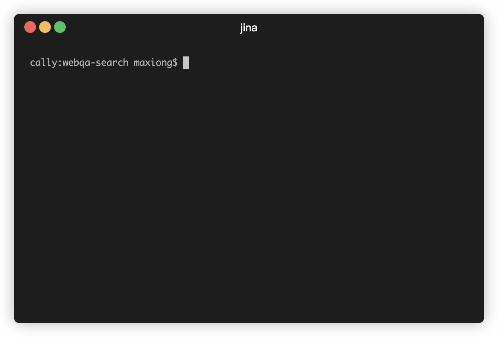
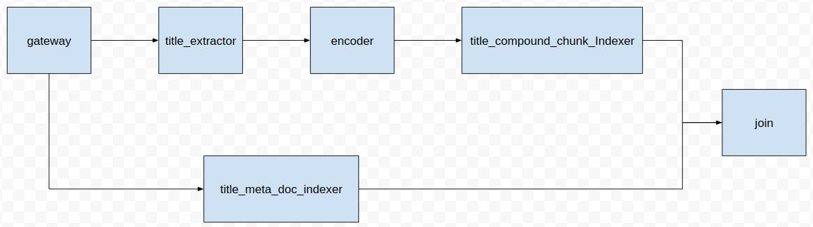
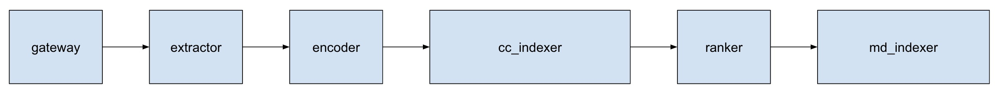

# JINA 100行代码搭建一套中文问答神经网络搜索引擎

## 前言

    一提到搜索引擎，大家可能会想到实现**困难，系统复杂、臃肿**。但是现在有一个**魔法器**，**它可以让我们专注于业务本身，以最快的时间实现一套**神经网络搜索引擎。

    那这个魔法器是什么呢？它就是**jina**；那jina是什么呢？jina是一个**开源神经搜索引擎框架**，它有什么特点呢？**易上手**、**分布式**、**模型容器化**、**弹性扩展**和**云原生**。

    讲到这，有没有觉得很高大上呢？有没有想马上利用jina搭建一套自己的搜索引擎呢？

    那今天我们来介绍如何使用jina**快速**搭建一套中文问答搜索引擎。

## 效果展示



## 示例

    在一般的搜索引擎中，创建索引和搜索是两个最基本的步骤。在jina中，将每个步骤都当成一个流水线，通过增加不同职责的工人来完成需要的工作。在jina中将流水线用`Flow`来定义，不同职责的工人用`Pod`来定义，通过`add()`增加不同职责的工人。

### Index Flow

```python
index_flow = (Flow().add(name='extractor', yaml_path='=extractor.yml')
 .add(name='md_indexer', yaml_path='md_indexer.yml', needs='gateway')
 .add(name='encoder', yaml_path='encoder.yml', needs='extractor', timeout_ready=60000)
 .add(name='cc_indexer', yaml_path='cc_indexer.yml',
 needs='encoder')
 .join(['md_indexer', 'cc_indexer']))
```

### Query Flow

```python
query_flow = (Flow().add(name='extractor', yaml_path='extractor.yml', needs='gateway')
 .add(name='encoder', yaml_path='encoder.yml', needs="extractor", timeout_ready=60000)
 .add(name='cc_indexer',yaml_path='cc_indexer.yml',
 needs='encoder')
 .add(name='ranker', yaml_path='ranker.yml', needs='cc_indexer')
 .add(name='md_indexer', yaml_path='md_indexer.yml',needs='ranker'))
```

    是不是惊讶了，如此少的代码实现了这么好的效果。这一切都要归功于jina，jina的特点就是模块化和易于使用，并且通过yaml文件注入的方式实现相应的逻辑，如果不熟悉yaml文件的同学，点击[链接](https://yaml.org/spec/1.2/spec.html)。

## 数据集

### 数据描述

    本系统采用web text 2019数据集，由于web text 2019数据集的数据形式是一问多答的情况，我们希望在建立完索引之后，用户输入问题，系统返回相似的问题和问题下的答案。

    数据集下载[地址](https://drive.google.com/open?id=1u2yW_XohbYL2YAK6Bzc5XrngHstQTf0v)。

    数据集含有410万个预先过滤过的、高质量问题和回复。每个问题属于一个【话题】，总共有2.8万个各式话题，话题包罗万象。从1400万个原始问答中，筛选出至少获得3个点赞以上的的答案，代表了回复的内容比较不错或有趣，从而获得高质量的数据集。除了对每个问题对应一个话题、问题的描述、一个或多个回复外，每个回复还带有点赞数、回复ID、回复者的标签。

### 样例

```json
    {"qid": 65618973, "title": "AlphaGo只会下围棋吗？阿法狗能写小说吗？", "desc": "那么现在会不会有智能机器人能从事文学创作？如果有，能写出什么水平的作品？", "topic": "机器人", "star": 3, "content": "AlphaGo只会下围棋，因为它的设计目的，架构，技术方案以及训练数据，都是围绕下围棋这个核心进行的。它在围棋领域的突破，证明了深度学习深度强化学习MCTS技术在围棋领域的有效性，并且取得了重大的PR效果。AlphaGo不会写小说，它是专用的，不会做跨出它领域的其它事情，比如语音识别，人脸识别，自动驾驶，写小说或者理解小说。如果要写小说，需要用到自然语言处理（NLP））中的自然语言生成技术，那是人工智能领域一个", "answer_id": 545576062, "answerer_tags": "人工智能@游戏业"}
```

## 搭建

### 解压数据集

1. 首先在解压数据集之前，我们需要将下载好的数据集压缩文件放入```/tmp```文件夹中

2. 执行```prepare_data.py```文件

 

### 创建索引

    首先在搭建之前我们先利用流程图来构建索引的`flow`，里面每一个方块代表了一个`Pod`。



    下面我们来对每个`Pod`进行详细介绍。

### gateway

    `gateway`相当于一个请求接收器，接受客户端的请求，并将请求传入`Flow`中；在jina中无需我们自己创建`gateway`，在创建`Flow`时，jina会自动创建`gateway`。

#### extractor

    `gateway`接收到的是一个一问多答的json串，我们在这称为`doc`级别的信息，但是一个`doc`携带的信息太多，jina细化了`doc`中的信息，引入了`chunk`的概念，即将`doc`分割成多个`chunk`。

    由于我们只对问题创建索引，所以这里我们只需要提取出`doc`中的问题，即每个`doc`分割出来的`chunk`只有1个。

```python
class WebQATitleExtractor(BaseSegmenter):
    def craft(self, doc_id, raw_bytes, *args, **kwargs):
        json_dict = json.loads(raw_bytes.decode('utf-8'))
        title = json_dict['title']
        return [{
                    'raw_bytes': title.encode('utf-8'),
                    'doc_id': doc_id,
                    'offset': 0,
                    'length': len(title),
                    'text': title
                }]
```

    你可能会问，为什么你这里会继承`BaseSegmenter`这个类？因为在不同的业务场景下，jina提供了不同的`Executor`基类，我们在实现我们的逻辑的时候，只需要继承相应的基类即可。详细介绍见[文档]()。

    上面我们定义了`Executor`，但是我们要怎么去用呢？通过yaml文件进行注入，并配置相应的模态和`Driver`。

    yaml文件

```yml
!WebQATitleExtractor
metas:
  py_modules: extractor.py
  workspace: $TMP_WORKSPACE
  name: title_extractor
requests:
  on:
    [IndexRequest, SearchRequest]:
      - !SegmentDriver
        with:
          method: craft

    ControlRequest:
      - !ControlReqDriver {}
```

> metas

1. `py_modules`:  指定包含`WebQATitleExtractor` `py`文件路径。

2. `workspace`： 指定工作路径。

3. `name`：指定`executor`的`name`。

> requests on

    指定不同`Request`的情况下，调用什么类型的`Driver`和`Executor`中的什么方法。jina支持4中不同模态的`Request`。

1. `IndexRequest`: 用于索引创建模态

2. `SearchRequest`: 用于查询模态

3. `TrainRequest`: 用于模型训练模态

4. `ControlRequest`: 用于远程控制模态

> Driver

    Driver是一个消息类型转换器，将ProtoBuf转换为Python Object / Numpy Object，或将Python Object / Numpy Object转换为ProtoBuf，各种Driver的作用见[文档](https://github.com/jina-ai/examples/blob/webqa-search/webqa-search)

#### encoder

    我们在`crafter`已经将`doc`级别的信息分割成了`chunk`级别的信息，那么我们下面需要将文本编码成向量。

    在这里我们使用哈工大-科大讯飞的`Roberta base wwm ext`模型作为编码器模型，并且使用`transformers`加载模型。使用`CLS`作为文本向量。

```python
@batching
@as_ndarray
def encode(self, data: 'np.ndarray', *args, **kwargs) -> 'np.ndarray':
    """

    :param data: a 1d array of string type in size `B`
    :return: an ndarray in size `B x D`
    """
    token_ids_batch = []
    mask_ids_batch = []
    for c_idx in range(data.shape[0]):
        token_ids = self.tokenizer.encode(
            data[c_idx], pad_to_max_length=True, max_length=self.max_length)
        mask_ids = [0 if t == self.tokenizer.pad_token_id else 1 for t in token_ids]
        token_ids_batch.append(token_ids)
        mask_ids_batch.append(mask_ids)

    token_ids_batch = torch.tensor(token_ids_batch).cuda()
    mask_ids_batch = torch.tensor(mask_ids_batch).cuda()

    with torch.no_grad():
        seq_output, pooler_output, *_ = self.model(token_ids_batch, attention_mask=mask_ids_batch)
        if self.pooling_strategy == 'cls':
            output = pooler_output.cpu().numpy()

        elif self.pooling_strategy == 'mean':
            output = reduce_mean(seq_output.numpy(), mask_ids_batch.numpy())
        elif self.pooling_strategy == 'max':
            output = reduce_max(seq_output.numpy(), mask_ids_batch.numpy())
        elif self.pooling_strategy == 'min':
            output = reduce_min(seq_output.numpy(), mask_ids_batch.numpy())
        else:
            self.logger.error("pooling strategy not found: {}".format(self.pooling_strategy))
            raise NotImplementedError

    return output
```

    yaml文件

```yml
!TransformerRobertaEncoder
metas:
  on_gpu: True
  batch_size: $BATCH_SIZE
  workspace: $TMP_WORKSPACE
  name: transformer_roberta_encoder
  py_modules: transformer_roberta.py
```

1. `batch_size`: 用于指定在编码时`batch_size`大小。

2. `on_gpu`: 指定是否在`GPU`上运行。

3. 在`encoder`类型的`Executor`不需要指定`request on`，因为jina内部默认指定在`IndexRequest`和`SearchRequest`的时候调用`EncoderDriver`和`Encoder`类型的`Executor`的`encode`方法。

#### tcc_indexer

    在`encoder`后，我们应该做什么呢？存储`chunk`级别的索引，也就是存储`chunk_id`和`chunk`下文本向量的对应关系，存储`chunk_id`和`doc_id`之间的对应关系，方便我们在日后查询的时候进行调用。并且jina在存储的时候利用了`leveldb`来存储这些键值对应关系。

```yml
!CompoundExecutor
components:
  - !NumpyIndexer
    with:
      index_filename: title_vecidx_index.gzip
      metrix: cosine
    metas:
      name: title_vecidx_exec
      workspace: $TMP_WORKSPACE
  - !leveldbIndexer
    with:
      index_filename: title_meta_chunk_index.gzip
    metas:
      name: title_chunk_meta_exec
      workspace: $TMP_WORKSPACE

metas:
  name: title_compound_chunk_indexer

requests:
  on:
    IndexRequest:
      - !ChunkIndexDriver
        with:
          executor: title_vecidx_exec
          method: add
      - !ChunkPruneDriver {}
      - !ChunkPbIndexDriver
        with:
          executor: title_chunk_meta_exec
          method: add
    SearchRequest:
      - !ChunkSearchDriver
        with:
          executor: title_vecidx_exec
          method: query
      - !ChunkPruneDriver {}
      - !ChunkPbSearchDriver
        with:
          executor: title_chunk_meta_exec
          method: query
    ControlRequest:
      - !ControlReqDriver {}
```

> CompoundExecutor

    `CompoundExecutor`是一个特殊的`Executor`，在`CompoundExecutor`里面可以存放多个多个`Executor`。当我们需要定义多个`Executor`时，只需要在`components`下依次添加`Executor`即可，并且在`Driver`处添加相应的`Executor`名字即可。

> 多个Driver执行顺序

    当有多个`Driver`时，会依次执行`Driver`中的`__call___`方法，而在`__call__`方法中，如果存在`Executor`的方法，那么会执行`Executor`中的方法，并执行`Driver`中其他的逻辑。

#### md_indexer

    我们已经存储了`chunk`级别的索引，但是我们在查询的时候，我们希望搜索引擎返回给用户的是相似的问题和问题下对应的答案，也就是返回相似的`doc`。所以我们还应该在`gateway`收到请求以后就存储`doc`级别的索引，也就是存储`doc`的原始数据，以便在查询时利用`doc_id`对原始数据进行召回。

    yaml文件

```yml
!LeveldbIndexer
with:
  index_filename: meta_title_doc_index.gzip
metas:
  name: title_meta_doc_indexer
  workspace: $TMP_WORKSPACE
requests:
  on:
    IndexRequest:
      - !DocPruneDriver {}
      - !DocPbIndexDriver
        with:
          method: add

    SearchRequest:
      - !DocPbSearchDriver
        with:
          method: query

    ControlRequest:
      - !ControlReqDriver {}
```

#### Join

   我们在前面提到，我们需要创建`doc`级别的索引和`chunk`级别的索引。并且在jina中这两个索引的创建过程是**并行**的。当其中一个流完成了以后，jina需要干嘛？等待另外一条流执行完成，然后执行后面的任务。

#### 发送数据

    上面我们已经完成了对创建索引时`Flow`中各个`Pod`的定义，但是并没有真正的建立`Flow`，我们要利用`build()`建立这个图，这里类似于`tensorflow2.0`之前中的`Session`；然后向`Flow`中发送请求和数据。

```python
with flow.build as f:
    f.index(raw_bytes=read_data(file_path))
```

```python
def read_data(fn):
    items = {}
    with open(fn, 'r', encoding='utf-8') as f:
        for line in f:
            item = json.loads(line)
            if item['content'] == '':
                continue
            if item['qid'] not in items.keys():
                items[item['qid']] = {}
                items[item['qid']]['title'] = item['title']
                items[item['qid']]['answers'] = [{'content': item['content']}]
            else:
                items[item['qid']]['answers'].append({'content': item['content']})

    result = []
    for _, value in items.items():
        result.append(("{}".format(json.dumps(value, ensure_ascii=False))).encode("utf-8"))

    for item in result:
        yield item
```

    这里我们使用`index()`方法，发送了`IndexRequest`请求类型，`raw_bytes`就是发送的数据。

### 查询

    上面我们已经完成了索引的创建，下面我们开始查询`Flow`的创建。

    在查询的时候，我们希望用户输入一个问题，搜索引擎返回相似的问题和问题下面对应的答案。

    下面为搜索时的`Flow`的流程图。



#### extractor

    我们这里与上面创建索引时一样共用`WebQATitleExtractor`， 这里我们就用到了`SearchRequest`，因为现在是查询模态。

#### encoder

    在分割完成以后，我们还是将`chunk`中的文本进行向量化。使用的`Executor`与建立索引时一致。

     在`encoder`后，我们该做什么呢？算关联度，算跟谁的关联度呢？当然是跟索引中的问题算关联度，这里我们就要用到建立索引时存储的向量了。

#### tcc_indexer

    在计算与关联度时，我们使用了**余弦相似度**，因为在bert中，如果存在多个文本，余弦分数最高的文本，那么就与查询文本最相似。

    我们先利用了向量余弦相似度找出了`top_k`的问题，找出的`top_k`都是`chunk`级别的信息，然后我们再利用`chunk_id`找出对应的`doc_id`，为什么要找出`doc_id`？因为后面要根据`doc_id`将`chunk`级别的信息映射会`doc`级别。  

#### ranker

    在`doc`下每个`chunk`的`top_k` `chunks`都找到以后，我们需要利用`Chunk2DocScoreDriver`组合到一起，并利用`ranker`进行打分排序，对于排序后的结果，`Chunk2DocScoreDriver`通过`doc_id`将`chunk`映射到`doc`，并将映射的结果放置在`doc`的`top_k`下。

    经过上诉后，`doc`下所有`chunk`的`top_k`变成了`doc`下的`top_k` `doc`。

```yml
!BiMatchRanker
metas:
  name: ranker
requests:
  on:
    SearchRequest:
      - !Chunk2DocScoreDriver
        with:
          method: score
      - !DocPruneDriver {}
```

#### md_indexer

    在创建索引的时候我们通过`md_indexer`存储了`doc_id`与文档的对应关系和原文档原始内容，并且在`ranker`之后，我们已经找到了`top_k`的`doc`，所以我们在这只需要通过`doc_id`就能找出原文档，并返回给用户。

#### 发送数据

    跟创建索引时，我们需要先build `Flow`。

    这里与创建索引时调用的方法不同，调用的为`flow.search()`，发送`SearchRequest`请求类型，并指定`top_k`。

```python
with flow.build() as f:
    flow.search(raw_bytes=read_data(data_fn), top_k=10)
```

## 容器

    在前言中，我们提到过jina是**利用容器技术实现了模型容器化**，那么是怎么利用的呢？答案就是可以直接在Pod中直接加载docker image，不用写繁琐的yaml文件。Awesome!

    我们对Encoder Pod进行举例说明。详细见[jina-hub](https://github.com/jina-ai/jina-hub)

加载yaml文件的Encoder Pod

```yml
add(
 name='encoder',yaml_path='encoder.yml',needs="extractor")
```

加载docker image的Encoder Pod

```yml
add(
 name='encoder',image='jinaai/examples.hub.encoder.nlp.transformers-hit-scir',needs="extractor")
```

    你可能在想，这里既然用了容器。那是不是我也可以通过容器来加载其他的预训练模型的镜像呢？答案是可以的。Wow。Magic。我想切什么预训练模型就切什么预训练模型，而且过程太简单了。哇，太爽了。我要去[Jina-hub]([https://github.com/jina-ai/jina-hub)上看看都有什么预训练模型。

## 

## 分布式

    你在前言中还说了，Jina支持分布式，那怎么个分布式法呢？设想一下，现在有这样一个场景，你的GPU机器在阿里云或者腾讯云上，但是，你又想利用预训练模型对文本进行编码。那怎么办呢？用Jina的分布式功能撒，将编码的Pod放到GPU服务器上，其余的Pod放到CPU的机器上。那怎么用呢？请看如下分解。

### 开启Gateway

    在GPU服务器上开启Jina gateway，输入如下命令。

```shell
jina gateway --allow-spawn --port-grpc 12345
```

    上面这条命令有什么用呢？开启Jina gateway，接收外部调用，并指定调用端口为12345。

### 连接Gateway

    我们还是将Encoder用于举例，假设GPU服务器已经存在了Roberta镜像。

    我们需要怎么进行连接呢？请看。

```python
add(
 name='encoder',image='jinaai/examples.hub.encoder.nlp.transformers-hit-scir',needs="extractor", host='123.34.23.56', port=12345)
```

    我们只需要指定远程服务器的host（我们假设GPU服务器的ip地址为123.34.23.56）和端口号就可以了，这样这个Encoder Pod就会连接GPU服务器的gateway，GPU服务器gateway就会开启一个Jina Pod，并加载Roberta这个镜像。Wow。厉害。

    建议：在使用分布式功能时，尽量使用镜像进行Pod加载，尽量不使用yml文件进行加载；因为服务器yml文件可能路径复杂，容易出错；直接使用镜像加载，方便，快捷。

## 结语

    经历了上诉的搭建过程，有没有觉得，哇。原来用jina搭建搜索引擎好简单。那么赶快尝试一下吧。

    详细项目[地址]()，欢迎关注[jina](https://github.com/jina-ai/jina)。
