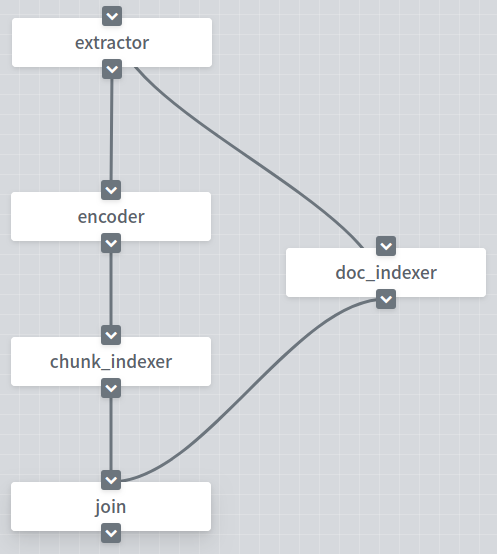
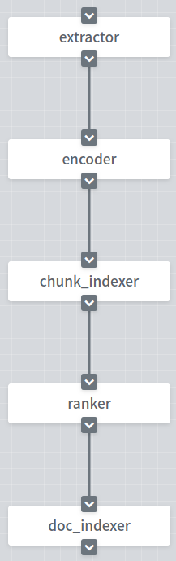

# JINA 100行代码搭建一套中文问答神经网络搜索引擎

    一提到搜索引擎，大家可能会想到实现**困难，系统复杂、臃肿**。但是现在有一个**魔法器**，**它可以让我们专注于业务本身，以最快的时间实现一套**神经网络搜索引擎。

    那这个魔法器是什么呢？它就是**jina**；那jina是什么呢？jina是一个**开源神经搜索引擎框架**，它有什么特点呢？**易上手**、**分布式**、**模型容器化**、**弹性扩展**和**云原生**。

    讲到这，有没有觉得很有趣呢？想马上利用jina搭建一套自己的搜索引擎呢？

    好，今天我们就用少于100行的Python代码搭建一套WebQA搜索系统。在这个系统中，我们采用WebQA作为我们的数据集， 数据集含有410万个预先过滤过的、高质量问题和多个回复，数据集下载[地址](https://drive.google.com/open?id=1u2yW_XohbYL2YAK6Bzc5XrngHstQTf0v)。我们将每个问题和问题下的回复当成一个**文档**，每个问题当成一个**chunk**，如果你不是很熟悉这些概念，在继续阅读之前，强烈建议你阅读[Jina 101](https://github.com/jina-ai/jina/tree/master/docs/chapters/101)和[Jina "Hello, World!"👋](https://github.com/jina-ai/jina#jina-hello-world-)。

## 导读

- [效果展示](https://github.com/jina-ai/examples/tree/webqa-search/webqa-search#%E6%95%88%E6%9E%9C%E5%B1%95%E7%A4%BA)
- [总览](https://github.com/jina-ai/examples/tree/webqa-search/webqa-search#%E6%80%BB%E8%A7%88)
- [环境依赖](https://github.com/jina-ai/examples/tree/webqa-search/webqa-search#%E7%8E%AF%E5%A2%83%E4%BE%9D%E8%B5%96)
- [数据预处理](https://github.com/jina-ai/examples/tree/webqa-search/webqa-search#%E6%95%B0%E6%8D%AE%E9%A2%84%E5%A4%84%E7%90%86)
- [定义Flow](https://github.com/jina-ai/examples/tree/webqa-search/webqa-search#%E5%AE%9A%E4%B9%89flow)
- [小结](https://github.com/jina-ai/examples/tree/webqa-search/webqa-search#%E5%B0%8F%E7%BB%93)
- [运行Flow](https://github.com/jina-ai/examples/tree/webqa-search/webqa-search#%E8%BF%90%E8%A1%8Cflow)
- [深入Pod](https://github.com/jina-ai/examples/tree/webqa-search/webqa-search#%E6%B7%B1%E5%85%A5pod)
- [容器化](https://github.com/jina-ai/examples/tree/webqa-search/webqa-search#%E5%AE%B9%E5%99%A8%E5%8C%96)
- [分布式](https://github.com/jina-ai/examples/tree/webqa-search/webqa-search#%E5%88%86%E5%B8%83%E5%BC%8F)
- [回顾](https://github.com/jina-ai/examples/tree/webqa-search/webqa-search#%E5%9B%9E%E9%A1%BE)
- [结语](https://github.com/jina-ai/examples/tree/webqa-search/webqa-search#%E7%BB%93%E8%AF%AD)

## 效果展示


## 总览

    与传统的搜索引擎一样，分为创建索引和搜索两个部分。

    在创建索引时，我们首先会为所有的文档建立索引，利用`transformes`加载哈工大`Roberta`作为编码器，将chunk中的文本编码成向量，并进行存储；在搜索时，用户输入问题，编码器将问题编码成向量，然后利用这些向量去召回最相似的问题，再利用问题返回问题下的回复。


## 环境依赖

    这个demo运行在Python3.7以上的环境

```shell
pip install -r requirements.txt
```


## 数据预处理

    在下载好数据集以后，我们将数据集放到`/tmp`文件夹中，运行下面命令。

```shell
python pre_data.py
```


## 定义Flow

### 创建索引

    在创建索引之前，我们需要通过YAML文件定义Flow。在Flow中我们定义了`extractor`，`doc_indexer`, `encoder`, `chunk_indexer`, `join`这5个Pod。

<table style="margin-left:auto;margin-right:auto;">
<tr>
<td> flow-index.yml</td>
<td> Flow in Dashboard</td>
</tr>
<tr>
<td>
  <sub>

```yaml
!Flow
pods:
  doc_indexer:
    yaml_path: doc_indexer.yml

  extractor:
    yaml_path: extractor.yml
    needs: gateway

  encoder:
    yaml_path: encoder.yml
    timeout_ready: 60000

  chunk_indexer:
    yaml_path: chunk_indexer.yml

  join:
    yaml_path: merger
    needs: [doc_indexer, chunk_indexer]
```

</sub>

</td>
<td>

</td>
</tr>
</table>

> gateway

    在这里你可能会发现还存在`gateway`这个Pod，这个Pod的主要作用是接受外部的请求，并将请求的数据发送到Flow中的Pod中；并且`gateway`这个Pod不需要我们在Flow的yaml文件中定义，在运行时，jina会自动在Flow的开头定义这个Pod。

> extractor

    将文档级别信息分割为chunk级别的信息，也就是提出文档中的问题。

> doc_indexer

    存储问题和回复整个文档。

> encoder

    将chunk中的文本编码成向量，等价于将问题编码成向量。

> chunk_indexer

    存储chunk与文档的关联关系，还存储了编码后的向量。

    

    在Flow中定义Pod时，我们需要指定Pod的YAML文件地址和接受哪个Pod的请求，例如在`extractor`这个Pod中，我们定义Pod的yaml文件地址为`extractor.yml`，接受来自`gateway`的请求。

```yaml
extractor:
    yaml_path: extractor.yml
    needs: gateway
```

    两个Pod在YAML文件中的顺序是依次的，则不需要定义needs，例如在`chunk_indexer`这个Pod。

```yaml
chunk_indexer:
    yaml_path: chunk_indexer.yml
```

    如果一个Pod加载耗时很长，而在jina中Pod的默认加载时间为5s，我们则需要指定`timeout_ready`这个参数，例如在`encoder`这个Pod。

```yaml
encoder:
  yaml_path: encode.yml
  timeout_ready: 60000
```

    你可能还注意到在介绍Pod的功能时，没有`join`这个Pod。在创建索引时，我们定义了两条并行的流，所以`join`的作用是合并两条并行流中的所有信息，或者你也可以理解成等待两个流完成工作，并执行下面的任务。当如果存在多个并行流时，只需要在`needs`中增加相应的Pod即可。

```yaml
join:
  yaml_path: join
  needs: [doc_indexer, chunk_indexer]
```

### 查询

    当建立完成索引后，下一步我们就是使用建立的索引进行查询。

    同样，在查询时，我们利用YAML文件定义查询的Flow！在查询的Flow中，我们共用`extractor`分割文档，共用`encoder`编码用户输入的问题，利用`chunk_indexer`存储的索引召回相似的问题。

    

<table style="margin-left:auto;margin-right:auto;">
<tr>
<td> flow-query.yml</td>
<td> Flow in Dashboard</td>
</tr>
<tr>
<td>
  <sub>

```yaml
!Flow
pods:
  extractor:
    yaml_path: extractor.yml

  encoder:
    yaml_path: encoder.yml
    timeout_ready: 60000

  chunk_indexer:
    yaml_path: chunk_indexer.yml

  ranker:
    yaml_path: ranker.yml

  doc_indexer:
    yaml_path: doc_indexer.yml
```

</sub>

</td>
<td>

</td>
</tr>
</table>
    不要忘记在jina中，**chunk是最基本的信息单元**。所以所有的索引都是在chunk级别进行的。

    在索引之后再利用`ranker`对文档下所有chunk的topk进行排序，并返回文档级别的信息，在`ranker`中我们采用`bi-match`算法进行排序，具体实现细节见[github]()。

    在有文档的信息之后，下一步就是利用`doc_indexer`将文档信息映射到文档原数据，并返回给用户。 

    在上面你可能发现`extractor`, `encoder`, `chunk_indexer`, `doc_indexer`的yaml文件地址与创建索引时一样，没错，它们共用同一个YAML文件，共同一个Pod，只是在内部定义不同的请求下的处理逻辑。

## 小结

    在开始下面之前，我们回过头来看看，是不是觉得很简单。那你可能会问两条Flow有什么不同呢？

    第一个不同点是，在创建索引时，我们采用了两条并行的流，为什么要这样做呢？并行的流可以提高创建索引的速度，为什么可以并行呢？在建立索引时，文档存储的是文档级别的索引，而chunk索引是存储chunk级别的索引，在`gateway`以后，没有任何共用的东西。 

    第二个不同点，在创建索引时，Flow中的模态为`IndexRequest`；在查询时，Flow中的模态为`SearchRequest`；到目前为止，jina支持4中不同的查询模态。

- `IndexRequest`: 用于索引创建模态

- `SearchRequest`: 用于查询模态

- `TrainRequest`: 用于模型训练模态

- `ControlRequest`: 用于远程控制模态

## 运行Flow

### 创建索引

```python
python app.py -t index
```

<details>
<summary>点击查看日志输出</summary>

<p align="center">
  
</p>

</details>

    现在我们可以通过代码让这个Flow跑起来了，在创建索引的过程中，我们需要定义Flow和`flow-index.yml`的文件地址，在这之后，我们需要通过`build()`让Flow中的Pod彼此连接，然后通过`index()`发送`IndexRequest`和数据。

```python
flow = Flow().load_config('flow-index.yml')
with flow.build() as fl:
    fl.index(raw_bytes=read_data(data_fn), batch_size=32)
```

    在发送数据中我们先将json文件中的所有样本组合成一问多答的形式，然后通过`bytes`数据的形式发送到Flow中。

```python
def read_data(fn):
    items = {}
    with open(fn, 'r', encoding='utf-8') as f:
        for line in f:
            item = json.loads(line)
            if item['content'] == '':
                continue
            if item['qid'] not in items.keys():
                items[item['qid']] = {}
                items[item['qid']]['title'] = item['title']
                items[item['qid']]['answers'] = [{'content': item['content']}]
            else:
                items[item['qid']]['answers'].append({'content': item['content']})

    result = []
    for _, value in items.items():
        result.append(("{}".format(json.dumps(value, ensure_ascii=False))).encode("utf-8"))

    for item in result:
        yield item
```

### 查询

```python
python app.py -t query
```

<details>
<summary>点击查看日志输出</summary>

<p align="center">
  
</p>

</details>

    在查询时刻，我们同样从YAML文件中建立Flow，通过`search()`方法发送`SearchRequest`请求和数据，并且发送的数据同样会被转换为`bytes`的数据形式。

```python
flow = Flow().load_config('flow-query.yml')
with flow.build() as fl:
    while True:
        title = input('请输入问题: ')
        item = {'title': title}
        if not title:
            break
        ppr = lambda x: print_topk(x)
        fl.search(read_query_data(item), callback=ppr, topk=top_k)
```

    在查询完成以后，FLow返回的数据形式为`Protobuf`，如果你希望了解详细的`Protobuf`数据，可以参考[链接](https://github.com/jina-ai/jina/blob/master/jina/proto/jina.proto)。callback参数的作用是将`Protobuf`转换为`python`的数据形式。`resp.search.docs`包含了所有的搜索文档，在这个例子中，我们只有一个文档，文档中包含了topk的搜索结果文档，`raw_bytes`代表了文档的原数据，在这里我们为了展示效果，只展示了问题，没有展示问题下的回复。

```python
def print_topk(resp):
    print(f'以下是相似的问题:')
    for d in resp.search.docs:
        for tk in d.topk_results:
            item = json.loads(tk.match_doc.raw_bytes.decode('utf-8'))
            print('→%s' % item['title'])
```

## 深入Pod

    在阅读完上面之后，你希望了解关于Pod的更多内容，请继续往下阅读。

    在jina中我们通过定义YAML文件定义Pod，那么是如何通过YAML文件定义Pod的呢？我们继续往下走。

### extractor

    在jina的原则中，一个YAML文件描述了一个对象的属性，所以我们可以通过YAML去改变对象的属性，而不必去改动代码。

    在`extractor`中，它的主要作用是将文档中的问题取出来，即将文档级别的信息分割成chunk级别的信息。下面是`extractor`的YAML文件，我们通过继承了`BaseSegmenter`实现了`WebQATitleExtractor`作为`extractor`的Executor，通过定义`metas`修改了Executor的默认属性。

```yaml
!WebQATitleExtractor
metas:
  py_modules: extractor.py
  workspace: $TMP_WORKSPACE
  name: title_extractor
requests:
  on:
    [IndexRequest, SearchRequest]:
      - !SegmentDriver
        with:
          method: craft
```
```python
class WebQATitleExtractor(BaseSegmenter):
    def craft(self, doc_id, raw_bytes, *args, **kwargs):
        json_dict = json.loads(raw_bytes.decode('utf-8'))
        title = json_dict['title']
        return [{
                    'raw_bytes': title.encode('utf-8'),
                    'doc_id': doc_id,
                    'offset': 0,
                    'length': len(title),
                    'text': title
                }]
```

    在`requests on`部分，我们定义了`extractor`在处理不同请求时的逻辑，在这个例子中`extractor`在`IndexRequest`和`SearchRequest`时都是相同的行为，这就是公用Pod的原理。

    在jina中Driver是一个数据类型转换器，将ProtoBuf转换为`python`数据类型/ `numpy`数据类型，或将`python`数据类型/ `numpy`数据类型转换为ProtoBuf，在这个例子中`SegmentDriver`将ProtoBuf转换为Python Object / Numpy Object，并调用`WebQATitleExtractor`中的`craft()`，在`craft()`处理完数据以后，`SegmentDriver`将Python Object / Numpy Object转换为ProtoBuf。

### encoder

    我们在`extractor`已经问题从文档中提取了出来，那么我们下面需要做的是将问题编码成向量。

    在这里我们使用哈工大-科大讯飞的`Roberta base wwm ext`模型作为编码器模型，通过继承`BaseTextEncoder`实现了`TransformerRobertaEncoder`作为我们的编码器，并且使用`transformers`加载模型，使用`CLS`作为文本向量，并且我们可以通过定义`with`来修改`__init__`方法中参数的值，在这里我们修改了模型的路径。详细代码见[链接]()。

```yaml
!TransformerRobertaEncoder
metas:
  workspace: $TMP_WORKSPACE
  name: transformer_roberta_encoder
  py_modules: transformer_roberta.py

with:
  model_path: /home/cally/jina/jina/pre_model/chinese_roberta_wwm_ext

requests:
  on:
    [SearchRequest, IndexRequest]:
      - !EncodeDriver
        with:
          method: encode
```

### doc_indexer

    与上面`extractor`和`encoder`处理请求时不一样，`doc_indexer`分开处理了`IndexRequest`和`SearchRequest`。

```yaml
!BasePbIndexer
with:
  index_filename: doc_index.gzip
metas:
  name: doc_indexer
  workspace: $TMP_WORKSPACE
requests:
  on:
    IndexRequest:
      - !DocKVIndexDriver
        with:
          method: add

    SearchRequest:
      - !DocKVSearchDriver
        with:
          method: query

    ControlRequest:
      - !ControlReqDriver {}
```

    在`IndexRequest`请求时，我们使用`DocKVIndexDriver`调用`BasePbIndexer`的`add()`存储了文档级别的数据。

    但是在`SearchRequest`时，我们使用`DocKVSearchDriver`调用`BasePbIndexer`的`query()`索引文档级别的数据。

### chunk_indexer

    `chunk_indexer`的YAML文件有点复杂。别着急，这是最简单的方法了。`chunk_indexer` Pod中的Executor称为`ChunkIndexer`，它封装了另外两个执行器。`components`字段指定两个包装好的执行器。`NumpyIndexer`用于存储问题的向量，`BasePbIndexer`用作键值存储来保存文档id和chunk id的关联。

```yaml
!ChunkIndexer
components:
  - !NumpyIndexer
    with:
      index_filename: vecidx_index.gzip
      metrix: cosine
    metas:
      name: vecidx_exec
      workspace: $TMP_WORKSPACE
  - !BasePbIndexer
    with:
      index_filename: chunk_index.gzip
    metas:
      name: chunk_exec
      workspace: $TMP_WORKSPACE

metas:
  name: chunk_indexer

requests:
  on:
    IndexRequest:
      - !VectorIndexDriver
        with:
          executor: vecidx_exec
          method: add
      - !ChunkPruneDriver {}
      - !ChunkKVIndexDriver
        with:
          executor: chunk_exec
          method: add
    SearchRequest:
      - !VectorSearchDriver
        with:
          executor: vecidx_exec
          method: query
      - !ChunkPruneDriver {}
      - !ChunkKVSearchDriver
        with:
          executor: chunk_exec
          method: query
```

    与`doc_indexer`一样，`chunk_indexer`在不同请求时，有不同的行为。

    在`IndexRequest`时，我们定义了3个不同的Driver，`VectorIndexDriver`，`ChunkPruneDriver`，`ChunkKVIndexDriver`，3个Driver是依次执行的。在`VectorIndexDriver`时，我们调用了`vecidx_exec`这个Executor中的`add()`存储了问题的向量，在存储完成以后，我们清空了chunk中的数据，只保留chunk id和文档id，因为在`ChunkKVIndexDriver`调用`chunk_exec`中的`add()`存储文档和chunk的关联时，我们不需要这些数据。

    在`SearchRequest`时，我们同样定义了3个不同的Driver，`VectorSearchDriver`调用了`vecidx_exec`中的`query()`索引了topk的问题，在这里我们使用了余弦相似度来进行召回，并且使用`ChunkPruneDriver`清空chunk中的数据，只保留chunk id和文档id，因为我们在后面用不到这些数据，也是为了减少在网络传输时数据的大小，最后使用`ChunkKVSearchDriver`调用`chunk_exec`中的`query()`，索引出topk中chunk的文档id。

### ranker

    `ranker`不同与其它Pod，它只在查询时使用，所以我们只需要在YAML文件中定义SearchRequest的行为。

    在每个文档下的问题的topk相似问题都找到以后，我们利用`Chunk2DocScoreDriver`将所有topk chunk组合到一起，在这里，每个文档下只有一个问题，也就只有一个chunk。然后调用`BimatchRanker`中的`score`方法对topk chunk进行打分，并排序。对于排序后的结果，`Chunk2DocScoreDriver`将topk chunk提升为topk文档。    

```yaml
!BiMatchRanker
metas:
  name: ranker
requests:
  on:
    SearchRequest:
      - !Chunk2DocScoreDriver
        with:
          method: score
      - !DocPruneDriver {}
```

## 回顾

    恭喜你，你已经了解了如何用jina搭建一套神经网络搜索引擎了👋👋。

    在你离开之前我们来回顾下在jina中比较重要的知识点。

1. chunk是jina的信息单元，文档是jina最终的输入和输出。

2. 通过定义YAML文件构建一个Flow是非常快捷和简单的。

3. 通过定义在YAML文件中定义不同的行为，很多Pod可以在创建索引和搜索时共用，。

4. Flow中我们可以定义许多并行的流。

5. 向Flow中发送的数据都是`bytes`类型的。

6. 在Pod内，Driver转换数据类型，将消息中的Protobuf转换为Python类型/Numpy类型，并调用Executor执行相关的逻辑，并将结果包装回消息中。

7. Flow的返回消息类型是Protobuf

## 结语

    在这里你可能已经发现了文档中只有一个chunk，那么如果有多个chunk时，应该怎么做呢？请看下一篇，[JINA 3分钟实现一套新闻搜索系统]()。
