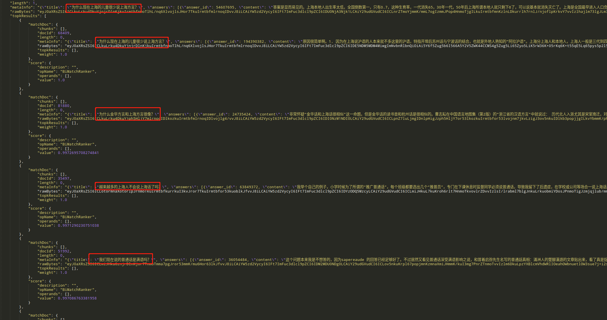

# JINA 100行代码搭建一套中文问答神经网络搜索引擎

## 前言

    一提到搜索引擎，大家可能会想到实现**困难，系统复杂、臃肿**。但是现在有一个**魔法器**，**它可以让我们专注于业务本身，以最快的时间实现一套**神经网络搜索引擎。

    那这个魔法器是什么呢？它就是**jina**；那jina是什么呢？jina是一个**开源神经搜索引擎框架**，它有什么特点呢？**易上手**、**分布式**、**模型容器化**、**弹性扩展**和**云原生**。

    讲到这，有没有觉得很高大上呢？有没有想马上利用jina搭建一套自己的搜索引擎呢？

    好，今天我们来介绍如何使用jina**快速**搭建一套中文问答搜索引擎。

## 效果展示



## 组件

    在搭建之前我想为大家介绍几个在jina中非常重要的概念，**Pod, Pea, Executor, Driver, Flow**

### Pod

     Pod是Jina最为基本的单元，Pod可以是Indexer，Bert模型等。

### Pea

    Pea是Pod最为基本的单元，如果一个Pod中存在多个Pea，每个Pea都是相同的。

### Executor

    Executor是一个Jina中最基本的逻辑处理单元。

### Driver

    Driver是一个消息类型转换器，将ProtoBuf转换为Python Object / Numpy Object，或将Python Object / Numpy Object转换为ProtoBuf，每种Driver的作用见[文档]()。

### Flow

    Flow可以理解为是一条线，串联所有的Pod，形成用户定义的搜索引擎网络结构。

## 数据集

### 数据描述

    本系统采用web text 2019数据集，数据集下载[地址](https://drive.google.com/open?id=1u2yW_XohbYL2YAK6Bzc5XrngHstQTf0v)。

    数据集含有410万个预先过滤过的、高质量问题和回复。每个问题属于一个【话题】，总共有2.8万个各式话题，话题包罗万象。从1400万个原始问答中，筛选出至少获得3个点赞以上的的答案，代表了回复的内容比较不错或有趣，从而获得高质量的数据集。除了对每个问题对应一个话题、问题的描述、一个或多个回复外，每个回复还带有点赞数、回复ID、回复者的标签。

### 样例

```json
    {"qid": 65618973, "title": "AlphaGo只会下围棋吗？阿法狗能写小说吗？", "desc": "那么现在会不会有智能机器人能从事文学创作？如果有，能写出什么水平的作品？", "topic": "机器人", "star": 3, "content": "AlphaGo只会下围棋，因为它的设计目的，架构，技术方案以及训练数据，都是围绕下围棋这个核心进行的。它在围棋领域的突破，证明了深度学习深度强化学习MCTS技术在围棋领域的有效性，并且取得了重大的PR效果。AlphaGo不会写小说，它是专用的，不会做跨出它领域的其它事情，比如语音识别，人脸识别，自动驾驶，写小说或者理解小说。如果要写小说，需要用到自然语言处理（NLP））中的自然语言生成技术，那是人工智能领域一个", "answer_id": 545576062, "answerer_tags": "人工智能@游戏业"}
```

## 搭建

    根据上面的介绍，我相信你已经对jina有了一定的了解，下面我们来一起搭建这套系统吧！

   

### 解压数据集

1. 首先在解压数据集之前，我们需要将下载好的数据集压缩文件放入```/tmp```文件夹中

2. 执行```prepare_data.py```文件

 

### 创建索引

    首先在搭建之前我们先利用流程图来构建索引的`flow`，里面每一个方块代表了一个`Pod`，整的流程图我们称之为`flow`。


    由于web text 2019数据集中存在答案和问题，所以在创建索引时，我们只需要对问题创建索引，为什么呢？因为我们在搜索的时候，我们输入的是问题，只需要将索引中与搜索的问题最相关的问题找出来即可！

#### Title Extractor

    tilte extractor的作用是将doc中的tilte取出来放入chunks中，即将document级别的信息分割成chunk级别的信息。

```python
class WebQATitleExtractor(BaseSegmenter):
    def craft(self, doc_id, raw_bytes, *args, **kwargs):
        json_dict = json.loads(raw_bytes.decode('utf-8'))
        title = json_dict['title']
        return [{
                    'raw_bytes': title.encode('utf-8'),
                    'doc_id': doc_id,
                    'offset': 0,
                    'length': len(title),
                    'text': title
                }]
```

    你可能会问，为什么你这里会继承`BaseSegmenter`这个类，因为在不同的业务场景下，jina提供了不同的`Executor`基类，我们在实现我们的逻辑的时候，只需要继承相应的基类即可。具体见[文档]()！

    yaml文件

```yml
!WebQATitleExtractor
metas:
  py_modules: extractor.py 
  workspace: $TMP_WORKSPACE 
  name: title_extractor
requests:
  on:
    IndexRequest: # 指定IndexRequest时调用什么driver和对应的executor的方法
      - !SegmentDriver
        with:
          method: craft
```

    你会问，```WebQATitleExtractor```是用来干嘛的？```metas```是用来干嘛的？```requests```是用来干嘛的？

> WebQATitleExtractor

  指定`pea`中使用什么`executor`，在这里我们使用`WebQATitleExtractor`作为`pea`中的`executor`。

> metas

    修改`BaseExecutor`默认的参数值，那么`BaseExecutor`有哪些默认的参数呢？那么这些参数默认的参数值是什么？

    如下所示！

```
is_trained: false
is_updated: false
batch_size:
workspace: './'
name:
on_gpu: false
warn_unnamed: false
max_snapshot: 0
py_modules:
replica_id: '{root.metas.replica_id}'  # this may result in self-referred
separated_workspace: '{root.metas.separated_workspace}'  # this may result in self-referred
replica_workspace: '{root.metas.workspace}/{root.metas.name}-{root.metas.replica_id}'
```

> requests

    指定不同`Request`的情况下，调用什么类型的`Driver`和`Executor`中的什么方法！jina支持4中不同的Request！

1. `IndexRequest`用于创建索引时调用

2. `SearchRequest`用于查询时调用

3. `TrainRequest`用于训练模型时使用，目前jina不支持训练模型，所以此Request暂时保留

4. `ControlRequest`用于远程控制时调用

#### Encoder

    我们在extractor已经将document级别的信息分割成了chunk级别的信息，那么我们下面需要做什么呢？

    不要忘记jina是什么？jina是一个**神经网络搜索框架**！当你听到神经网络的时候，脑中有没有浮现出什么？对，没错，就是向量！那么在extractor以后，我们就要将文本编码成向量。

    在这里我们使用哈工大-科大讯飞的Roberta base wwm ext模型作为编码器，完整代码见[jina-hub](https://github.com/jina-ai/jina-hub/blob/master/hub/executors/encoders/nlp/transformers-hitscir/transformer_roberta.py)

    在post_init的时候我们加载模型！为什么要在post_init的时候加载模型？因为在executor中，post_init方法的作用就是加载一些不能被反序列化的内容，所以我们要在这个方法中加载模型。

```python
    def post_init(self):
        from transformers import BertTokenizer, BertModel

        if os.path.exists(self.model_abspath):
            self._tmp_model_path = self.model_abspath
        else:
            self._tmp_model_path = 'hfl/chinese-roberta-wwm-ext'

        self.tokenizer = BertTokenizer.from_pretrained(self._tmp_model_path)
        self.tokenizer.padding_side = 'right'

        self.model = BertModel.from_pretrained(self._tmp_model_path)
```

   

    yaml文件

```yml
!TransformerRobertaEncoder
metas:
  on_gpu: True
  batch_size: $BATCH_SIZE
  workspace: $TMP_WORKSPACE
  name: transformer_roberta_encoder
  py_modules: transformer_roberta.py
```

#### Title Compound Chunk Indexer

    在`Encoder`后，我们应该做什么呢？答案就是存储这些向量，存储`doc`和`chunk`之间的对应关系，方便我们在日后查询的时候进行调用！

```yml
!CompoundExecutor
components:
  - !NumpyIndexer
    with:
      index_filename: title_vecidx_index.gzip
      metrix: cosine
    metas:
      name: title_vecidx_exec
      workspace: $TMP_WORKSPACE
  - !LeveldbIndexer
    with:
      index_filename: title_meta_chunk_index.gzip
    metas:
      name: title_chunk_meta_exec
      workspace: $TMP_WORKSPACE

metas:
  name: title_compound_chunk_indexer

requests:
  on:
    IndexRequest:
      - !ChunkIndexDriver
        with:
          executor: title_vecidx_exec
          method: add
      - !ChunkPruneDriver {}
      - !ChunkPbIndexDriver
        with:
          executor: title_chunk_meta_exec
          method: add
```

    怎么还有`CompoundExecutor`，什么是`CompoundExecutor`？怎么还有`with`？`with`关键字是用来干嘛的？当有多个`Driver`时，调用顺序是怎么样的？

> CompoundExecutor

    `CompoundExecutor`是一个特殊的`Executor`，在`CompoundExecutor`里面可以存放多个多个`Executor`！当我们需要定义多个`Executor`时，只需要在`components`下依次添加`Executor`即可，并且在`Driver`处添加相应的`Executor`名字即可！

> with

    当默认的`BaseExecutor`中的参数无法满足我们的时候，我们需要在`__init__`方法中定义额外的参数，那么`with`关键字就是给这些参数进行赋值！Wow, magic!

> 多个Driver执行顺序

    当有多个`Driver`时，会依次执行`Driver`中的`__call___`方法，而在`__call__`方法中，如果存在Executor的方法，那么会执行`Executor`中的方法，并执行`Driver`中其他的逻辑。

#### Title Meta Doc Indexer

    `title meta doc indexer`的作用就是将`doc`级别的索引进行存储，也就是存储原json串和该json串对应的`doc_id`，以便在查询时利用`doc_id`对原始数据进行召回！

    yaml文件

```yml
!LeveldbIndexer
with:
  index_filename: meta_title_doc_index.gzip
metas:
  name: title_meta_doc_indexer
  workspace: $TMP_WORKSPACE
requests:
  on:
    IndexRequest:
      - !DocPruneDriver {}
      - !DocPbIndexDriver
        with:
          method: add
```

#### Join

    你可能会问，`Join`是用来干嘛的？我们在前面提到，我们需要创建`doc`级别的索引和`chunk`级别的索引。你想象一下，当`doc`级别的索引创建完成之后，`chunk`级别的索引没有创建完成，那么jina需要做什么？需要等待`chunk`级别的索引创建完成。所以`Join`的作用就是等待，然后结束任务！

#### Index Flow

    在上面我们已经介绍完毕了创建索引时各个Pod，那么怎么把它进行组合呢？用Flow!

```python
flow = Flow().add(
        name='title_extractor', yaml_path='images/title_extractor/title_extractor.yml'
    ).add(
        name='title_meta_doc_indexer', yaml_path='images/title_meta_doc_indexer/title_meta_doc_indexer.yml',
        needs='gateway'
    ).add(
        name='title_encoder', yaml_path='images/encoder/encoder.yml', needs='title_extractor', timeout_ready=60000,
    ).add(
        name='title_compound_chunk_indexer',
        yaml_path='images/title_compound_chunk_indexer/title_compound_chunk_indexer.yml', needs='title_encoder'
    ).join(
        name='merge', yaml_path='images/merger/merger.yml',
        needs=['title_compound_chunk_indexer', 'title_meta_doc_indexer']
    )
```

    看到这，你脑中有没有觉得很神奇？Wow！Magic！有没有恍然大悟？一个yaml文件就对应一个Pod！

  

### 查询

    上面我们已经完成了索引的创建，那么索引创建完成了以后，我们需要做什么呢？查询！

    在查询的时候，我们希望用户输入一个问题，我们给他返回一系列的答案。

    话不多说，直接贴上查询时flow的流程图。


#### Extractor

    我们这里与上面创建索引时一样共用`WebQATitleExtractor`

```python
class WebQATitleExtractor(BaseSegmenter):
    def craft(self, doc_id, raw_bytes, *args, **kwargs):
        json_dict = json.loads(raw_bytes.decode('utf-8'))
        title = json_dict['title']
        return [{
                    'raw_bytes': title.encode('utf-8'),
                    'doc_id': doc_id,
                    'offset': 0,
                    'length': len(title),
                    'text': title
                }]
```

    yaml文件

```yml
!WebQATitleExtractor
metas:
  py_modules: extractor.py
  workspace: $TMP_WORKSPACE
  name: title_extractor
requests:
  on:
    SearchRequest:
      - !SegmentDriver
        with:
          method: craft    
```

#### Encoder

    在分割完成以后，我们还是将`chunk`中的文本进行向量化！使用的`Pod`与建立索引时一致。

     在Encoder后，我们该做什么呢？算关联度，算跟谁的关联度呢？当然是跟问题算关联度撒。

    在计算与关联度时，我们使用了余弦相似度，在bert中，如果存在多个文本，余弦分数最高的文本，那么就与查询文本最相似！

#### Title Compound Chunk Indexer

```yml
!CompoundExecutor
components:
  - !NumpyIndexer
    with:
      index_filename: title_vecidx_index.gzip
      metrix: cosine
    metas:
      name: title_vecidx_exec
      workspace: $TMP_WORKSPACE
  - !LeveldbIndexer
    with:
      index_filename: title_meta_chunk_index.gzip
    metas:
      name: title_chunk_meta_exec
      workspace: $TMP_WORKSPACE

metas:
  name: title_compound_chunk_indexer

requests:
  on:
    SearchRequest:
      - !ChunkSearchDriver
        with:
          executor: title_vecidx_exec
          method: query
      - !ChunkPruneDriver {}
      - !ChunkPbSearchDriver
        with:
          executor: title_chunk_meta_exec
          method: query
```

    在问题查询的过程中，我们先利用了余弦相似度找出了topk的问题，找出的topk都是`chunk`级别的信息，然后我们再利用`chunk_id`找出`chunk`与`doc`的对应关系。

#### Ranker

    ranker的作用利用相应的算法是`chunk`级别的信息进行排序

```yml
!BiMatchRanker
metas:
  name: ranker
requests:
  on:
    SearchRequest:
      - !Chunk2DocScoreDriver
        with:
          method: score
      - !DocPruneDriver {}
```

    在ranker过后，我们得到了对于融合后的topk打分，但是仅仅有打分还是不够的，我们需要的是答案，所以这个时候我们就要利用`doc_id`找出原文档的信息！那么我们就需要`Title Meta Doc Indexer`。

#### Title Meta Doc Indexer

    在创建索引的时候我们通过`title_meta_doc_indexer`存储了`doc_id`与文档的对应关系和原文档原始内容，所以我们在这只需要通过doc_id就能找出原文档，并返回给用户！

```yml
!LeveldbIndexer
with:
  index_filename: title_meta_doc_index.gzip
metas:
  name: title_meta_doc_indexer
  workspace: $TMP_WORKSPACE
requests:
  on:
    SearchRequest:
      - !DocPbSearchDriver
        with:
          method: query
```

#### Query Flow

    思路和创建索引是的搭建一样，废话不多说，直接上代码！

```python
 flow = Flow().add(
        name='extractor', yaml_path='images/title_extractor/title_extractor.yml', needs='gateway'
    ).add(
        name='encoder', yaml_path='images/encoder/encoder.yml', needs="extractor", timeout_ready=60000
    ).add(
        name='title_compound_chunk_indexer',
        yaml_path='images/title_compound_chunk_indexer/title_compound_chunk_indexer.yml', needs='encoder'
    ).add(
        name='ranker', yaml_path='images/ranker/ranker.yml', needs='title_compound_chunk_indexer'
    ).add(
        name='title_meta_doc_indexer', yaml_path='images/title_meta_doc_indexer/title_meta_doc_indexer.yml',
        needs='ranker'
    )
```

    至此，我们已经完成了对创建索引flow的搭建和查询flow的搭建！总共下面没有超过100行代码吧，是不是很简单，Wow，Magic!

## 容器

    在前言中，我们提到过Jina是**利用容器技术实现了模型容器化**，那么是怎么利用的呢？答案就是可以直接在Pod中直接加载docker image，不用写繁琐的yaml文件！Awesome!

    我们对Encoder Pod进行举例说明！详细见[jina-hub](https://github.com/jina-ai/jina-hub)

加载yaml文件的Encoder Pod

```yml
add(
 name='encoder',yaml_path='images/encoder/encoder.yml',needs="extractor")
```

加载docker image的Encoder Pod

```yml
add(
 name='encoder',image='jinaai/examples.hub.encoder.nlp.transformers-hit-scir',needs="extractor")
```

    你可能在想，这里既然用了容器！那是不是我也可以通过容器来加载其他的预训练模型的镜像呢？答案是可以的！Wow！Magic！我想切什么预训练模型就切什么预训练模型，而且过程太简单了！哇，太爽了！我要去[Jina-hub]([https://github.com/jina-ai/jina-hub)上看看都有什么预训练模型！

## 分布式

    你在前言中还说了，Jina支持分布式，那怎么个分布式法呢？设想一下，现在有这样一个场景，你的GPU机器在阿里云或者腾讯云上，但是，你又想利用预训练模型对文本进行编码！那怎么办呢？用Jina的分布式功能撒，将编码的Pod放到GPU服务器上，其余的Pod放到CPU的机器上。那怎么用呢？请看如下分解！

### 开启Gateway

    在GPU服务器上开启Jina gateway，输入如下命令！

```shell
jina gateway --allow-spawn --port-grpc 12345
```

    上面这条命令有什么用呢？开启Jina gateway，接收外部调用，并指定调用端口为12345。

### 连接Gateway

    我们还是将Encoder用于举例，假设GPU服务器已经存在了Roberta镜像！

    我们需要怎么进行连接呢？请看！

```python
add(
 name='encoder',image='jinaai/examples.hub.encoder.nlp.transformers-hit-scir',needs="extractor", host='123.34.23.56', port=12345)
```

    我们只需要指定远程服务器的host（我们假设GPU服务器的ip地址为123.34.23.56）和端口号就可以了，这样这个Encoder Pod就会连接GPU服务器的gateway，GPU服务器gateway就会开启一个Jina Pod，并加载Roberta这个镜像！Wow！厉害！

    建议：在使用分布式功能时，尽量使用镜像进行Pod加载，尽量不使用yml文件进行加载；因为服务器yml文件可能路径复杂，容易出错；直接使用镜像加载，方便，快捷！

## 结语

    经历了上诉的搭建过程，有没有觉得，哇！原来用jina搭建搜索引擎好简单！那么赶快尝试一下吧！

    详细项目[地址]()，欢迎关注[jina](https://github.com/jina-ai/jina)！
