# Querying While Indexing in the Wikipedia Search Example

| About this example: |  |
| ------------- | ------------- |
| Learnings | How to configure Jina for querying while indexing |
| Used for indexing | Text data |
| Used for querying | Text data |
| Dataset used | [Wikipedia dataset from kaggle](https://www.kaggle.com/mikeortman/wikipedia-sentences) |
| Model used | [flair-text](https://github.com/flairNLP/flair) |

This is an example of using [Jina](http://www.jina.ai) to support both querying and indexing simultaneously in our [Wikipedia sentence search example](https://github.com/jina-ai/examples/tree/master/wikipedia-sentences).

## Table of contents:

  * [Prerequisites](#prerequisites)
  * [What is querying while indexing?](#what-is-querying-while-indexing)
  * [Configuration changes](#configuration-changes)
  * [🐍 Build the app with Python](#-build-the-app-with-python)
  * [Flow diagrams](#flow-diagrams)
  * [🔮 Overview of the files](#-overview-of-the-files)
  * [Troubleshooting](#troubleshooting)
  * [⏭️ Next steps](#-next-steps)
  * [👩‍👩‍👧‍👦 Community](#-community)
  * [🦄 License](#-license)

## Prerequisites

- Run and understand our [Wikipedia sentence search example](https://github.com/jina-ai/examples/tree/master/wikipedia-sentences)

## What is querying while indexing?

Querying while indexing means you are able to still query your data while new data is simultaneously being inserted (or updated, or deleted).
Jina achieves this with its dump-reload feature.

## Configuration changes

This feature requires you to split the Flow, one for Indexing (and Updates, Deletes) and one for Querying, and have them running at the same time.
Also, you will need to replace the indexers in Flows.
The Index Flow (also referred to as the Storage Flow) will require a [Storage Indexer](https://github.com/jina-ai/executors/tree/main/jinahub/indexers/storage), while the Query Flow requires a [Compound Searcher](https://github.com/jina-ai/executors/tree/main/jinahub/indexers/searcher).

In our case we use :

- [LMDBStorage](https://github.com/jina-ai/executors/tree/main/jinahub/indexers/storage/LMDBStorage), which uses a disk-based key-value storage [LMDB](https://lmdb.readthedocs.io/) as a storage engine.
- [FaissLMDBSearcher](https://github.com/jina-ai/executors/tree/main/jinahub/indexers/searcher/compound/FaissLMDBSearcher), which uses the [`faiss`](https://github.com/spotify/annoy) algorithm to provide faster query results and LMDB to retrieve the metadata.

_____

## 🐍 Build the app with Python

These instructions explain how to run the example yourself and deploy it with Python.

### 🗝️ Requirements

1. Have a working Python 3.7 or 3.8 environment.
1. We recommend creating a [new Python virtual environment](https://docs.python.org/3/tutorial/venv.html) to have a clean installation of Jina and prevent dependency conflicts.
1. Install [Docker Engine](https://docs.docker.com/engine/install/).
1. Have at least 5 GB of free space on your hard drive.


### Running the example

### 👾 Step 1. Clone the repo and install Jina

Begin by cloning the repo so you can get the required files and datasets. (If you already have the examples repository on your machine make sure to fetch the most recent version)

```sh
git clone https://github.com/jina-ai/examples
cd examples/wikipedia-sentences-query-while-indexing
```

Let's install `jina` and the other required libraries. For further information on installing jina check out [our documentation](https://docs.jina.ai/get-started/install/).

```sh
pip install -r requirements.txt
```

In order to run the example you will need to do the following:

### 📥 Step 2. Download your data to search (Optional)

The repo includes a small subset of the Wikipedia dataset, for quick testing. You can just use that.

If you want to use the entire dataset, run `bash get_data.sh` and then modify the `DATA_FILE` constant (in `app.py`) to point to that file.

### 🏃 Step 3. Running the Flows

In this example, we use [JinaD]((https://docs.jina.ai/advanced/daemon/#remote-management-via-jinad)) to serve the two Flows (Index and Query) and listen to incoming requests.

1. Start `JinaD` server using the below command.

   ```bash
   docker run --add-host host.docker.internal:host-gateway \
           -v /var/run/docker.sock:/var/run/docker.sock \
           -v /tmp/jinad:/tmp/jinad \
           -p 8000:8000 \
           --name jinad \
           -d jinaai/jina:2.1.0-daemon
   ```

2. Run `python app.py -t flows`

    This will create the two Flows, and then repeatedly do the following (which can also be done in any other REST client), every 10 seconds:

    1. Index 5 Documents.
    2. Send a `DUMP` request to the Storage (Index) Flow to dump its data to a specific location.
    3. Send a `ROLLING_UPDATE` request to the Query Flow to take down its Indexers and start them again, with the new data located at the respective path.

    **Warning**: If you want to use the entire wikipedia dataset, run `bash get_data.sh` and then modify the `DATA_FILE` constant to point to that file.

### 🔎 Step 4: Query your data

Finally, in a second terminal, run `python app.py -t client`

This will prompt you for a query, send the query to the Query Flow, and then show you the results.

Since the Flows uses `http` protocol, you can query the REST API with whatever `Client` provided within jina or use `cURL`, `Postman` or [custom Swagger UI provided with jina](https://docs.jina.ai/fundamentals/practice-your-learning/#query-via-swaggerui) etc.

#### Cleanup

JinaD creates several containers during this process. In order to remove all the containers do the following after you are done using the example:

`docker stop $(docker ps -a -q)`
and
`docker rm $(docker ps -a -q)`

## Flow diagrams

Below you can see a graphical representation of the Flow pipeline:

#### Storage Flow


#### Query Flow



Notice the following:

- the encoder has the same configuration
- the Query Flow uses replicas. One replica continues to serve requests while the other is being reloaded.
- the Indexer in the Query Flow is actually made up of two Indexers: one for vectors, one for Document metadata. On the Storage Flow, this data is stored into one Storage Indexer.

## 🔮 Overview of the files

| File or folder |  Contents |
| -------------------- | ---------------------------------------------------------------------------------------------------------------- |
| 📂 `data/`      | Folder where the data files are stored   |
| 📂 `flows/`          | Folder to store Flow configuration                                                                               |
| --- 📃 `storage.yml`     | YAML file to configure Storage (Index) Flow                                                                             |
| --- 📃 `query.yml`     | YAML file to configure Querying Flow                                                                             |
| 🐍 `app.py`      | Code file for the example   |

_________

## ⏭️ Next steps

Did you like this example and are you interested in building your own? For a detailed tutorial on how to build your Jina app check out [How to Build Your First Jina App](https://docs.jina.ai/chapters/my_first_jina_app/#how-to-build-your-first-jina-app) guide in our documentation.

If you have any issues following this guide, you can always get support from our [Slack community](https://slack.jina.ai) .

## 👩‍👩‍👧‍👦 Community

- [Slack channel](https://slack.jina.ai) - a communication platform for developers to discuss Jina.
- [LinkedIn](https://www.linkedin.com/company/jinaai/) - get to know Jina AI as a company and find job opportunities.
- [](https://twitter.com/JinaAI_) - follow us and interact with us using hashtag `#JinaSearch`.
- [Company](https://jina.ai) - know more about our company. We are fully committed to open-source!

## 🦄 License

Copyright (c) 2021 Jina AI Limited. All rights reserved.

Jina is licensed under the Apache License, Version 2.0. See LICENSE for the full license text.
