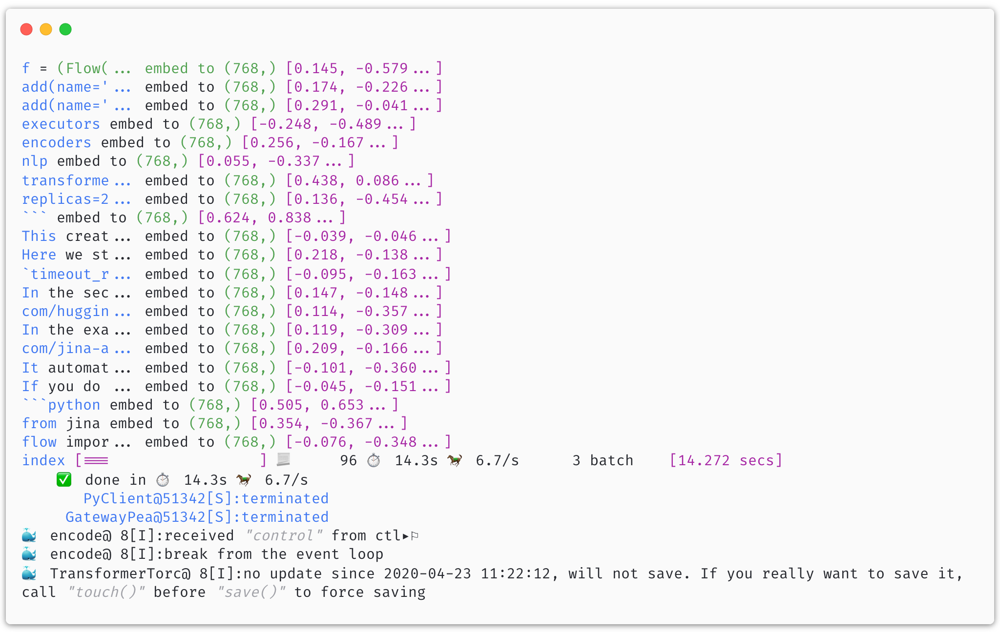

# From BERT-as-service to X-as-Service

<p align="center">
 
[](https://jina.ai)

[](https://github.com/jina-ai/jina#jina-hello-world-)
[](#license)
[](https://docs.jina.ai)
[](https://jobs.jina.ai)
<a href="https://twitter.com/intent/tweet?text=%F0%9F%91%8DCheck+out+Jina%3A+the+New+Open-Source+Solution+for+Neural+Information+Retrieval+%F0%9F%94%8D%40JinaAI_&url=https%3A%2F%2Fgithub.com%2Fjina-ai%2Fjina&hashtags=JinaSearch&original_referer=http%3A%2F%2Fgithub.com%2F&tw_p=tweetbutton" target="_blank">
  </img>
</a>
[](#)
[](https://hub.docker.com/r/jinaai/jina/tags)

</p>

[BERT-as-service](https://github.com/hanxiao/bert-as-service/) is a popular and scalable architecture for extracting feature vectors using the BERT model. Unfortunately, it is optimized for the original BERT model only. Adaption is required if one wants to employ other deep learning models with that architecture.

In this short tutorial, we shall see how simple it is to use Jina for extracting feature vectors. The best part is, you can use any representation beyond BERT.


<!-- START doctoc generated TOC please keep comment here to allow auto update -->
<!-- DON'T EDIT THIS SECTION, INSTEAD RE-RUN doctoc TO UPDATE -->
**Table of Contents**

- [Requirements](#requirements)
- [Design the Flow](#design-the-flow)
- [Implement the Input Function](#implement-the-input-function)
- [Implement the Callback Function for the Output](#implement-the-callback-function-for-the-output)
- [Run the Flow](#run-the-flow)
- [Run the Encoding Work Remotely](#run-the-encoding-work-remotely)
- [Documentation](#documentation)
- [Community](#community)
- [License](#license)

<!-- END doctoc generated TOC please keep comment here to allow auto update -->


## Requirements

You need to have Docker installed to run this example. To enable Docker feature in Jina:

```bash
pip install --upgrade "jina[devel]"
```

## Design the Flow 

Let's look at the workflow:

1. split the document at punctuation, building a set of chunks from it;
2. use a deep learning model to embed sentences into vectors;
3. print the embeddings on the console. 

In a real-world application, you may want to use one of our [`BaseIndexer` class](https://jina-ai.github.io/docs/api/jina.executors.indexers.html) to store these embeddings instead of printing them out. Please refer to other examples for the end-to-end workflow.

```python
from jina.flow import Flow

f = (Flow(callback_on_body=True)
     .add(name='spit', uses='Sentencizer')
     .add(name='encode', uses='jinaai/hub.executors.encoders.nlp.transformers-pytorch',
          parallel=2, timeout_ready=20000))
```

This creates a `Flow` with two `Pods`, corresponding to the first and second step described above. Here we start two `parallel`, so there will be two encoders running in parallel. `timeout_ready` is set to 20s (20000ms) as loading the pretrained model and starting pytorch take some time.

In the second step, we use [transformers](https://github.com/huggingface/transformers) for embedding computation. In the example above, we use a prebuilt image from [Jina Hub](https://github.com/jina-ai/jina-hub). If you do not want to use Docker or if you already have transformer and pytorch installed locally, you can simply do:

```python
from jina.flow import Flow

f = (Flow(callback_on_body=True)
     .add(name='spit', uses='Sentencizer')
     .add(name='encode', uses='enc.yml',
          parallel=2, timeout_ready=20000))
```

with `enc.yml` such as 

```yaml
!TransformerTorchEncoder
with:
  pooling_strategy: cls
  model_name: distilbert-base-cased
  max_length: 96
```


## Implement the Input Function

Here we will simply feed this README file to the flow. Each line is considered as a document.

```python
def input_fn():
    with open('README.md') as fp:
        for v in fp:
            yield v.encode()
``` 

## Implement the Callback Function for the Output

Step 3 can be implemented by the callback function below.

```python
def print_embed(req):
    for d in req.docs:
        for c in d.chunks:
            embed = pb2array(c.embedding)
            text = colored(f'{c.text[:10]}...' if len(c.text) > 10 else c.text, 'blue')
            print(f'{text} embed to {embed.shape} [{embed[0]:.3f}, {embed[1]:.3f}...]')
```

## Run the Flow

```python
with f:
    f.index(input_fn, batch_size=32, callback=print_embed)
```



## Run the Encoding Work Remotely

Say if you don't have GPU resources locally and you want to deploy the encoding work to remote. You can simply start a gateway on the remote machine via:

```bash
jina gateway --allow-spawn --port-expose 34567
```

Then you can change the local flow to:

```python
from jina.flow import Flow

f = (Flow(callback_on_body=True)
     .add(name='spit', uses='Sentencizer')
     .add(name='encode', uses='jinaai/hub.executors.encoders.nlp.transformers-pytorch',
          host='192.168.1.100', # the ip/hostname of the remote GPU machine
          port_expose=34567,
          parallel=2, timeout_ready=20000))
```

Done!

For more information about running remotely and using Docker container, [please refer to our documentation](https://docs.jina.ai). 


## Documentation 

<a href="https://docs.jina.ai/">

</a>

The best way to learn Jina in depth is to read our documentation. Documentation is built on every push, merge, and release event of the master branch. You can find more details about the following topics in our documentation.

- [Jina command line interface arguments explained](https://docs.jina.ai/chapters/cli/index.html)
- [Jina Python API interface](https://docs.jina.ai/api/jina.html)
- [Jina YAML syntax for executor, driver and flow](https://docs.jina.ai/chapters/yaml/yaml.html)
- [Jina Protobuf schema](https://docs.jina.ai/chapters/proto/index.html)
- [Environment variables used in Jina](https://docs.jina.ai/chapters/envs.html)
- ... [and more](https://docs.jina.ai/index.html)


## Community

- [Slack channel](https://join.slack.com/t/jina-ai/shared_invite/zt-dkl7x8p0-rVCv~3Fdc3~Dpwx7T7XG8w) - a communication platform for developers to discuss Jina
- [Community newsletter](mailto:newsletter+subscribe@jina.ai) - subscribe to the latest update, release and event news of Jina
- [LinkedIn](https://www.linkedin.com/company/jinaai/) - get to know Jina AI as a company and find job opportunities
- [](https://twitter.com/JinaAI_) - follow us and interact with us using hashtag `#JinaSearch`  
- [Company](https://jina.ai) - know more about our company, we are fully committed to open-source!


## License

Copyright (c) 2020 Jina AI Limited. All rights reserved.

Jina is licensed under the Apache License, Version 2.0. See [LICENSE](https://github.com/jina-ai/jina/blob/master/LICENSE) for the full license text.
