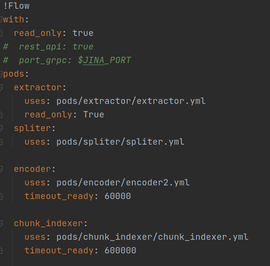
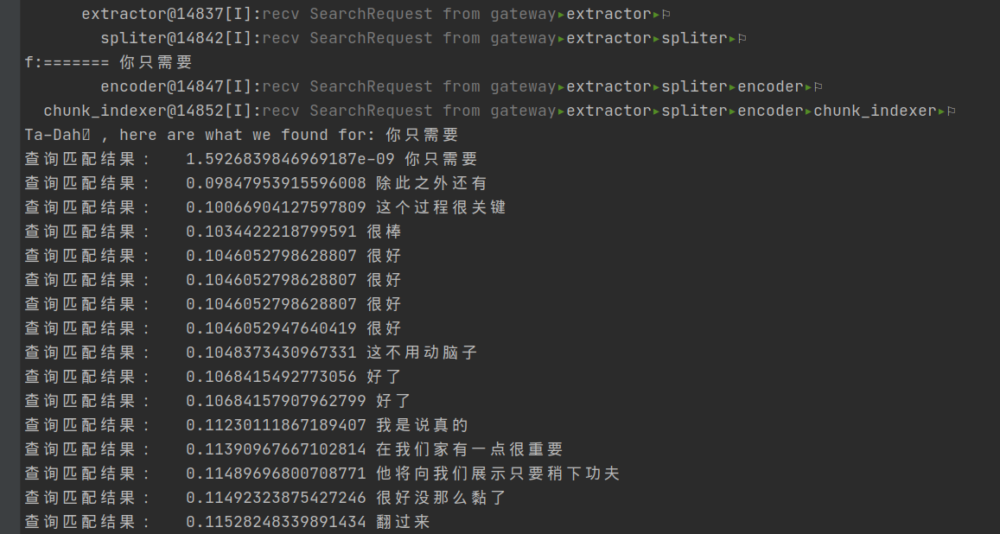
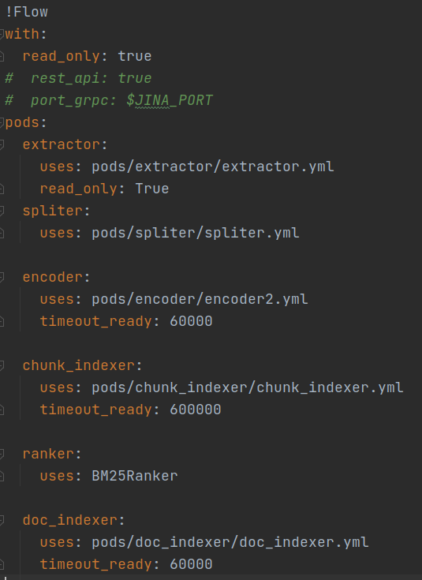
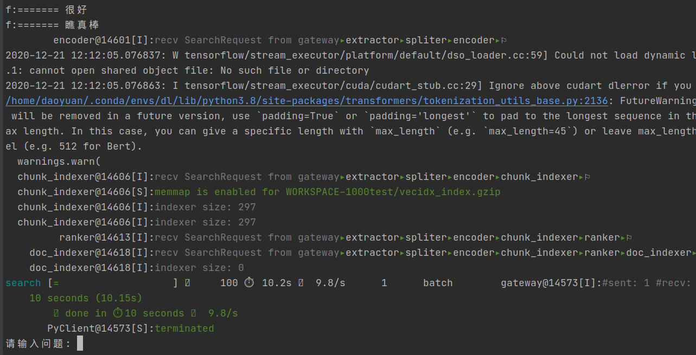
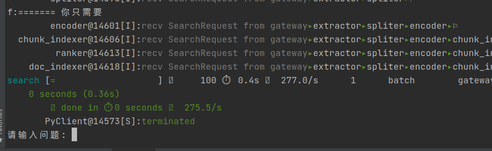

# modify the jina-ai/examples/webwq-search in the version of 0.3.8 to 0.8.0 

The project structure has changed dramatically, and much of the underlying logic has changed. I found that the official examples were still in older versions, and many of them were no longer working due to the rapid development of the project.

Because I started with the most recent stable version(0.8.0) to build a knowledge-based search engine, and I have encountered some difficult problems and need the help of developers.

For some reason, only the base version is available in order to run successfully on that version.

"hfl/chinese-roberta-wwm-ext" encoder is used to encode Chinese texts,raw data is a pure text of jsonline format:

> {"file": "raymond.blancs.kitchen.secrets.s01e06.720p.hdtv.x264-sfm[Bread].简体.srt", "start": "00:05:21,290", "end": "00:05:28,490", "content": "就是这么简单，接着取一颗柠檬把果皮锉碎加入"}

the "content" field is seen as a document to be indexed, and its associated other fields are our final results. The key problems is how to **add the extra infos** into _extractor_ (meta_info?).

In addition, there is a problem with the inability to obtain an aggregate index of documents during the query-flow.

while the query-flow end with chunk_indexer:

the chunks can be searched successfully.

but when ranker and doc_indexer are added:

It return nothing, **no warnings, no errors!**

So does the chunk2docdriver works well?  how to  aggregate  the  scores of matching  chunks and then return matching docs.

What's more, how to get the extra infos related to this document?

