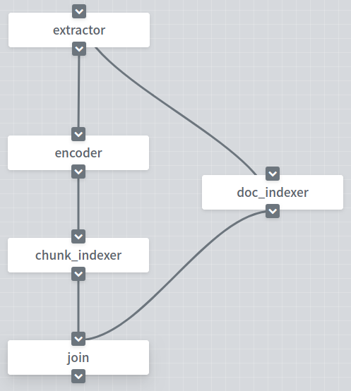
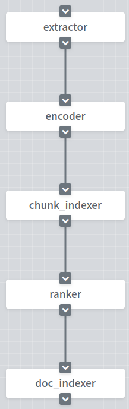

# JINA 100行代码搭建一套中文问答神经网络搜索引擎

    一提到搜索引擎，大家可能会想到实现**困难，系统复杂、臃肿**。但是现在有一个**魔法器**，**它可以让我们专注于业务本身，以最短的时间内实现一套**神经网络搜索引擎。

    那这个魔法器是什么呢？它就是**jina**，那jina是什么呢？jina是一个**开源神经搜索引擎框架**，它有什么特点呢？**易上手**、**分布式**、**模型容器化**、**弹性扩展**和**云原生**。

    那么如何使用jina搭建一套搜索引擎呢？请看如下分解。

<!-- START doctoc generated TOC please keep comment here to allow auto update -->
<!-- DON'T EDIT THIS SECTION, INSTEAD RE-RUN doctoc TO UPDATE -->
**Table of Contents**

- [效果展示](#%E6%95%88%E6%9E%9C%E5%B1%95%E7%A4%BA)
- [总览](#%E6%80%BB%E8%A7%88)
- [环境依赖](#%E7%8E%AF%E5%A2%83%E4%BE%9D%E8%B5%96)
- [数据预处理](#%E6%95%B0%E6%8D%AE%E9%A2%84%E5%A4%84%E7%90%86)
- [定义Flow](#%E5%AE%9A%E4%B9%89flow)
- [运行Flow](#%E8%BF%90%E8%A1%8Cflow)
- [小结](#%E5%B0%8F%E7%BB%93)
- [深入Pod](#%E6%B7%B1%E5%85%A5pod)
- [回顾](#%E5%9B%9E%E9%A1%BE)
- [结语](#%E7%BB%93%E8%AF%AD)

<!-- END doctoc generated TOC please keep comment here to allow auto update -->

## 效果展示


## 总览

    在继续阅读之前，如果你还没有阅读过[Jina 101](https://github.com/jina-ai/jina/tree/master/docs/chapters/101)，在继续阅读之前，我们强烈建议你先阅读[Jina 101](https://github.com/jina-ai/jina/tree/master/docs/chapters/101)。

    在本篇文章中我们将介绍如何使用jina搭建一套中文问答搜索引擎。通过本文，你将会学到：

1. Chunk是最基本的信息单元，Document是jina的最终输入和输出。

2. 在jina中如何定义Flow。

3. 在jina中如何定义Pod。

## 环境依赖

    这个demo运行在Python3.7以上的环境

```shell
pip install --upgrade -r requirements.txt
```

## 数据预处理

     在这个例子中，我们采用WebQA作为我们的数据集。数据集含有410万个预先过滤过的、高质量问题和多个回复，数据集下载[地址](https://drive.google.com/open?id=1u2yW_XohbYL2YAK6Bzc5XrngHstQTf0v)。

    在下载好数据集以后，我们将数据集放到`/tmp`文件夹中，运行下面命令。

```shell
python prepare_data.py
```

    该数据集中每个条目对应一个问题和一个答案，每个问题包含多个答案。在数据预处理时，我们将同一个问题对应的答案进行聚合，整理为一问多答的形式。

## 定义Flow

    与传统的搜索引擎一样，jina也将搜索分为创建索引和查询两个任务，对应索引和查询两个不同的Flow。

### 创建索引

    在创建索引时，我们需要通过YAML文件定义Flow。在Flow中我们定义了`extractor`，`doc_indexer`, `encoder`, `chunk_indexer`, `join`5个Pod。

<table style="margin-left:auto;margin-right:auto;">
<tr>
<td> flow-index.yml</td>
<td> Flow in Dashboard</td>
</tr>
<tr>
<td>
  <sub>

```yaml
!Flow
pods:
  doc_indexer:
    uses: pods/doc_indexer/doc_indexer.yml

  extractor:
    uses: pods/extractor/extractor.yml
    needs: gateway
    read_only: True

  encoder:
    uses: pods/encoder/encoder.yml
    timeout_ready: 60000
    parallel: 3
    read_only: True

  chunk_indexer:
    uses: pods/chunk_indexer/chunk_indexer.yml

  join:
    uses: _merge
    needs: [chunk_indexer, doc_indexer]
    read_only: True
```

</sub>

</td>
<td>

</td>
</tr>
</table>

> extractor

    将Document级别信息转换为Chunk级别的信息。

> encoder

    将Chunk中的文本编码成向量。

> chunk_indexer

    存储编码后的向量，还存储Chunk与Document的关联关系。

> join

    合并两条并行流程中的所有信息。在我们的例子中，join后面没有其他的Pod，所以join的功能类似于多线程编程中的等待并行线程全部完成。

> doc_indexer

    存储Document的原数据。

   介绍完各个Pod的作用，接下来，我们具体看看每个Pod如何定义的。

    我们通过`yaml_path`指定Pod的YAML文件地址。Flow中的信息传递默认是按照YAML文件中定义的顺序自上而下依次执行的。在特殊情况下，我们也通过`needs`指定接受哪个Pod的请求。例如在`extractor`这个Pod中，我们定义Pod的YAML文件地址为`extractor.yml`，接受来自`gateway`的请求，而不是上方的`doc_indexer`。

```yaml
extractor:
  uses: pods/extractor/extractor.yml
  needs: gateway
  read_only: True
```

    两个Pod在YAML文件中的顺序是依次的，则不需要定义`needs`，例如在`chunk_indexer`这个Pod。

```yaml
chunk_indexer:
  uses: pods/chunk_indexer/chunk_indexer.yml
```

    如果一个Pod加载耗时很长，而在jina中Pod的默认加载时间为5s，我们则需要指定`timeout_ready`。例如在`encoder`这个Pod，我们指定它的加载时间为60s。

```yaml
encoder:
  uses: pods/encoder/encoder.yml
  timeout_ready: 60000
  parallel: 3
  read_only: True
```

    在这里你可能会发现还存在`gateway`这个Pod。这个Pod的主要作用是接受外部的请求，并将请求的数据发送到Flow中的Pod。在运行时，jina会自动在Flow的开头定义这个Pod，所以不需要在Flow的YAML文件中定义`gateway`。

### 查询

    当索引建立完成以后，下一步我们使用建立的索引进行查询。

    同样，在查询时，我们也利用YAML文件定义查询任务的Flow。在查询任务的Flow中，我们共用了在创建索引时定义的`extractor`、`encoder`、`chunk_indexer`和`doc_indexer`这几个Pod。它们在查询时的功能如下。

> extractor

将Document级别的信息转换为Chunk级别的信息。

> encoder

将Chunk中文本编码成向量。

> chunk_indexer

利用存储的Chunk索引，召回相似的Chunk。

> doc_indexer

利用存储的Document索引，索引Document级别的原数据。

<table style="margin-left:auto;margin-right:auto;">
<tr>
<td> flow-query.yml</td>
<td> Flow in Dashboard</td>
</tr>
<tr>
<td>
  <sub>

```yaml
!Flow
pods:
  extractor:
    uses: pods/extractor/extractor.yml
    read_only: True

  encoder:
    uses: pods/encoder/encoder.yml
    timeout_ready: 60000
    read_only: True

  chunk_indexer:
    uses: pods/chunk_indexer/chunk_indexer.yml
    timeout_ready: 600000
    read_only: True

  ranker:
    uses: pods/ranker/ranker.yml
    read_only: True

  doc_indexer:
    uses: pods/doc_indexer/doc_indexer.yml
    read_only: True
```

</sub>

</td>
<td>

</td>
</tr>
</table>

    

    我们可以看到在查询任务中这些Pod和在索引任务中是共用了相同的YAML文件进行定义的。我们如何控制Pod用同一个YAML定义文件实现不同的任务呢？只需要在Pod的YAML文件中定义不同任务请求下的处理逻辑。我们在后面会细细道来。

    相比索引任务，查询任务的Flow中还多了`ranker`这个Pod。`ranker`的作用是对Document下所有查询Chunk的查询结果进行打分排序，并将Chunk级别的信息转换为Document级别的信息。

## 运行Flow

### 创建索引

```python
python app.py -t index -n 10000
```

<details>
<summary>点击查看日志输出</summary>

<p align="center">
  
</p>

</details>

    现在我们可以通过代码让这个Flow跑起来了。在创建索引的过程中，我们通过上文提到的`flow-index.yml`来定义创建索引任务的Flow，然后通过`index_lines()`函数对数据进行索引创建。

```python
flow = Flow().load_config('flow-index.yml')
with flow:
    flow.index_lines(filepath=data_fn, size=num_docs, batch_size=32)
```

    在创建索引的过程中，我们将每个问题和问题下的所有回复当成一个Document，使用`index_lines()`将文件地址传入Flow中。

### 查询

```python
python app.py -t query
```

<details>
<summary>点击查看日志输出</summary>

<p align="center">
  
</p>

</details>

    在查询时刻，我们同样通过`flow-query.yml`定义查询任务的Flow。通过`search()`方法进行查询。

```python
flow = Flow().load_config('flow-query.yml')
with flow:
    while True:
        title = input('请输入问题: ')
        item = {'title': title}
        if not title:
            break
        ppr = lambda x: print_topk(x)
        flow.search(read_query_data(item), output_fn=ppr, top_k=top_k)
```

```python
def read_query_data(item):
    yield ("{}".format(json.dumps(item, ensure_ascii=False)))   
```

    在查询完成以后，FLow返回的数据形式为`Protobuf`，如果你希望了解详细的`Protobuf`内容，可以参考[链接](https://github.com/jina-ai/jina/blob/master/jina/proto/jina.proto)。`output_fn`参数接收一个函数，在接收到jina的返回结果后，会调用该函数对返回结果进行后处理。在这里，我们从返回结果中把得分最高的结果打印出来。`resp.search.docs`包含了所有的查询结果，对于每个查询结果得分最高的k个结果会保存在`topk_results`这个字段下。`text`代表了Document的原数据。

```python
def print_topk(resp):
    print(f'以下是相似的问题:')
    for d in resp.search.docs:
        for match in d.matches:
            item = match.chunks[0].text
            print('👉%s' % item)
```

## 小结

    在开始下面之前，我们回过头来看看，是不是觉得很简单。那你可能会问两条Flow有什么不同呢？

    第一个不同点，在创建索引时，我们采用了两条并行的处理流程。为什么要这样做呢？因为并行的处理流程可以提高创建索引的速度。为什么我们可以并行呢？因为在建立索引时，`doc_indexer`存储的是Document级别的索引；而`chunk_indexer`存储的是Chunk级别的索引；在`gateway`以后，彼此是独立的，没有信息的交互。

    第二个不同点，在创建索引时，Flow接收的请求类型为`IndexRequest`。更准确的说，`index()`方法本质是使用jina的Python客户端，向索引Flow发出一个`IndexRequest`类型的请求。在查询时，Flow中的请求类型为`SearchRequest`。这也是为什么我们在创建索引和查询任务中可以共用同一个Pod，因为我们在Pod的YAML文件中定义了不同请求下的处理逻辑。

## 深入Pod

    在阅读完上面之后，你意犹未尽，希望了解关于Pod的更多内容。请继续往下阅读。

    在jina中我们通过定义YAML文件来定义Flow，在[Jina 101](https://github.com/jina-ai/jina/tree/master/docs/chapters/101)中提到Pod也是通过YAML文件来进行定义的。那么是怎么定义的呢？我们继续往下走。依次看看每个Pod的YAML文件。

### doc_indexer

    在jina的原则中，一个YAML文件描述了一个对象的属性。所以我们可以通过YAML去改变对象的属性，而不必去改动代码。

    在`doc_indexer`中，它的作用是存储Document级别的原数据和查询Document级别的原数据。并且我们通过这样的定义方式`!BasePbIndexer`将jina自带的`BasePbIndexer`作为`doc_indexer`的Executor。

    我们通过定义`with`修改了`BasePbIndexer`中`__init__`方法中参数的值，在这里我们修改了存储索引文件的文件名。

```yaml
!BinaryPbIndexer
with:
  index_filename: doc_index.gzip
metas:
  workspace: $TMP_WORKSPACE
```

    在`requests on`部分，我们分别定义了`IndexRequest`和`SearchRequest`下的处理逻辑。

    在`IndexRequest`请求时，`doc_indexer`调用`KVIndexDriver`进行索引存储，因为这里存储的是Document级别的数据，所以我们指定存储`level`为doc。在一方面，因为Pod之间传递的数据类型为ProtoBuf。所以，Driver是一个数据类型转换器，将ProtoBuf转换为Python Object / Numpy Object，或将Python Object / Numpy Object转换尾ProtoBuf。在另一方面，`KVIndexDriver`调用了`BasePbIndexer`的`add()`存储了Document级别的数据，也就是存储了Document id和Document原数据。

    但是在`SearchRequest`时，`doc_indexer`调用`DocKVSearchDriver`查询了Document级别的索引。在`DocKVSearchDriver`中，`DocKVSearchDriver`调用了`BasePbIndexer`的`query()`方法，通过Document id索引Document的原数据。

### extractor

   在这个demo中，`extractor`主要任务有：

    1. 将Document级别的信息转换成Chunk级别的信息。

    2. 提取Document中的问题。

    在jina中我们可以在YAML文件中使用jina内部的Executor，也可以继承相应的基类来实现自己的Executor。在这里我们通过继承了`BaseSegmenter`实现了`WebQATitleExtractor`，`BaseSegmenter`的作用是将Document的信息转换为Chunk级别的信息；并且我们通过在`metas`中定义`py_modules`定义了`WebQATitleExtractor` py文件路径。

    与`doc_indexer`不同，`extractor`在`IndexRequest`和`SearchRequest`时都是相同的处理逻辑。

```yaml
!WebQATitleExtractor
metas:
  py_modules: extractor.py
requests:
  on:
    [IndexRequest, SearchRequest]:
      - !SegmentDriver
        with:
          method: craft
```

     在`WebQATitleExtractor`中我们通过复写`craft()`方法实现了`extractor`的相应逻辑。

```python
class WebQATitleExtractor(BaseSegmenter):
    def craft(self, text, *args, **kwargs):
        json_dict = json.loads(text)
        title = json_dict['title']
        return [{
                    'offset': 0,
                    'length': len(title),
                    'text': title
                }]
```

### encoder

    我们在`extractor`已经将问题从Document中提取了出来，那么我们下面需要做的是将问题编码成向量。

    在这里我们使用哈工大-科大讯飞的`Roberta base wwm ext`模型作为编码器模型。通过继承`BaseTextEncoder`实现了`TransformerRobertaEncoder`作为我们的编码器；并且使用`transformers`加载模型，使用`CLS`作为文本向量。我们通过定义`with`修改了`__init__`方法中参数的值。详细代码见[链接](https://github.com/jina-ai/examples/blob/master/webqa-search/pods/encoder/transformer_roberta.py)。

```yaml
!TransformerRobertaEncoder
metas:
  py_modules: transformer_roberta.py

requests:
  on:
    [SearchRequest, IndexRequest]:
      - !EncodeDriver
        with:
          method: encode
```

### chunk_indexer

    `chunk_indexer`的YAML文件有点复杂。别着急，这是最简单的方法了。`chunk_indexer`中的Executor称为`ChunkIndexer`。它封装了另外两个Executor，`components`字段指定两个包装好的Executor，`NumpyIndexer`用于存储问题的向量，`BasePbIndexer`用作键值存储来存储Document id和Chunk id的关联。并且我们通过分别定义了`metas`修改了两个Executor的名称和索引存储的路径。

```yaml
!CompoundIndexer
components:
  - !NumpyIndexer
    with:
      index_filename: vecidx_index.gzip
      metric: cosine
    metas:
      name: vecidx_index
      workspace: $TMP_WORKSPACE

  - !BinaryPbIndexer
    with:
      index_filename: chunk_index.gzip
    metas:
      name: chunk_index
      workspace: $TMP_WORKSPACE
metas:
  name: chunk_indexer
  workspace: $TMP_WORKSPACE

```

    与`doc_indexer`一样，`chunk_indexer`在不同请求时，也有不同的处理逻辑。

    在处理`IndexRequest`时，我们定义了3个不同的Driver，分别是: `VectorIndexDriver`、`ChunkPruneDriver`和`KVIndexDriver`，3个Driver依次执行。在`VectorIndexDriver`时，`VectorIndexDriver`调用了`NumpyIndexer`这个Executor中的`add()`存储了问题的向量。在存储完成以后，我们清除了Chunk中的某些数据，只保留Chunk id和Document id。因为在`KVIndexDriver`调用`BasePbIndexer`中的`add()`存储Document和Chunk的关联时，我们不需要这些数据，同时也是为了减少在网络传输时的数据大小。

    在处理`SearchRequest`时，我们同样定义了3个不同的Driver。`VectorSearchDriver`调用了`NumpyIndexer`中的`query()`索引了相似的Chunk，在这里我们使用了余弦相似度来进行召回。并且使用`ChunkPruneDriver`清除了Chunk中的某些数据，只保留Chunk id和Document id。因为我们在后面用不到这些数据，也是为了减少在网络传输时的数据大小。最后使用`ChunkKVSearchDriver`调用`BasePbIndexer`中的`query()`，索引出相似Chunk的Document id。

### join

    在定义Flow时，我们提到`join`的作用是等待并合并两条并行流程的信息，并执行下面的任务。在指定`join`的`yaml_path`时，我们只需指定`yaml_path`为`_merge`，这样jina就会调用内部默认的`join` Pod的YAML文件。

```python
join:
    uses: _merge
    needs: [chunk_indexer, doc_indexer]
    read_only: True
```

## 回顾

    恭喜你，你已经了解了如何用jina搭建一套神经网络搜索引擎了👋👋。

    在你离开之前，我们来回顾下本篇文章中重要的知识点。

1. Chunk是jina的信息单元，Document是jina最终的输入和输出。

2. 在jina中，我们通过在YAML文件定义不同的Pod来定义Flow。

3. 在jina中，我们通过YAML文件来定义Pod。通过更改YAML文件来改变Pod的属性；并且可以在YAML文件中定义Pod在不同请求下的处理逻辑。

## 结语

    在这里你可能已经发现了Document中只有一个Chunk，那么如果有多个Chunk时，应该怎么做呢？请看下一篇，[JINA 3分钟实现一套新闻搜索系统](https://github.com/jina-ai/examples/tree/master/news-search)。
